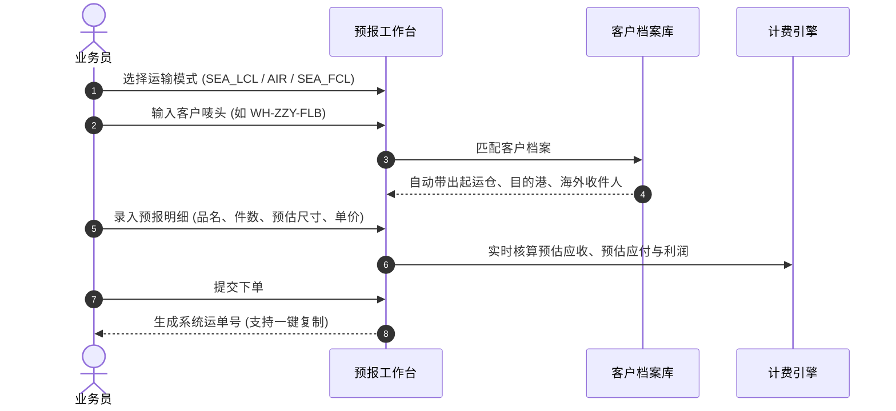
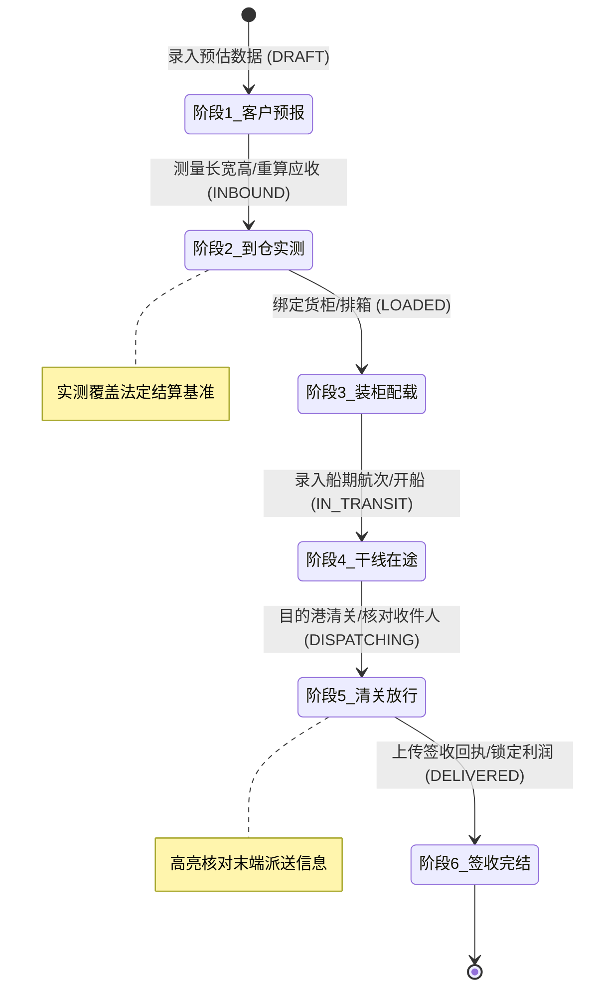
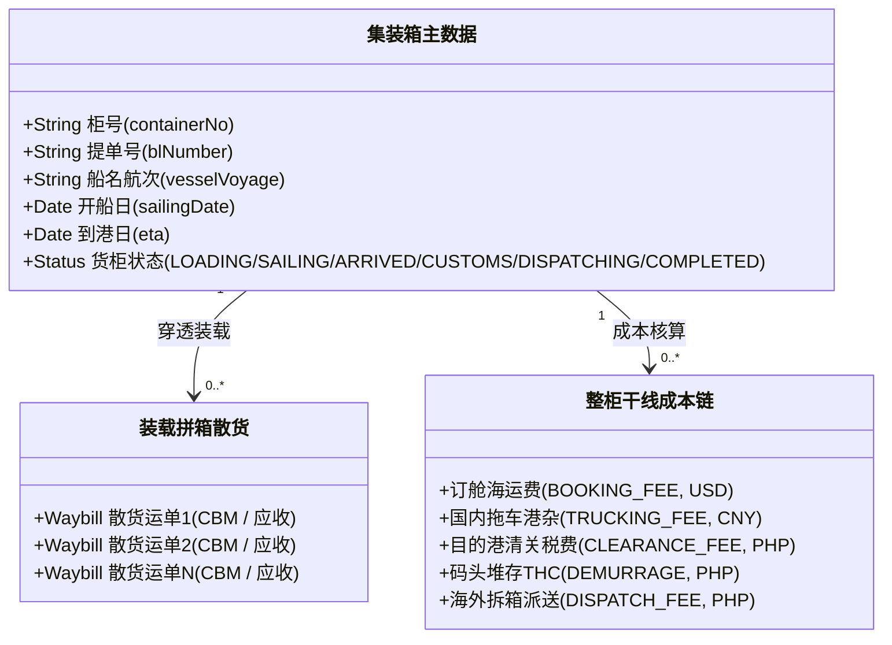

# Global Link Logistics - V2 智能物流中台系统操作使用手册

> **版本**：v2.0 Enterprise  
> **适用对象**：物流操作员、调度员、单证员、仓库核量员、财务结算员、客服及管理人员  
> **核心设计理念**：认唛头不认发件人 · 两段式双轨计费 · 全生命周期增量流转 · 整柜干线全链路穿透

---

## 目录
1. [系统整体架构与导航布局](#1-系统整体架构与导航布局)
2. [客户档案与专属唛头管理 (`/v2/customers`)](#2-客户档案与专属唛头管理-v2customers)
3. [国内起运仓 / 集货点配置 (`/v2/warehouses`)](#3-国内起运仓--集货点配置-v2warehouses)
4. [渠道与全链路服务商管理 (`/v2/channels`)](#4-渠道与全链路服务商管理-v2channels)
5. [阶段 1：极速预报下单与入库工作台 (`/v2/inbound`)](#5-阶段-1极速预报下单与入库工作台-v2inbound)
6. [运单全景调度看板与批量装柜 (`/v2/waybills`)](#6-运单全景调度看板与批量装柜-v2waybills)
7. [运单详情全生命周期流转与财务实测 (`/v2/waybills/:id`)](#7-运单详情全生命周期流转与财务实测-v2waybillsid)
   - [7.1 路线与海外收件人档案（形态 2 & 随时纠偏）](#71-路线与海外收件人档案形态-2--随时纠偏)
   - [7.2 双轨数据模型与实测偏差分析](#72-双轨数据模型与实测偏差分析)
   - [7.3 六大阶段逐步流转推进操作指南](#73-六大阶段逐步流转推进操作指南)
   - [7.4 状态安全回退机制 (Rollback)](#74-状态安全回退机制-rollback)
   - [7.5 附加杂费与单票纯利润动态账本](#75-附加杂费与单票纯利润动态账本)
   - [7.6 附件与单证凭证档案库](#76-附件与单证凭证档案库)
8. [集装箱整柜跟踪与干线成本链 (`/v2/containers`)](#8-集装箱整柜跟踪与干线成本链-v2containers)
9. [Excel 数据批量导入体系](#9-excel-数据批量导入体系)
10. [业务风控与常见问题 (FAQ)](#10-业务风控与常见问题-faq)

---

## 1. 系统整体架构与导航布局

Global Link Logistics V2 中台将传统复杂的国际物流操作重构为标准化、流程化、可视化的 7 大核心功能模块。


### 左侧主导航栏清单：
| 菜单项 | 访问路径 | 核心业务职能 |
| :--- | :--- | :--- |
| **入库拼箱工作台** | `/v2/inbound` | 客户预报接单、散拼/空运/整柜极速下单、批量导入 |
| **运单全景调度** | `/v2/waybills` | 跨运输方式全流程监控、状态管线筛选、批量装柜排箱 |
| **集装箱整柜跟踪** | `/v2/containers` | 柜级航线追踪、穿透查看装载明细、整柜多币种干线成本核算 |
| **客户档案与唛头** | `/v2/customers` | 客户唯一唛头编码、常用路线、海外收件人地址簿维护 |
| **渠道与服务商** | `/v2/channels` | 6大分类服务商（拼箱/空运/订舱/报关/清关/拖车）维护 |
| **起运仓集货点** | `/v2/warehouses` | 广州/龙岩/义乌等集货仓地址维护、一键复制送仓指引 |

---

## 2. 客户档案与专属唛头管理 (`/v2/customers`)

### 业务原则：**“认唛头不认发件人”**
在跨境电商集运与国际散拼业务中，国内寄件人往往多变（淘宝卖家、1688供货商、各快递网点）。仓库收件与分拣**唯一识别外箱专属客户唛头**（Client Mark / Client Code，如 `WH-ZZY-FLB`、`WH-10115`）。

### 操作流程：
1. **新建客户唛头**：
   - 点击右上角 **「新建客户唛头」**；
   - 填写**客户编码/唛头**（必填，全局唯一，大写字母与数字组合）；
   - 填写**客户名称/企业全称**与**联系电话**；
   - 选择该客户的**常用起运仓**（如广州仓）、**常用目的国**（如菲律宾）及**常用目的港**（如马尼拉）；
   - （可选）填写绑定的**默认海外收件人档案**（收件人姓名、海外电话、详细派送地址）；
   - 点击 **「确认创建」**。
2. **批量导入客户**：
   - 点击 **「批量导入客户」**，下载标准 Excel 模板，填妥后上传即可一次性批量初始化数百个客户档案。
3. **效果联动**：
   - 在阶段 1 下单时，输入或选择唛头，系统将**毫秒级自动补全**起运仓、目的国、目的港以及海外收件人信息。

---

## 3. 国内起运仓 / 集货点配置 (`/v2/warehouses`)

### 业务场景：
跨区域集货业务涉及多个国内接货网点（如广州白云集运总仓、福建龙岩仓、浙江义乌仓等）。

### 操作流程：
1. **新建/维护起运仓**：
   - 填写**仓库简码**（如 `GZ-01`、`LY-01`）、**仓库简称**（如 `广州仓`）与**仓库全称**；
   - 填写**收货负责人/组别**与**联系电话**；
   - 填写**详细仓址**与**营业收货时间**（如 `09:00 - 21:00 (周一至周日)`）；
   - 可勾选 **「设为系统默认起运仓」**（创建新单时默认自动预选）；
2. **一键生成「客户送仓指引」**：
   - 点击卡片下方的 **「复制送仓指引」** 按钮；
   - 系统自动生成标准化文本并复制到剪贴板，可直接粘贴发送给国内供货商或客户：
     ```text
     【送仓指引】广州白云集拼总仓 (广州仓)
     收货联系人: 广州收货组 (李主管)
     联系电话: 138-0000-1111
     详细仓址: 广东省广州市白云区石井街道石沙路物流园B区6栋102室
     营业收货时间: 09:00 - 21:00 (周一至周日)
     ⚠️ 重要提示: 外箱醒目处请务必贴牢客户唛头！
     ```

---

## 4. 渠道与全链路服务商管理 (`/v2/channels`)

### 业务场景：
为各环节（干线订舱、报关行、目的港清关行、拖车行）提供独立服务商档案库，支持灵活设定默认推荐选项。

### 6 大业务分类选项卡：
1. **海运拼箱专线 (`SEA_LCL`)**：散货拼柜承运渠道（如 `万海自营专线`、`中外运拼箱`）；
2. **空运专线渠道 (`AIR`)**：航空快件庄家渠道（如 `马尼拉空运特快DDP`）；
3. **整柜 - 订舱渠道 (`FCL_BOOKING`)**：船司或一级订舱货代（如 `优尼科订舱`、`万海订舱`）；
4. **整柜 - 报关渠道 (`FCL_CUSTOMS`)**：国内出口口岸买单报关行；
5. **整柜 - 清关渠道 (`FCL_CLEARANCE`)**：目的港双清包税清关代理；
6. **整柜 - 拖车渠道 (`FCL_TRUCKING`)**：港口/码头集卡车队。

### 操作要点：
- 点击卡片上的 **★（星标）** 可一键将该服务商设为该分类下的**全局默认推荐**；
- 支持随时开启/停用服务商，停用后不会出现在新增下拉列表中，但保留历史单据关联。

---

## 5. 阶段 1：极速预报下单与入库工作台 (`/v2/inbound`)

### 核心设计：**“初始预报仅填已知，后续阶段增量完善”**
业务员在接单初期无需掌握货柜号、封签号或实测尺寸，只需录入客户预报信息。



### 操作步骤：
1. **选择运输模式**：
   - 顶部提供三大模式切换：**海运拼柜 (SEA_LCL)** / **空运快递 (AIR)** / **海运整柜 (SEA_FCL)**；
2. **录入客户识别与路线**：
   - **客户编码/唛头**：支持拼音与下拉模糊联想，匹配后展示绿色勾选徽章；
   - **起运仓/集货点**：自动带出默认仓，支持下拉切换；
   - **目的国 & 目的港口**：选择目的国后，目的港口自动联动填充（如选择 `菲律宾` ➔ 自动推荐 `马尼拉南港/北港`）；
   - **承运服务商/专线渠道**：下拉选择对应的拼箱/空运渠道；
3. **维护海外收件人档案 (Consignee)**：
   - 点击 **「展开/维护海外收件人与派送地址」**；
   - 自动预填客户绑定的默认收件人、电话、公司与详细地址，支持单票针对性修改；
4. **添加货物明细与计费单价**：
   - **海运拼箱**：填报品名、件数、预估长宽高（cm）、应收体积单价（元/方）与应付体积单价；
   - **空运专线**：填报品名、件数、预估单重（kg）、应收重量单价（元/kg）与应付重量单价；
   - **海运整柜 (FCL)**：自动隐藏散货单价列，启用**「整柜协议包干总报价」**卡片，直接录入整柜协议总额；
5. **录入附加杂费（可选）**：
   - 点击 **「+ 添加附加杂费」**，录入报关费、打木架费、超重费、偏远派送费等（支持应收/应付双向）；
6. **核对右下角实时财务预估看板**：
   - 实时查看：总件数、总预估体积（CBM）/重量（KG）、预估总应收、预估总应付及预估单票利润；
7. **提交与成功提示**：
   - 点击 **「创建并生成预报运单」**；
   - 弹出创建成功卡片，展示生成的系统运单号（如 `WB202608200001`），支持**一键复制单号**、**跳转详情页**或**继续录入下一单**。

---

## 6. 运单全景调度看板与批量装柜 (`/v2/waybills`)

### 功能特色：
全景看板提供跨模式、跨维度的集中调度，支持散货多票批量组合装箱。

### 核心功能操作：
1. **多维度筛选与快速检索**：
   - **运输类型标签页**：全部 / 海运拼柜 (LCL) / 空运快递 (AIR) / 海运整柜 (FCL)；
   - **状态管线筛选**：待入库 (DRAFT)、已入库 (INBOUND)、已装柜 (LOADED)、在途中 (IN_TRANSIT)、清关中 (CUSTOMS)、已签收 (DELIVERED)，每个状态按钮均实时显示当前票数；
   - **关键词搜索**：支持输入运单号、客户唛头、专线单号或货物模糊品名进行实时过滤；
2. **散货批量排柜与装箱 (`Batch Assign`)**：
   - 勾选列表中多票处于 `已入库` 状态的散货运单；
   - 点击顶部出现的 **「批量排柜 (N)」** 按钮；
   - 在弹窗中选择目标集装箱（货柜）并确认装柜日期；
   - 点击 **「确认批量装柜」**，所有勾选运单将一键关联该集装箱并将状态流转至 `已装柜 (LOADED)`；
3. **标准分页控件**：
   - 支持切换每页展示 10 / 20 / 50 / 100 条记录；
   - 支持一键快速跳页与总条数汇总。

---

## 7. 运单详情全生命周期流转与财务实测 (`/v2/waybills/:id`)

运单详情页是整个 V2 系统的核心大脑，承载了从客户预报到末端签收的完整 6 大阶段。



### 7.1 路线与海外收件人档案（形态 2 & 随时纠偏）
- **形态 2 摘要条**：页面顶部展示始发起运仓、目的港、海外收件人简略信息；
- **展开式档案**：点击可展开完整档案，显示收件人全名、联系电话/WhatsApp、收件公司及详细派件地址；
- **全生命周期随时纠偏**：在货物运输的任何阶段（即使已在途或清关），若客户更改收件人或地址，点击 **「修改海外收件人」** 即可独立更新并持久化主表；
- **一键复制派件指令**：点击 **「复制派件指令」**，一键生成规范格式的派件指令文本，直接粘贴给海外车队/快递。

---

### 7.2 双轨数据模型与实测偏差分析
系统在数据库中严格隔离两大轨数据：
- **预报轨（参考数据）**：`estimatedLength`、`estimatedWidth`、`estimatedHeight`、`estimatedWeight`、`estimatedVolume`；
- **实测轨（结算基准）**：`length`、`width`、`height`、`unitWeight`、`payableVolume`。

在详情页的货物明细表格中，系统自动将预报体积与实测体积进行比对，并展示**「实测偏差比」**（如 $+12.50\%$ 或 $-5.20\%$），红绿高亮提醒超重超体情况，自带除零容错保护。

---

### 7.3 六大阶段逐步流转推进操作指南

| 阶段序号 | 阶段名称 | 关键录入字段与操作要求 | 触发的系统状态与财务变更 |
| :--- | :--- | :--- | :--- |
| **阶段 1** | **客户预报** | 唛头、起运仓、目的港、专线渠道、预报货物清单 | 状态为 `DRAFT`；生成预估应收参考数据。 |
| **阶段 2** | **到仓实测** | 录入**实测长宽高、单重、实收件数**、入库日期、国内快递单号。<br>💡 **快捷操作**：支持点击「一键带入预报尺寸」快速填报。 | 状态流转至 `INBOUND`；**系统自动重新计算实测体积，强制覆盖运单主表的总应收、总应付与纯利润**。 |
| **阶段 3** | **装柜配载** | 选择已有集装箱或快速新建集装箱号（如 `MILU6019768`），选择装柜日期。 | 状态流转至 `LOADED`；运单与集装箱完成双向绑定关联。 |
| **阶段 4** | **干线在途** | **船名/航次 (Vessel/Voyage)**（必填）、实际开船日 (ETD)、预计到港日 (ETA)、提单号 (B/L)。 | 状态流转至 `IN_TRANSIT`；自动同步集装箱状态为 `SAILING`。 |
| **阶段 5** | **清关放行** | 清关放行日期、查验状态（正常放行/查验放行）、上传海关税费水单文件。<br>⚠️ **重点**：弹窗内高亮呈现末端收件人及送货地址，确保放行前核对防漏派。 | 状态流转至 `DISPATCHING` (海外拆派中)；同步集装箱状态为 `DISPATCHING`。 |
| **阶段 6** | **签收完结** | 客户签收日期（必填）、上传客户盖章/签字的签收回执单照片。 | 状态流转至 `DELIVERED`；**全流程流转圆满结束，锁定单票最终纯利润**。 |

---

### 7.4 状态安全回退机制 (Rollback)
- **业务场景**：若因海关查验延误、甩柜或退仓需要修正前置阶段数据；
- **防越级强校验**：系统禁止跳过中间阶段直接推进至未来阶段；
- **一键回退**：点击前置阶段卡片，系统提示确认后可将运单状态安全回退至指定阶段，**已录入的历史尺寸、货柜及费用数据完整保留不丢失**。

---

### 7.5 附加杂费与单票纯利润动态账本
- **计费公式**：
  $$\text{单票纯利润 (Profit)} = \text{总应收金额 (receivableAmount)} - \text{总应付成本 (payableAmount)}$$
- **附加杂费管理**：
  - 支持随时录入「应收杂费」与「应付杂费」（如查验费、超长费、叉车费、熏蒸费等）；
  - 无论在哪个流转阶段增删杂费，系统**实时触发主表财务总账动态累加/扣减**，确保账实相符。

---

### 7.6 附件与单证凭证档案库
- 支持上传并集中归档：
  - `INBOUND_IMAGE`（入库实物外箱照片、唛头照片）
  - `PACKING_LIST`（装箱单与商业发票）
  - `BILL_OF_LADING`（海运提单/电放提单）
  - `CUSTOMS_SLIP`（海关缴税放行水单）
  - `SIGN_IMAGE`（末端收货人签收回执）
- 支持本地文件直传与在线预览、下载及安全删除。

---

## 8. 集装箱整柜跟踪与干线成本链 (`/v2/containers`)

### 核心功能：
以集装箱（40HQ/20GP）为核算主体，跟踪海上干线运输，穿透核算整柜全链路硬成本。



### 操作指南：
1. **新建集装箱**：
   - 填写集装箱柜号（如 `TGBU5218902`）、柜型（`40HQ`）、海运提单号 (B/L)、船公司（如 `万海航运`）、起运港与目的港；
2. **多维组合查询**：
   - 支持按柜号、提单号、船司、起运港、目的港与货柜状态组合检索；
3. **穿透查看柜内装载运单**：
   - 点击集装箱右侧的展开箭头，一键穿透展示**柜内装载的所有拼箱散货运单列表**（运单号、唛头、件数、核算方数、应收金额与运单当前状态），支持一键点击直达运单详情；
4. **录入整柜多币种全链路干线成本**：
   - 点击 **「+ 录入整柜成本」**；
   - 选择费用科目：`订舱海运费 (USD)`、`国内拖车港杂费 (CNY)`、`目的港清关税费 (PHP)`、`码头堆存与THC (PHP)`、`海外拆箱派送费 (PHP)`；
   - 填入原币金额与汇率，系统自动折合为人民币（CNY）汇总至干线成本账本；
5. **集装箱完结强校验准则 (COMPLETED 拦截)**：
   - ⚠️ **系统铁律**：只有当货柜名下装载的**所有运单状态均为「已签收完结」(DELIVERED)** 时，方允许将货柜状态更新为 **「全部完结」(COMPLETED)**；
   - 若柜内仍有散货处于派送中或清关中，前后端均会**主动拦截并弹出提示**，精准列出尚未签收的运单号清单，杜绝提前误完结。

---

## 9. Excel 数据批量导入体系

系统在工作台、运单看板与客户管理中深度集成了 Excel 批量导入组件（`BatchImportModal`），大幅降低初始录单工作量。

### 支持导入类型与标准规范：
| 导入类型 | 核心必填列要求 | 自动处理规则 |
| :--- | :--- | :--- |
| **海运散拼导入 (`SEA_LCL`)** | 客户唛头、品名、件数、预估长/宽/高、应收体积单价 | 自动根据尺寸折算预估 CBM；自动匹配客户与起运仓。 |
| **空运专线导入 (`AIR`)** | 客户唛头、品名、件数、预估单重、应收重量单价 | 自动按重量单价核算预估应收；自动归集专线渠道。 |
| **海运整柜导入 (`SEA_FCL`)** | 客户唛头、品名、总件数、整柜包干总报价 | 自动锁定包干一口价模式，散货单价留空。 |
| **客户档案导入 (`CUSTOMER`)** | 客户唛头/编码、客户名称、联系电话、默认海外收件地址 | 自动建立客户主数据及关联的默认海外地址簿。 |

---

## 10. 业务风控与常见问题 (FAQ)

### Q1: 录入预报单时找不到对应的客户唛头怎么办？
> **解答**：  
> 1. 可在客户唛头输入框直接手动输入新的唛头文本完成下单；  
> 2. 建议优先前往「客户档案与唛头」页面新建该客户档案，并绑定其海外收件地址，以便后续所有订单自动带出。

### Q2: 货物到仓实测后，预估应收金额会自动改变吗？
> **解答**：  
> 会！在阶段 2 录入仓库实测尺寸（长宽高/重量）并保存后，系统会**以实测数据为法定结算基准，自动重算并直接覆盖持久化主表的总应收金额与利润**。预估数据将作为历史参考快照保留在明细中以供偏差比对。

### Q3: 为什么无法将某个货柜修改为“全部完结”？
> **解答**：  
> 请检查该货柜展开后的散货列表。根据系统黄金准则，**柜内所有拼箱运单必须全部推进至阶段 6「已签收完结」(DELIVERED)** 状态后，该货柜方可完结。系统弹窗会明确列出未签收运单号。

### Q4: 客户在开船后临时通知更换海外派送地址怎么办？
> **解答**：  
> 进入该运单详情页，在顶部的「海外收件人与派送档案」卡片中点击「修改海外收件人」，更新后点击保存即可即时生效，不影响前端阶段流转状态。在阶段 5 清关放行时系统会再次高亮核对最新地址。

---

*本文档由 Global Link Logistics 研发与运维团队维护。如有业务疑问或功能建议，请联系系统管理员。*
