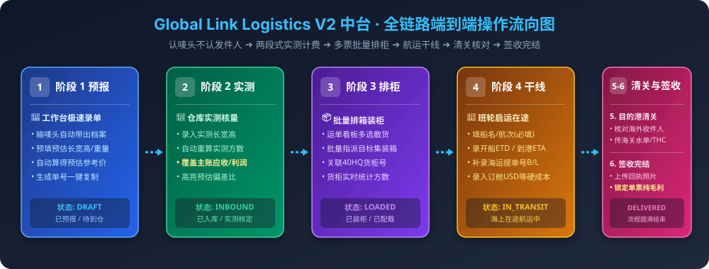
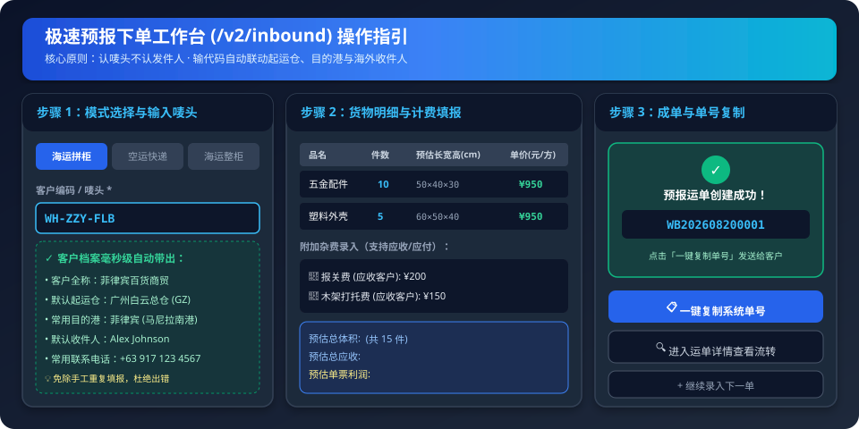
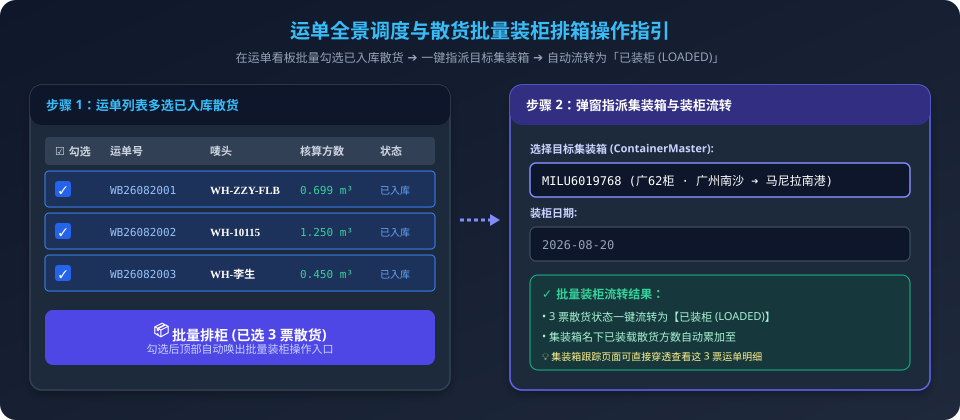
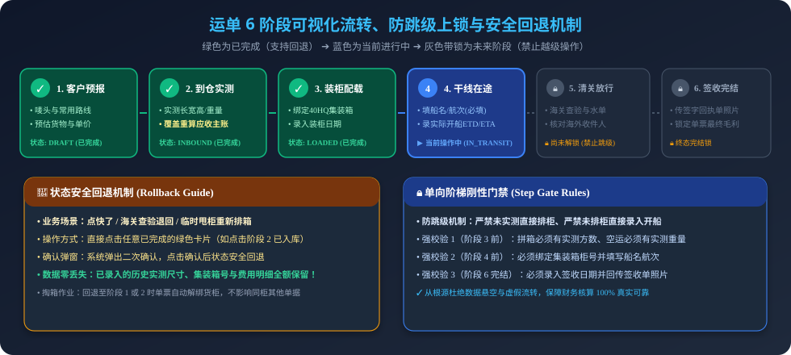
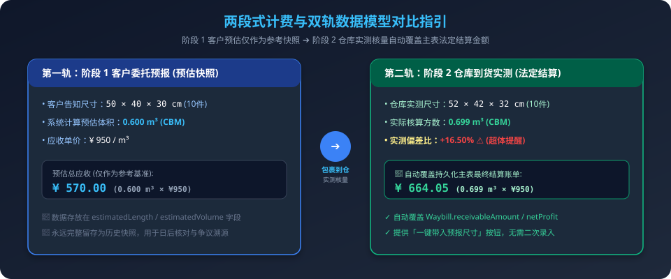
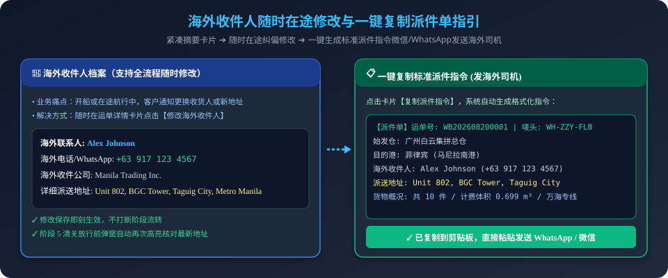
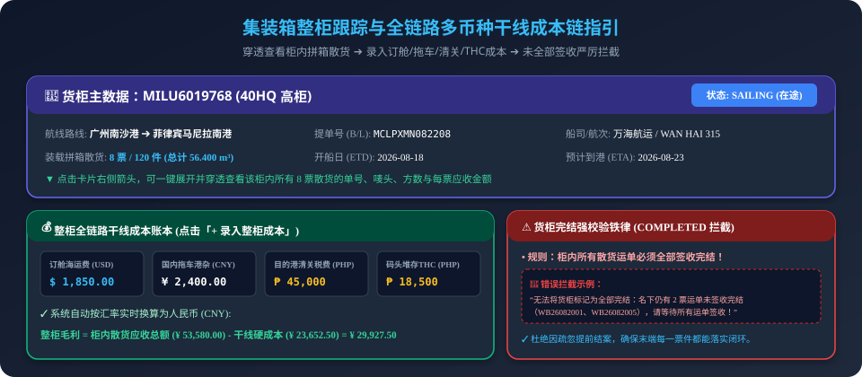

# Global Link Logistics - V2 智能物流中台操作手册

> 💡 **编写说明**：本手册严格依据系统业务知识库编写，专为一线业务员、操作员、仓库核量员、调度员及财务人员设计。语言通俗易懂，图文并茂，按“实际工作场景与操作步骤”逐步展开。

---

## 目录
1. [🌟 30秒新手速通：核心业务口诀](#1-30秒新手速通核心业务口诀)
2. [🧭 系统主菜单与功能分布](#2-系统主菜单与功能分布)
3. [⚙️ 基础配置：打好系统地基（使用前必看）](#3-基础配置打好系统地基使用前必看)
   - [3.1 配置国内起运仓 / 集货点 (`/v2/warehouses`)](#31-配置国内起运仓--集货点-v2warehouses)
   - [3.2 配置客户档案与专属唛头 (`/v2/customers`)](#32-配置客户档案与专属唛头-v2customers)
   - [3.3 配置物流渠道与合作服务商 (`/v2/channels`)](#33-配置物流渠道与合作服务商-v2channels)
4. [📝 业务下单录入实操（阶段 1：客户预报）](#4-业务下单录入实操阶段-1客户预报)
   - [4.1 海运拼柜 (SEA_LCL) 录单](#41-海运拼柜-sea_lcl-录单)
   - [4.2 空运专线 (AIR) 录单](#42-空运专线-air-录单)
   - [4.3 海运整柜 (SEA_FCL) 录单](#43-海运整柜-sea_fcl-录单)
   - [4.4 使用 Excel 批量导入订单](#44-使用-excel-批量导入订单)
5. [📋 运单全景调度与批量装柜 (`/v2/waybills`)](#5-运单全景调度与批量装柜-v2waybills)
6. [🔄 运单 6 阶段流转全操作指南 (`/v2/waybills/:id`)](#6-运单-6-阶段流转全操作指南-v2waybillsid)
   - [6.1 阶段 1：客户预报 (DRAFT)](#61-阶段-1客户预报-draft)
   - [6.2 阶段 2：到仓实测核量与计费 (INBOUND)](#62-阶段-2到仓实测核量与计费-inbound)
   - [6.3 阶段 3：装柜配载 / 仓库发货 (LOADED)](#63-阶段-3装柜配载--仓库发货-loaded)
   - [6.4 阶段 4：干线启运在途 (IN_TRANSIT)](#64-阶段-4干线启运在途-in_transit)
   - [6.5 阶段 5：目的港海关清关 (DISPATCHING)](#65-阶段-5目的港海关清关-dispatching)
   - [6.6 阶段 6：末端派送与签收完结 (DELIVERED)](#66-阶段-6末端派送与签收完结-delivered)
   - [6.7 在途随时修改海外收件人 & 一键复制派件单](#67-在途随时修改海外收件人--一键复制派件单)
   - [6.8 填错或退仓如何安全回退 (Rollback)](#68-填错或退仓如何安全回退-rollback)
   - [6.9 杂费录入与单票纯利润动态账本](#69-杂费录入与单票纯利润动态账本)
   - [6.10 单据与凭证管理（叫车图、水单、签收单）](#610-单据与凭证管理叫车图水单签收单)
7. [🚢 集装箱整柜跟踪与干线成本链 (`/v2/containers`)](#7-集装箱整柜跟踪与干线成本链-v2containers)
8. [❓ 高频常见问题与避坑速查 (FAQ)](#8-高频常见问题与避坑速查-faq)

---

## 1. 🌟 30秒新手速通：核心业务口诀

为了让新员工快速上手，请牢记以下 **6 句业务口诀**：

1. **认唛头，不认发件人**：仓库只认外箱贴的客户专属代码（如 `WH-ZZY-FLB`）。输入唛头，系统秒级自动带出客户的起运仓、目的港和海外收件人，不用每次手工重复填。
2. **两步算钱，实测为准**：
   - **第一步（下单预报）**：填客户报的预估长宽高或重量，系统算个**预估参考价**；
   - **第二步（包裹到仓）**：仓库拿尺子/称实测并录入，系统**自动用实测方数/重量覆盖并生成最终结算金额**。
3. **三大业务，各走各道**：
   - **海运拼柜 (LCL)**：按**立方米 ($m^3$/CBM)** 计费；
   - **空运专线 (AIR)**：按**公斤 (kg)** 计费；
   - **海运整柜 (FCL)**：整柜按**协议总价包干**计费。
4. **六大阶段，按序推进**：
   - `1.客户预报` ➔ `2.到仓实测` ➔ `3.装柜配载` ➔ `4.干线在途` ➔ `5.清关放行` ➔ `6.签收完结`。
   - 必须一步一步往下走，系统禁止跳级；若中途有变故，可点击前置阶段安全**回退**。
5. **海外地址，在途可改**：
   - 客户在开船后临时变更收件人或地址？随时点开运单详情修改，不影响当前流程，还能**一键复制标准派件单发给海外司机**。
6. **整柜完结，全签才结**：
   - 只有货柜里装的所有散货拼箱单子都签收完结（`DELIVERED`）了，集装箱才能标记为「全部完结 (`COMPLETED`)」。

### 🗺️ V2 中台全流程操作流向全景图



---

## 2. 🧭 系统主菜单与功能分布

登录系统后，左侧导航栏包含以下核心功能模块：

| 菜单名称 | 访问路径 | 谁来使用 | 核心做什么 |
| :--- | :--- | :--- | :--- |
| **入库拼箱工作台** | `/v2/inbound` | 业务员/客服 | 快速接单录单（散拼/空运/整柜）、单单预估算费、Excel批量导入。 |
| **运单全景调度** | `/v2/waybills` | 调度员/操作员 | 监控所有运单状态、按状态分类过滤、勾选散货**批量排柜装箱**。 |
| **集装箱整柜跟踪** | `/v2/containers` | 航运调度/财务 | 跟踪大货柜船期、穿透看柜里装了哪些货、录入整柜订舱/清关/港杂硬成本。 |
| **客户档案与唛头** | `/v2/customers` | 客服/管理 | 维护客户代码/唛头、联系电话、常用路线及绑定的海外收货地址。 |
| **渠道与服务商** | `/v2/channels` | 调度/管理 | 维护海运专线、空运专线、订舱代理、报关行、清关行、拖车队等服务商。 |
| **起运仓集货点** | `/v2/warehouses` | 仓管/管理 | 维护广州仓、龙岩仓、义乌仓等仓库地址，**一键复制送仓指南发客户**。 |

---

## 3. ⚙️ 基础配置：打好系统地基（使用前必看）

在正式接单录单前，先确保系统中已录好**仓库**、**客户**与**渠道**这三项主数据。

### 3.1 配置国内起运仓 / 集货点 (`/v2/warehouses`)
用于告诉客户该把货物寄送到哪个集运点。

- **操作步骤**：
  1. 点击左侧菜单 **「起运仓集货点」** ➔ 点击右上角 **「新建起运仓」**；
  2. 填写仓库代码（如 `GZ-01`）、简称（如 `广州仓`）、全称（如 `广州白云集拼总仓`）；
  3. 填写收货负责人与收件电话（如 `138-0000-1111`）、详细仓址与营业收货时间；
  4. 可勾选 **「设为系统默认起运仓」**（录单时会自动预选它）；
  5. 点击 **「确认保存」**。
- 💡 **实用功能【一键复制送仓指引】**：
  - 点击仓库卡片上的 **「复制送仓指引」**，即可将标准格式的地址、收货人与贴唛提醒一键复制，直接粘贴发给客户微信/QQ。

---

### 3.2 配置客户档案与专属唛头 (`/v2/customers`)
维护客户的专属代码（唛头），实现“一键带出一整套资料”。

- **操作步骤**：
  1. 点击左侧菜单 **「客户档案与唛头」** ➔ 点击右上角 **「新建客户唛头」**；
  2. 填写**客户编码/唛头**（必填，如 `WH-ZZY-FLB` 或 `WH-10115`）；
  3. 填写客户姓名/企业名称与联系电话；
  4. 选择客户的常用路线：起运仓（如 `广州仓`）、目的国（如 `菲律宾`）、目的港（如 `马尼拉`）；
  5. （推荐）填写客户的海外默认收件人姓名、海外电话与详细派送地址；
  6. 点击 **「确认创建」**。
- 💡 **批量导入**：支持点击右上角 **「批量导入客户」**，下载模板批量上传初始化。

---

### 3.3 配置物流渠道与合作服务商 (`/v2/channels`)
分类管理合作的承运渠道、船公司代理、报关行与车队。

- **6 大业务分类**：
  1. **海运拼箱专线 (`SEA_LCL`)**：如 `万海自营专线`、`中外运拼箱`；
  2. **空运专线渠道 (`AIR`)**：如 `马尼拉特快专线`；
  3. **整柜 - 订舱渠道 (`FCL_BOOKING`)**：如 `优尼科订舱`；
  4. **整柜 - 报关渠道 (`FCL_CUSTOMS`)**：如 `国内买单报关行`；
  5. **整柜 - 清关渠道 (`FCL_CLEARANCE`)**：如 `菲律宾清关代理`；
  6. **整柜 - 拖车渠道 (`FCL_TRUCKING`)**：如 `港口集卡车队`。
- **操作要点**：
  - 点击列表上的 **★（星标）** 可将该服务商设为**默认推荐**，录单时会自动优先选中。

---

## 4. 📝 业务下单录入实操（阶段 1：客户预报）

当客户提出发货需求时，打开 **「入库拼箱工作台」(`/v2/inbound`)**。

### 📸 阶段 1：极速预报下单操作指引图



### 4.1 海运拼柜 (SEA_LCL) 录单
适用于散货拼箱按体积收费的业务：
1. 顶部模式选择 **「海运拼柜 (LCL)」**；
2. 输入或选择 **「客户编码/唛头」**（例如输入 `WH-ZZY-FLB`，系统自动关联起运仓、目的港和海外地址）；
3. 检查起运仓（如广州仓）、目的国与目的港口；
4. 点击 **「展开海外收件人」**（系统已自动填好默认地址，若有变动可直接修改）；
5. 录入货物明细行：
   - 填写货物**品名**（如 `五金配件`）、**件数**（如 `10` 件）；
   - （可选）填写预估长宽高（厘米，如 `50 × 40 × 30`），系统自动折算总立方数；
   - 填写**应收单价**（如 `950` 元/方）和**应付单价**（如 `700` 元/方）；
   - 若有一票多件不同品名，点击 **「+ 添加一行货物」**；
6. （可选）录入附加杂费（如打木架费 150 元、报关费 200 元）；
7. 核对右下角总方数、预估应收、预估应付与预估利润；
8. 点击 **「创建并生成预报运单」** ➔ 页面弹出成功窗口，点击 **「复制单号」** 发给客户或继续录入下一单。

---

### 4.2 空运专线 (AIR) 录单
适用于航空快递、专线包裹按重量收费的业务：
1. 顶部模式切换为 **「空运快递 (AIR)」**；
2. 输入客户唛头，确认路线与海外收件人；
3. 货物明细行中：
   - 填写品名、件数、**预估单重 (kg)**；
   - 填写**应收重量单价（元/kg）** 与**应付重量单价（元/kg）**；
4. 系统自动按 $总重量\times单价$ 计算总运费，确认无误后点击提交。

---

### 4.3 海运整柜 (SEA_FCL) 录单
适用于包柜出海整柜订舱业务：
1. 顶部模式切换为 **「海运整柜 (FCL)」**；
2. 输入客户唛头，起运港必须选择具体港口（如 `南沙港` / `厦门港`）；
3. 系统自动启用 **「整柜协议包干总报价」** 卡片：
   - 选择币种（¥ 人民币 / $ 美元 / ₱ 比索）并录入**整柜一口价总报价**（如 `¥ 28,000`）；
4. 货物明细只需填入品名与总件数（无需填报单件方数单价）；
5. 点击提交生成整柜预报单（实际干线订舱、港杂清关等成本将在后续集装箱开航阶段逐笔录入）。

---

### 4.4 使用 Excel 批量导入订单
如果客户一次性发送了包含几十票货物的 Excel 清单：
1. 点击工作台右上角 **「批量导入此类型订单」**；
2. 在弹出的对话框中点击 **「下载标准导入模板」**；
3. 将客户数据复制到 Excel 对应列并保存；
4. 拖拽或上传 Excel 文件，系统自动解析并校验数据；
5. 点击确认，系统一次性批量生成所有预报运单。

---

## 5. 📋 运单全景调度与批量装柜 (`/v2/waybills`)

全景调度看板用于集中监控所有在途订单，并执行**散货批量排柜装箱**。

### 📸 散货批量排柜装箱操作指引图



### 常用操作：
1. **快速找单**：
   - 顶部标签按模式切换：全部 / 海运拼柜 / 空运 / 海运整柜；
   - 状态管线按钮：点击【待入库】、【已入库】、【已装柜】、【在途中】、【清关中】、【已签收】，可直接筛选对应阶段，按钮上带有数字统计；
   - 搜索栏：输入单号、唛头、专线单号或品名进行快速搜索；
2. **散货批量装柜排箱 (`Batch Stuffing`)**：
   - 当仓库完成多票散货的实测入库后，在列表中**勾选多票【已入库】状态的散货**；
   - 列表上方会自动出现 **「批量排柜 (已选 N 票)」** 按钮，点击它；
   - 在弹窗中选择要把它们装进哪一个集装箱货柜（如 `MILU6019768 (广62柜)`），并选择装柜日期；
   - 点击 **「确认批量装柜」**，所选运单将全部自动绑定该货柜，状态流转为【已装柜】。

---

## 6. 🔄 运单 6 阶段流转全操作指南 (`/v2/waybills/:id`)

点击任意运单的「详情」图标进入流转中心。

### 📸 运单 6 阶段流转与防跳级上锁/回退机制图



---

### 6.1 阶段 1：客户预报 (DRAFT)
- **什么时候用**：收到客户委托，初次录入阶段。
- **怎么操作**：
  - 点击阶段 1 卡片可查看预报快照；
  - 若客户通知修改品名、件数或预报尺寸，可在弹窗中修改并保存。

---

### 6.2 阶段 2：到仓实测核量与计费 (INBOUND)
- **什么时候用**：包裹实际送达国内集运仓，仓库测量了真实尺寸与重量。

### 📸 两段式计费与双轨数据模型对比指引图



- **怎么操作**：
  1. 点击阶段 2 卡片打开实测弹窗；
  2. 填写**入库日期**与国内快递/运递单号；
  3. 录入每件货物的**实测长、宽、高（cm）** 与**实测单重（kg）**；
     - 💡 **偷懒小技巧**：如果实物与客户报的一模一样，直接点击 **「一键带入预报尺寸」** 即可瞬间填满；
  4. 点击 **「确认保存并流转至已入库」**；
  5. 🌟 **系统自动做的事**：
     - 系统自动计算实际总方数；
     - **自动用实测方数重新计算总运费，并强制覆盖持久化主表的应收金额与利润**；
     - 详情表格中会自动高亮显示「预估 vs 实测」的偏差百分比。

---

### 6.3 阶段 3：装柜配载 / 仓库发货 (LOADED)
- **什么时候用**：仓库开始把散货装入集装箱货柜。
- **怎么操作**：
  1. 点击阶段 3 卡片；
  2. 在下拉框中选择目标集装箱；若该货柜还未建立，可直接在下方输入新的集装箱柜号（如 `TGBU5218902`）；
  3. 选择装柜日期；
  4. 点击 **「确认装柜配载」**，运单流转至【已装柜】。

---

### 6.4 阶段 4：干线启运在途 (IN_TRANSIT)
- **什么时候用**：集装箱装完重柜集港，班轮实际开船出海。
- **怎么操作**：
  1. 点击阶段 4 卡片；
  2. 填写**船名/航次 (Vessel/Voyage)**（必填，如 `WAN HAI 315 / V.S021`）；
  3. 填写**实际开船日 (ETD)** 与**预计到港日 (ETA)**；
  4. （可选）补录海运提单号 (B/L Number)；
  5. 点击 **「确认起运流转」**，运单流转至【在途中】。

---

### 6.5 阶段 5：目的港海关清关 (DISPATCHING)
- **什么时候用**：船舶抵港，清关代理在海外目的港海关申报并缴税放行。
- **怎么操作**：
  1. 点击阶段 5 卡片；
  2. 填写**清关放行日期**与海关查验状态（如“正常放行”或“查验放行”）；
  3. （推荐）上传海关缴税水单凭据图片或 PDF；
  4. ⚠️ **核心防漏派检查**：弹窗中会**特别高亮显示海外收件人姓名、电话与送货地址**，操作员请务必再次核对；
  5. 点击 **「确认放行」**，运单流转至【海外拆派中】。

---

### 6.6 阶段 6：末端派送与签收完结 (DELIVERED)
- **什么时候用**：海外司机/快递已将货物送达客户手中，客户签字签收。
- **怎么操作**：
  1. 点击阶段 6 卡片；
  2. 填写客户**实际签收日期**；
  3. 上传客户签字或盖章的**签收回执单照片**；
  4. 点击 **「确认签收完结」**；
  5. 运单流转为【已签收完结】，**财务账目正式锁定，核定最终单票纯利润**。

---

### 6.7 在途随时修改海外收件人 & 一键复制派件单

### 📸 海外收件人随时纠偏与一键派件单指引图



- **随时纠偏**：
  - 在开船、在途或清关阶段，如果客户提出要变更收货人或地址，随时在运单详情页顶部的「海外收件人与派送档案」卡片中点击 **「修改海外收件人」**，填入新地址并保存即可即时更新；
- **一键复制派件指令**：
  - 点击 **「复制派件指令」** 按钮，系统自动生成标准文本：
    ```text
    【派件单】运单号: WB202608200001 | 唛头: WH-ZZY-FLB
    始发仓: 广州白云集拼总仓
    目的港: 菲律宾 (马尼拉南港)
    海外收件人: Alex Johnson
    联系电话: +63 917 123 4567
    派送地址: Unit 802, BGC Tower, Taguig City, Metro Manila
    货物概况: 共 10 件 / 计费体积 0.600 m³ / 渠道: 万海自营专线
    ```
  - 复制后可直接粘贴发送给海外车队派件。

---

### 6.8 填错或退仓如何安全回退 (Rollback)
- 如果操作员不小心点快了，或者货物遇上海关查验需要回到前序阶段：
  - 点击你想回退到的**前置阶段卡片**（如从在途中点击阶段 2 已入库）；
  - 系统弹出确认窗口，点击确认；
  - 状态将安全回退至目标阶段，**已录入的历史尺寸、货柜和杂费数据完整保留，不会丢失**。

---

### 6.9 杂费录入与单票纯利润动态账本
- 在详情页下方的「费用明细与纯利润账本」卡片中：
  - 点击 **「+ 添加附加杂费」**；
  - 可录入：打木架费、报关费、港口超期堆存费、偏远派送费等；
  - 支持选择**应收客户**或**应付成本**；
  - 录入后，页面上的 **「总应收」**、**「总应付」** 与 **「纯利润（总应收 - 总应付）」** 会实时动态重算。

---

### 6.10 单据与凭证管理（叫车图、水单、签收单）
- 在详情页下方的「单据与凭证附件库」卡片中：
  - 点击 **「+ 上传单据附件」**；
  - 支持直接从电脑中拖拽或选择文件上传（支持图片、PDF）；
  - 分类归档为：叫车截图、装箱单、海运提单、清关水单、签收回执；
  - 支持在线点击放大预览与下载。

---

## 7. 🚢 集装箱整柜跟踪与干线成本链 (`/v2/containers`)

用于以**大货柜（40HQ/20GP）** 为单位进行干线跟踪与核算全链路硬成本。

### 📸 集装箱整柜跟踪与干线成本链指引图



### 核心操作指南：
1. **查看柜内散货**：
   - 点击任意集装箱卡片右侧的展开箭头，系统穿透展开**该柜子里装的所有拼箱散货单据清单**（单号、唛头、件数、方数、应收金额、当前状态）；
2. **录入整柜干线硬成本**：
   - 点击 **「+ 录入整柜成本」**；
   - 选择费用科目：
     - `订舱海运费 (BOOKING_FEE)`：支持选择 **USD 美元**，输入美元金额与汇率，系统自动折合人民币；
     - `国内拖车与港杂 (TRUCKING_FEE)`：**CNY 人民币**；
     - `目的港清关税费 (CLEARANCE_FEE)`：支持选择 **PHP 比索**；
     - `码头堆存与THC (DEMURRAGE)`：支持选择 **PHP 比索**；
     - `海外拆箱派送费 (DISPATCH_FEE)`：支持选择 **PHP 比索**；
   - 录入后实时生成整柜成本链总账；
3. **补录提单号与船讯**：
   - 拿到船公司放舱资料后，点击 **「补录提单/船讯」**，录入 B/L 提单号、船名航次与实际开船日，系统将一键同步给名下所有散货运单；
4. ⚠️ **集装箱完结铁律（强校验拦截）**：
   - 当将集装箱状态切换为 **「全部完结 (COMPLETED)」** 时，系统会自动检查柜内所有散货；
   - 如果还有散货处于派送中（未到阶段 6 签收），系统会**弹出警告并严厉拦截**，精确指出哪几票单子还没签收，坚决杜绝糊涂账。

---

## 8. ❓ 高频常见问题与避坑速查 (FAQ)

### Q1: 新建预报单时，下拉列表找不到客户的唛头怎么办？
> **答**：
> 1. 可以直接在唛头输入框中手动打字输入新唛头；
> 2. 更好的做法是：花 10 秒钟去左侧 **「客户档案与唛头」** 页面新建该客户，并填好他的常用地址。这样以后每次只要输入唛头，系统就会自动帮您带出一整套信息。

---

### Q2: 货物到仓库后实测的体积比客户报的大很多，系统会自动改价吗？
> **答**：
> **会！** 在阶段 2（到仓实测）录入实际长宽高并保存后，系统会**立刻以实测方数为基准，自动重新计算总应收金额并覆盖系统主账**。详情页还会用红字高亮标出偏差百分比，方便您找客户沟通补差价。

---

### Q3: 货物已经在海运途中了，客户突然说要改送货地址，需要撤回运单吗？
> **答**：
> **完全不需要撤回！** 直接在运单详情页上方的「海外收件人与派送档案」卡片点击 **「修改海外收件人」**，输入新地址保存即可。到了阶段 5 清关放行时，系统还会再次高亮提示最新的收件地址，以防派错。

---

### Q4: 为什么我点集装箱的“全部完结”时，系统弹红字报错不让我完结？
> **答**：
> 这是系统的质量保护机制。说明这个集装箱里装的散货中，**还有部分单子没有完成阶段 6 签收（DELIVERED）**。请点击展开集装箱，查看列表里哪些单子还处于派送中，催促海外司机回传签收单并将运单推进到已签收后，货柜即可正常完结。

---

### Q5: 录入空运单时，为什么没有长宽高和算方？
> **答**：
> 因为空运业务在国际物流中一律按**实测重量（kg）** 结算。系统已经自动为您切换为空运专属界面，只需录入实测重量和每公斤单价即可。

---

*手册完结。如有其他疑问，请查阅 `docs/knowledge/` 深度业务标准或咨询技术运维团队。*
