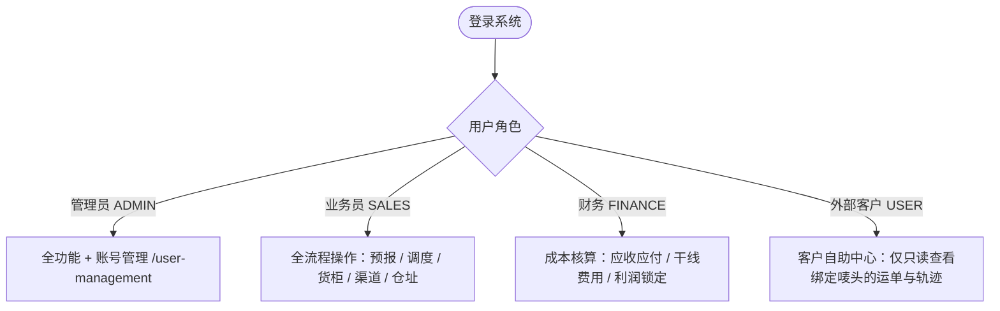

# 万海物流系统 (Global Link Logistics) - V2 使用手册

> 💡 **手册导读**：本手册旨在用**最精炼明了的语言**，手把手教会您如何熟练使用系统。无论是内部操作人员还是外部客户，都能在 3 分钟内掌握核心用法。

---

## 快速导航目录

- [一、30秒了解系统架构与角色](#一30秒了解系统架构与角色)
- [二、新员工快速上手：核心业务 5 步走](#二新员工快速上手核心业务-5-步走)
  - [第 1 步：基础数据配置（起运仓 / 客户唛头 / 渠道）](#第-1-步基础数据配置起运仓--客户唛头--渠道)
  - [第 2 步：极速接单下单（阶段 1：客户预报）](#第-2-步极速接单下单阶段-1客户预报)
  - [第 3 步：仓库实测核量与批量装柜（阶段 2 & 3）](#第-3-步仓库实测核量与批量装柜阶段-2--3)
  - [第 4 步：干线运输、清关与客户签收（阶段 4、5 & 6）](#第-4-步干线运输清关与客户签收阶段-45--6)
  - [第 5 步：空箱归还闭环（整柜业务专属）](#第-5-步空箱归还闭环整柜业务专属)
- [三、三大业务类型录单速查表](#三三大业务类型录单速查表)
  - [1. 海运拼柜 (SEA_LCL)](#1-海运拼柜-sea_lcl)
  - [2. 空运专线 (AIR)](#2-空运专线-air)
  - [3. 海运整柜 (SEA_FCL)](#3-海运整柜-sea_fcl)
- [四、运单全生命周期操作秘籍](#四运单全生命周期操作秘籍)
  - [4.1 在途随时修改海外收件人 & 一键复制派件单](#41-在途随时修改海外收件人--一键复制派件单)
  - [4.2 状态安全回退机制 (Rollback)](#42-状态安全回退机制-rollback)
  - [4.3 单票费用明细与纯利润自动结算](#43-单票费用明细与纯利润自动结算)
  - [4.4 单证凭证集中归档池](#44-单证凭证集中归档池)
- [五、外部客户查单指南（客户门户）](#五外部客户查单指南客户门户)
- [六、用户管理与权限分配（管理员专用）](#六用户管理与权限分配管理员专用)
- [七、高频常见问题与避坑指南 (FAQ)](#七高频常见问题与避坑指南-faq)

---

## 一、30秒了解系统架构与角色

系统根据人员角色分为两大工作界面：

### 核心设计原则：
1. **认唛头不认发件人**：仓库分拣唯一识别客户专属唛头（如 `WH-ZZY-FLB`），输入唛头自动带出一整套档案，不用每次手填收发件人。
2. **两步算钱，实测为准**：
   - 下单时填**预估数据**，系统计算**预估参考价**；
   - 货到仓拿尺量完填**实测数据**，系统**自动覆盖主表生成最终法定结算金额**。
3. **数据严格隔离**：外部客户账号仅能查看自身绑定唛头的运单，**内部底价、服务商渠道与采购成本 100% 自动隐藏脱敏**。

---

## 二、新员工快速上手：核心业务 5 步走

### 第 1 步：基础数据配置（起运仓 / 客户唛头 / 渠道）

在使用系统前，先确认系统中有以下 3 项基础数据：

1. **起运仓集货点 (`/v2/warehouses`)**：
   - 录入广州仓、龙岩仓、义乌仓等仓库地址、收件人和联系电话；
   - 💡 **实用功能**：点击 **「复制送仓指引」**，一键复制标准送仓格式，直接发给供货商微信。
2. **客户档案与唛头 (`/v2/customers`)**：
   - 录入客户唛头代码（如 `WH-ZZY-FLB`）、客户全称、常用起运仓、常用目的港口及默认海外收件人；
   - 支持点击 **「批量导入客户」** 导入 Excel。
3. **渠道与服务商 (`/v2/channels`)**：
   - 分类维护海运散拼专线、空运专线、整柜订舱代理、报关行、清关代理与拖车车队。点击 **★（星标）** 可设为默认推荐渠道。

---

### 第 2 步：极速接单下单（阶段 1：客户预报）

- **入口**：左侧菜单 ➔ **「入库拼箱工作台」(`/v2/inbound`)**
- **操作步骤**：
  1. **选模式**：顶部点击切换 **海运拼柜 (LCL)** / **空运快递 (AIR)** / **海运整柜 (FCL)**；
  2. **输唛头**：输入客户唛头（如 `WH-ZZY-FLB`），系统**瞬间自动带出**起运仓、目的港、常用海外收件人；
  3. **填货物**：填写品名、件数、预估尺寸/重量、应收单价；
  4. **核对利润**：右下角看板实时显示总方数、总应收、总成本和预估利润；
  5. **生成单号**：点击 **「创建并生成预报运单」**，弹窗展示生成的单号（如 `WB202609020001`），点击 **「一键复制单号」** 发给客户。

---

### 第 3 步：仓库实测核量与批量装柜（阶段 2 & 3）

#### 3.1 仓库实测（进入运单详情 ➔ 阶段 2）
- 包裹送到仓库后，点击运单详情的 **「阶段 2：到仓实测」** 卡片；
- 录入仓库实测的**长宽高（cm）** 与**重量（kg）**（若尺寸无变化可直接点击 **「一键带入预报尺寸」**）；
- 点击保存流转至 `已入库 (INBOUND)`；
- 🌟 **系统自动做的事**：按实测尺寸重新计算总体积，**自动覆盖主表总应收金额并锁定结算基准**。

#### 3.2 批量排柜装箱（运单全景调度 `/v2/waybills`）

- 在运单列表勾选多票处于【已入库】状态的散货；
- 点击列表上方出现的 **「批量排柜 (已选 N 票)」** 按钮；
- 弹窗中选择要把它们装进哪一个集装箱（如 `MILU6019768 (广62柜)`）并选定装柜日期；
- 点击确认，多票散货一键绑定货柜，状态流转为 `已装柜 (LOADED)`。

---

### 第 4 步：干线运输、清关与客户签收（阶段 4、5 & 6）

在运单详情页按顺序点击推进：

1. **阶段 4：干线在途 (`IN_TRANSIT`)**：
   - 班轮开船后，点击阶段 4，填入**船名/航次 (必填)**、实际开船日 (ETD)、预计到港日 (ETA) 与提单号 (B/L)，点击流转；
2. **阶段 5：目的港清关 (`DISPATCHING`)**：
   - 抵港清关放行后，填入放行日期与查验状态，上传海关税费水单；
   - ⚠️ 弹窗高亮显示**海外送货地址与电话**，务必复核防漏派；
3. **阶段 6：签收完结 (`DELIVERED`)**：
   - 司机送达客户后，填入**实际签收日期**，上传客户签字的**签收单照片**；
   - 点击确认，运单全流程完结，**财务锁定单票最终毛利**。

---

### 第 5 步：空箱归还闭环（整柜业务专属）

- **入口**：左侧菜单 ➔ **「空箱还柜管理」(`/v2/container-return`)**
- **业务场景**：海运整柜（FCL）客户卸完货后，需将空集装箱归还至船司指定堆场（CY）。
- **操作指南**：
  1. 列表清晰展示所有已卸货货柜的还柜状态：`未完结` ➔ `待还柜` ➔ `还柜中` ➔ `已还柜`；
  2. 调度安排车队还箱，填入**还箱日期**、**还柜堆场名称**及**车队/司机信息**；
  3. 若产生超期费（Detention）或修箱费（Damage），勾选 **「产生额外费用」**，录入金额（自动入账货柜总成本）；
  4. 堆场验收入库后，切换为 `已还柜 (COMPLETED)`，集装箱生命周期正式圆满终结。

---

## 三、三大业务类型录单速查表

| 业务类型 | 标识 | 计量计费基准 | 关键录入字段 | 计费公式 |
| :--- | :--- | :--- | :--- | :--- |
| **海运拼柜** | `SEA_LCL` | **体积 ($m^3$ / CBM)** | 品名、件数、实测长宽高(cm)、单价(元/方) | $\text{总方数} \times \text{单价} + \text{附加杂费}$ |
| **空运专线** | `AIR` | **重量 (kg)** | 品名、件数、实测重量(kg)、单价(元/kg) | $\text{总重量} \times \text{单价} + \text{车费/杂费}$ |
| **海运整柜** | `SEA_FCL` | **集装箱 (20GP/40HQ)** | 起运港口、目的港口、整柜包干协议总报价 | $\text{协议总价} + \text{特殊附加费}$ (散货不拆方) |

---

## 四、运单全生命周期操作秘籍

### 4.1 在途随时修改海外收件人 & 一键复制派件单

- **修改地址**：无论货物在海运中还是在清关，只要客户提出改地址，随时在运单详情卡片点击 **「修改海外收件人」**，保存立即生效；
- **一键复制派件单**：点击 **「复制派件指令」**，直接将标准格式派件文本粘贴发给海外车队司机。

### 4.2 状态安全回退机制 (Rollback)
- **如果点快了或遇上海关查验需要退回上一步**：
  - 直接在横向进度条上点击你想回退到的**前置绿色阶段卡片**（例如从阶段 4 回退到阶段 2）；
  - 确认后状态安全倒退，**之前录过的尺寸、重量、货柜号和费用数据全部完整保留，绝不丢失**。

### 4.3 单票费用明细与纯利润自动结算
- 点击费用卡片中的 **「+ 添加附加杂费」**；
- 录入打木架费、报关费、超期费、派送偏远费等（支持选择应收客户或应付成本）；
- 系统自动实时计算：$\text{纯利润} = \text{总应收} - \text{总应付}$。

### 4.4 单证凭证集中归档池
在单据卡片可分类上传并在线预览：
- `提货/叫车截图` ➔ 仓库提货凭证
- `报关单 / 放行条 / 货柜封条照片` ➔ 口岸报关凭证
- `海运提单 (B/L)` ➔ 班轮提单草本/正本
- `海关缴税水单` ➔ 目的港清关税费水单
- `客户签收单照片` ➔ 客户签字签收回执（完结必备）

---

## 五、外部客户查单指南（客户门户）

如果是货主或外部委托客户登录系统（角色为 `USER`）：

1. **登录账号**：使用管理员为您开通的手机号和密码登录；
2. **极简专属菜单**：
   - 外部客户仅能看到：**「我的运单」**、**「外部轨迹查询」**、**「船舶船讯查询」**；
3. **安全透明与防商业泄密**：
   - 客户仅能看到自己名下唛头的运单；
   - 客户仅能查看应收金额、物流时间轴、实测尺寸和签收单；
   - **内部底价成本、合作船代与服务商渠道 100% 隐藏脱敏**。

---

## 六、用户管理与权限分配（管理员专用）

- **入口**：左侧菜单 ➔ **「用户系统管理」(`/user-management`)**
- **操作步骤**：
  1. 点击 **「新建用户」**，填入姓名、登录手机号和初始密码；
  2. **选择角色**：
     - `ADMIN (管理员)`：全功能最高权限；
     - `SALES (业务员)`：开单、排柜、调度；
     - `FINANCE (财务)`：审核对账、录入干线成本、利润核算；
     - `USER (普通用户/货主)`：**专属客户账号**；
  3. **绑定唛头（关键）**：
     - 当角色选择 `普通用户` 时，系统自动展开「关联客户唛头」选择器；
     - 为该客户勾选其拥有的 1 个或多个唛头（如 `WH-ZZY-FLB`、`WH-10115`）；
     - 绑定后，该客户登录系统只能看到这些唛头名下的货，实现严密的数据隔离。

---

## 七、高频常见问题与避坑速查 (FAQ)

### Q1：录单时找不到某个客户的唛头怎么办？
> **答**：可以直接在输入框手打输入新唛头。但**更推荐**前往「客户档案与唛头」先建好客户档案并填上海外地址，这样下次录单就能 1 秒自动补全。

### Q2：实测方数比客户报的大很多，运费会自动改吗？
> **答**：**会！** 阶段 2 录入实测尺寸保存后，系统立刻以实测方数为准重新算费并更新主表总应收。界面还会用红字标出偏差百分比，方便找客户核对补收差价。

### Q3：集装箱状态为什么无法改为“全部完结”？
> **答**：因为柜子内还有散货运单没有签收！系统有防呆保护：**必须柜内所有散货都到达阶段 6 签收完结后，大货柜才能标记为全部完结**。

### Q4：空运单为什么不能填长宽高？
> **答**：空运国际惯例纯按**计费重量（kg）** 结算。系统已自动精简掉立方算方，填实测公斤数和每公斤单价即可。

### Q5：还空箱超期产生的超期费在哪里记录？
> **答**：在左侧 **「空箱还柜管理」** 找到该柜子，点击编辑，勾选“产生额外费用”，录入费用金额。该笔费用会自动记入该货柜的干线成本账本。

---

*手册制作：万海物流中台产研团队 · 祝您使用愉快！*
