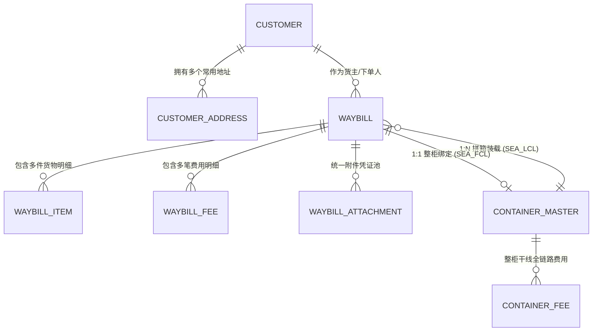

# Global Link 物流系统：数字化架构与业务总览

> 本文档为《Global Link 国际物流系统》全新重构的标准业务与技术设计规范，作为全局唯一事实依据 (Single Source of Truth)。

---

## 🎯 1. 核心定位与设计哲学

系统旨在将原本分散在 Excel 表格中的海运拼柜、空运快递、海运整柜业务进行**标准化、数字化、中心化管理**，解决数据孤岛、费用对账混乱、单据丢失等问题。

### 核心设计原则：
1. **“统一运单头 (Waybill) + 物理载具/货柜 (ContainerMaster)”解耦架构**：
   - 订单逻辑全系统统一（统一单号、统一客户关联、统一地址簿、统一凭证池、统一状态流转）。
   - 物理计量与计费模型按业务场景解耦（海运拼箱按体积 CBM、空运按重量 kg、整柜按集装箱干线费用链）。
2. **增量流转与分阶段录入**：
   - 业务数据随物流节点逐步产生（客户预报 ➔ 仓库实测 ➔ 人工配柜 ➔ 开船在途 ➔ 目的港清关 ➔ 客户签收），支持全生命周期随时编辑与增量补充。
3. **统一附件凭证池**：
   - 摒弃旧系统机械割裂的凭证上传，建立按订单关联的统一凭证池，支持随时追加、替换、预览（叫车图、水单、签收单等）。
4. **灵活杂费与一口价支持**：
   - 支持标准单价计量（方/公斤），同时支持“一口价”与“附加杂费清单（报关费/车费/小费等）”。

---

## 🗺️ 2. 领域模型全景关系图 (ER Diagram)

---

## 📦 3. 三大核心运输业务映射

| 业务类型 | 标识代码 | 计量基准 | 货柜关联方式 | 核心跟踪指标 |
| :--- | :--- | :--- | :--- | :--- |
| **海运拼柜** | `SEA_LCL` | 体积 ($m^3$ / CBM) | 多票拼箱关联同一 `containerId` | 快递单号、件数、尺寸体积、拼箱柜号、海外签收 |
| **空运快递** | `AIR` | 重量 (kg) | 无需关联集装箱 | 快递单号、空运单号 (AWB)、计费重量、起飞到达 |
| **海运整柜** | `SEA_FCL` | 集装箱 (20GP/40HQ等) | 1:1 或 1:N 独占绑定 `ContainerMaster` | 柜号、提单号、订舱/报关/清关渠道、THC/港杂费用 |

---

## 📚 4. 知识库模块导航

- 📦 [01_INBOUND_LCL.md](./01_INBOUND_LCL.md) — **海运拼柜业务标准**（入库、尺寸实测、人工排柜、特殊杂费）
- ✈️ [02_AIR_FREIGHT.md](./02_AIR_FREIGHT.md) — **空运业务标准**（空运单号、重量核算、内部车费拆分）
- 🚢 [03_FCL_CUSTOMS.md](./03_FCL_CUSTOMS.md) — **海运整柜与清关跟踪标准**（集装箱主数据、各港口、渠道商链条）
- 💰 [04_FINANCE_COST.md](./04_FINANCE_COST.md) — **多币种财务结算与成本链**（CNY/PHP/USD汇率、费用子表、毛利计算）
- 📖 [05_DICTIONARY.md](./05_DICTIONARY.md) — **业务名词字典与状态枚举**（唛头规则、港口字典、渠道字典、凭证类型）
- 🗄️ [06_DATA_SCHEMA.md](./06_DATA_SCHEMA.md) — **全新 Prisma 数据表结构定义规范**
- 🔄 [07_LIFECYCLE_AND_TABLES.md](./07_LIFECYCLE_AND_TABLES.md) — **订单全生命周期 6 阶段与数据表使用指南**
- 🛠️ [08_BUSINESS_PRACTICE_AND_PITFALLS.md](./08_BUSINESS_PRACTICE_AND_PITFALLS.md) — **业务实战沉淀、调度工作台与工程避坑指南**
