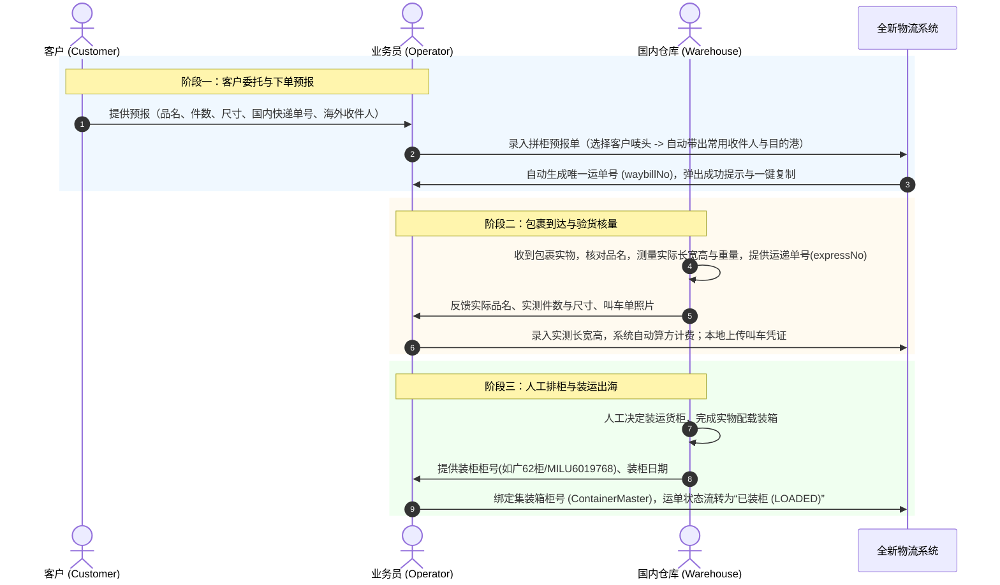

# 业务模块 01：海运拼柜业务标准 (Sea LCL)

> 参考数据源：
> - `万海入库计划表 广州 2026.8.13xlsx.xlsx.xlsx` (Sheet: 广州)
> - `万海入库计划表 龙岩 空运2026.8.13.xlsx` (Sheet: 龙岩海运到货数据)
> - `万海入库计划表 印尼 泰国 马来 2026.8.13.xlsx.xlsx` (Sheet: 其他国家入库数据)

---

## 📌 1. 业务流程全生命周期（3 阶段）

---

## 📋 2. 字段规范与数据结构

### 2.1 运单头信息 (`Waybill`)
- **运单编号 (`waybillNo`)**：系统自动生成全局唯一单号（如 `LCL2608170001`），提交预报单后弹窗展示并支持一键复制保存。
- **业务类型 (`orderType`)**：固定为 `SEA_LCL` (海运拼箱)。
- **客户编码/唛头 (`userMark`)**：如 `WH-ZZY-FLB`、`WH-10115`、`WH-五金`。支持输入联动与模糊检索，选中后从 `Customer` 档案自动回显目的国、港口、海外收件人。
- **起运仓/渠道 (`originWarehouse`)**：义乌仓、龙岩仓、广州仓等。默认留白，通过唛头带出或由业务员选择。
- **目的国 (`destinationCountry`)**：菲律宾、马来西亚、印度尼西亚、泰国、越南等。
- **目的港口 (`destinationPort`)**：马尼拉南港、马尼拉北港、巴生港等。
- **报关通道 (`customsType`)**：普货双清、退税报关、敏感特货、一般贸易买单。
- **承运渠道 (`forwarderChannel`)**：万海自营专线、中外运、天帆东南亚等。系统通过 `ChannelMapping` 级联联动，自动防错屏蔽不合规渠道。
- **关联货柜 (`containerId`)**：**人工手动选择/绑定**。装柜前为空，装柜后绑定具体集装箱记录。
- **航运航次 (`voyageNumber`)**：对应船名航次。
- **运递/专线单号 (`expressNo`)**：如广州表记录的 `FLY100002162` 等，阶段 2 仓库实测核量后填入。
- **国内收件/入库时间 (`inboundDate`)**：货物到达国内仓库日期。
- **海外签收时间 (`signedDate`)**：客户签收日期。
- **运单备注 (`note`)**：如“不报关”、“特货”等。

### 2.2 货物明细清单 (`WaybillItem`，支持 1 票多行)
| 字段列 | 属性 | 说明 |
| :--- | :--- | :--- |
| **序号** | 自动生成 | `itemIndex` (1, 2, 3...) |
| **国内快递单号 (`trackingNumber`)** | 文本 | 国内送仓快递单号（一票多包裹可分行填写） |
| **品名 (`productName`)** | 文本 | 中文商品名称 |
| **数量/件数 (`quantity`)** | 整数 | 包装箱数/件数（默认 1） |
| **长 / 宽 / 高 (`length`, `width`, `height`)** | 浮点数 | 厘米 ($cm$) |
| **应付体积 (`payableVolume`)** | **自动计算** | $\text{件数}\times\text{长}\times\text{宽}\times\text{高} / 1,000,000$ (保留4位小数) |
| **应收体积 (`receivableVolume`)** | 浮点数 | 实际计费体积（默认取应付体积，支持向上微调至两位小数） |
| **单重 / 总重 (`unitWeight` / `totalWeight`)** | 浮点数 | 公斤 ($kg$)，选填 |
| **应收单价 (`receivableUnitPrice`)** | 货币 | 支持 **¥ 人民币** 或 **₱ 比索** (元/CBM) |
| **应付单价 (`payableUnitPrice`)** | 货币 | 支持 **¥ 人民币** 或 **₱ 比索** (元/CBM) |

### 2.3 费用子表 (`WaybillFee`)
针对 Excel 中常见的特例收费与杂费，建立独立的明细记录：
- **费用科目 (`feeName`)**：海运主运费、报关费、国内车费、一口价调整、退税补贴、杂费。
- **收支方向 (`feeDirection`)**：`RECEIVABLE` (应收客户) / `PAYABLE` (应付渠道/成本)。
- **金额 (`amount`)** 与 **币种 (`currency`)**：`CNY` / `PHP` / `USD`。
- **汇率与折合 (`exchangeRate`, `amountInCny`)**：支持汇率自动换算为人民币核算毛利。
- **一口价模式 (`isFixedPrice`)**：若勾选一口价，则直接按固定金额覆盖基础体积单价公式。

### 2.4 统一附件凭证池与本地文件上传 (`WaybillAttachment`)
- 系统支持**本地文件直选与拖拽上传**（图片 JPG/PNG/WEBP、PDF、Excel、Word，单文件最大 20MB），自动在服务端安全存储并生成实时预览。
- 业务员在订单创建、配柜、报关、签收等**全生命周期的任何时间点均可随时追加、查看或替换**：
  - `PICKUP_SCREENSHOT` (叫车/提货截图)
  - `CUSTOMS_SLIP` (海关缴税水单)
  - `SIGN_IMAGE` (海外客户签收单照片)
  - `BILL_OF_LADING` (提单草稿确认件)
  - `CERT_OF_ORIGIN` (产地证 Form E)
  - `OTHER` (其他凭据)
