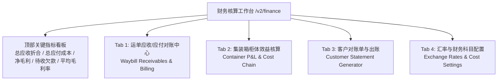
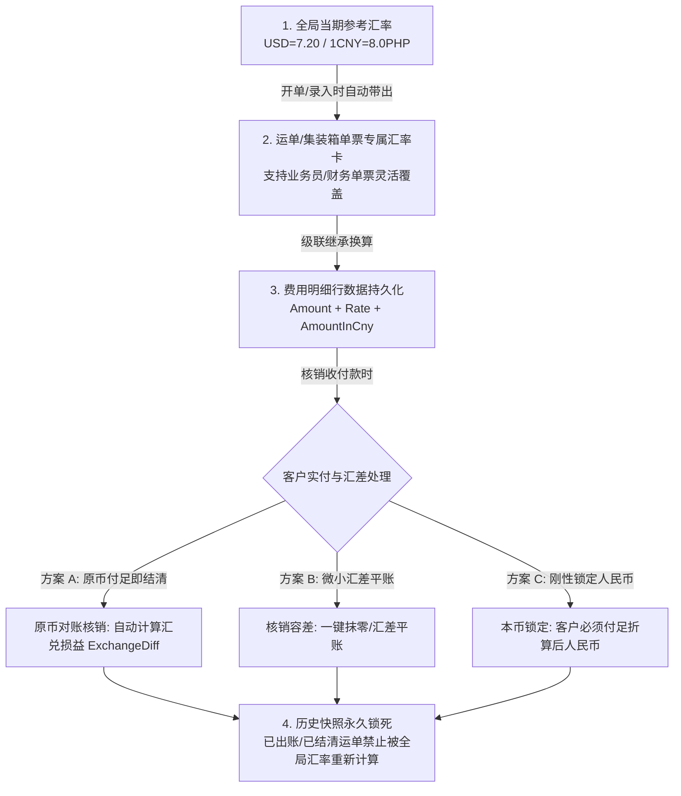

# 业务模块 04：多币种财务结算、核算工作台与汇率成本链 (Finance & Cost Chain)

> 参考数据源与实战沉淀：
> - `整柜信息进度表2026.8.13(1).xlsx`
> - `万海入库计划表 广州 2026.8.13xlsx.xlsx.xlsx`
> - `万海入库计划表 龙岩 空运2026.8.13.xlsx`
> - 财务与业务实战研讨（多币种收付、每单汇率浮动与汇兑损益处理）

---

## 📌 1. 业务概念与多币种收付背景

国际物流业务涉及跨境多环节协同，天然存在 **多币种混合结算 (RMB 人民币、PHP 菲律宾比索、USD 美元)** 与 **细粒度成本项**：

- **人民币 (RMB / CNY)**：国内收发货人主运费结算、国内短驳拖车、国内港杂、出口报关费；
- **菲律宾比索 (PHP / Peso)**：目的港 THC（码头操作费）、超期堆存费、目的港派车小费、海外货主马尼拉现结运费；
- **美元 (USD)**：国际海运庄家/船司订舱纯海运费 (Ocean Freight)。

### 🚨 核心业务痛点：多币种混合收付与“汇率差”难题
在实际运作中，不同客户由于贸易模式与结算主体不同，付款习惯高度离散：
- **混合币种付款**：有的人付比索，有的人付美金，有的人付人民币；甚至同一票货，国内发货人付 RMB，海外收件人到付 PHP；
- **每笔订单汇率动态变化**：不同出运批次、不同客户谈判协议、不同订舱周期的结算汇率互不相同；
- **三重时间差与汇兑损益 (Exchange Gain/Loss)**：
  1. *报价时点汇率*（业务员给客户承诺的参考汇率）；
  2. *费用发生时点汇率*（目的港代理支付港杂/送货时的实际汇率）；
  3. *实收核销时点汇率*（客户 20 天后打款结汇时的实际到账汇率）。

---

## 🏗️ 2. 财务核算工作台功能架构规范 (`/v2/finance`)

财务中台设计为包含 **顶部全局统计看板 + 4 大核心视图 Tab** 的综合核算工作台：

### 2.1 顶部全局财务指标看板 (Financial KPI Summary)
- **总应收账款 (Total Receivables)**：折合 ¥CNY 汇总（附带 PHP 比索原币、USD 原币汇总）；
- **总应付成本 (Total Payables)**：干线成本 + 渠道杂费 + 整柜分段硬成本；
- **综合毛利与毛利率 (Gross Profit & Margin)**：`总毛利 = 总应收 - 总应付`；严格做好除零保护（`receivableAmount > 0.0001`）；
- **待收欠款 / 在途资金 (Uncollected Balance)**：已完成签收但尚未核销结清的运单款项；
- **核算业务总量**：统计当前筛选周期内的运单票数与集装箱出运柜数。

---

### 2.2 Tab 1：运单级应收/应付对账中心 (散货/空运/整柜单票对账)
- **多维筛选**：运输方式 (SEA_LCL / AIR / SEA_FCL)、结算状态 (UNBILLED / BILLED / PAID / PARTIAL)、客户唛头、起运仓/目的国、多节点时间范围 (录单日/入库日/开船日/签收日)；
- **核心数据列**：
  - `运单号 / 唛头 / 业务类型`
  - `实收件数 / 计费方量(CBM) / 计费重量(KG)`
  - `应收原币 & 折合人民币 (receivableAmount)`（支持一口价标示）
  - `应付原币 & 折合人民币 (payableAmount)`（含报关、车费等杂费明细）
  - `单票毛利 (¥) & 毛利率 (%)`（高亮提示负毛利异常单）
  - `水单凭证`（小图标预览付款/转账水单 `PAYMENT_PROOF`）
  - `结算状态 & 经办业务员`
- **核心操作**：
  - 勾选多票运单 ➔ 批量标记“已对账 / 已结清”；
  - 一键导出标准对账 Excel 表格；
  - 展开行内抽屉快捷补录/调整费用科目。

---

### 2.3 Tab 2：集装箱柜体效益核算 (Container P&L & Cost Tracking)
专门解决“单柜实际盈利与各环节成本支出穿透”的核算诉求：
- **柜体基本信息**：柜号、柜型、船名航次、开船日、ETA、散货装载票数、装载总方量；
- **【收入端】**：该集装箱挂载的所有散货运单应收总额合计（$\sum \text{Waybill Receivables}$）；
- **【成本端】**：穿透展开 7 大分段硬成本：
  1. 订舱费 (`BOOKING_FEE`，USD 折合 CNY)
  2. 国内港杂费 (`PORT_SURCHARGE`，CNY)
  3. 国内拖车费 (`TRUCKING_FEE`，CNY)
  4. 出口报关/产地证费 (`CUSTOMS_FEE`，CNY)
  5. 目的港清关费 (`CLEARANCE_FEE`，CNY / PHP)
  6. 码头THC/超期堆存费 (`THC_OVERSTAY_FEE`，PHP 折合 CNY)
  7. 目的港送仓拖车与小费 (`DEST_TRUCKING_FEE` / `HOLIDAY_TIP`，PHP 折合 CNY)
- **【盈亏与单方指标】**：
  - 单柜净毛利 = 总收入 - 各项硬成本汇总；
  - 单柜毛利率 (%)；
  - 平均单方收入（¥/CBM）vs 平均单方成本（¥/CBM）。

---

### 2.4 Tab 3：客户对账单生成与开票管理 (Customer Statement Generator)
- **按客户/唛头聚合**：选择客户唛头与账期区间，一键拉取该客户名下待出账单；
- **对账单双轨明细模板**：
  - 客户抬头、唛头、对账单流水号；
  - 明细清单：品名、件数、实测体积/重量、收费单价、杂费项目、原币金额、约定汇率、折合本币；
  - 银行收款账户信息与付款说明；
- **导出与核销闭环**：
  - 导出标准 Excel 对账单 / 打印 PDF 账单；
  - 上传客户转账水单，批量核销标记结清。

---

## 💱 3. 多币种、每单独立汇率与汇差处理机制

### 3.1 解决“每单汇率不同”——单票专属汇率卡 (Per-Order Rate Card)
1. **自动预填 + 自由单票覆盖**：
   - 系统维护全局参考汇率（如比索 `1 CNY = 8.0 PHP`，美元 `1 USD = 7.20 CNY`）；
   - 创建运单或集装箱时，系统自动预填参考汇率；
   - 业务员/财务若针对该单有特殊约定汇率（如特批 `8.15` 或 `7.85`），只需在单头修改一次，该单名下所有费用明细（运费、杂费、小费）自动继承该汇率，**彻底免除每项费用重复手工计算的负担**。
2. **汇率输入防呆设计（杜绝 8.0 变 0.125 的误乘风险）**：
   - 界面统一采用符合直觉的换算条：
     - 比索：`1 CNY = [ 8.00 ] PHP` ➔ 实时预览 `输入 10,000 PHP ≈ ¥1,250.00 CNY`；
     - 美元：`1 USD = [ 7.20 ] CNY` ➔ 实时预览 `输入 $1,000 USD ≈ ¥7,200.00 CNY`。

### 3.2 解决“汇率差（汇兑损益）”——三大对账核销方案对比

| 方案 | 核心业务逻辑 | 优缺点分析 | 推荐场景 |
| :--- | :--- | :--- | :--- |
| **方案 A：原币对账核销法 (推荐)** | **以原币是否付足作为结清依据**。如应收 ₱10,000 比索，客户实付 ₱10,000 比索即判定 100% 结清。结汇时产生的折合人民币差额自动计入 `exchangeLossGain` 汇兑损益。 | 🟢 流程最顺畅，绝不因为几块钱汇差卡住运单状态；财务总账清晰反映汇率盈亏。 | 目的港比索现结多、海外客户付外币为主。 |
| **方案 B：核销容差与一键平账** | 财务录入银行实收水单时，若实收人民币与应收人民币存在微小汇差（如 ±50 元以内），勾选“汇差平账”，系统自动生成调差抹平账目。 | 🟢 灵活可控，财务人工确认每一笔平账。 | 客户付人民币但因中间行扣费/汇率折算有小额零头差。 |
| **方案 C：本币绝对刚性锁定** | 出具账单时以人民币 (CNY) 为唯一刚性标准，客户无论付何种币种，必须折算补足该人民币金额。 | 🟡 风险全由客户承担，但容易因几分钱/几块钱差额导致订单长期处于欠款状态。 | 国内货主月结人民币大客户。 |

### 3.3 历史账目防篡改机制（Snapshot Locking 铁律）
- **持久化双字段存储**：所有费用表一律保留 `amount` (原币)、`currency` (币种)、`exchangeRate` (汇率)、`amountInCny` (折合人民币)；
- **锁汇不可逆性**：一旦运单或集装箱进入 `BILLED (已出账)` 或 `PAID (已结清)` 状态，`amountInCny` 与汇率快照永久固化，严禁随全局汇率变动被重新触发重算，确保历史财务报表绝对真实可信。

---

## 📋 4. 待与业务员对接确认的细节清单 (Pending Alignments)

在正式落地开发前，建议与业务团队就以下几点进行最终对齐：

1. **客户结算币种常态分布**：
   - 统计当前存量客户中，付比索（PHP）、付美金（USD）、付人民币（CNY）的具体占比及结算场景（如：哪类客户允许马尼拉现结比索？哪类客户必须国内付人民币？）。
2. **汇差承担与平账规则**：
   - 海外客户付比索时，汇率波动产生的汇差是由货代公司内部消化（方案 A 原币核销计入汇兑损益），还是要求向客户二次追收/退款？
3. **单票汇率录入节点与责任人**：
   - 单票约定的结算汇率由**录单业务员在开单时确定**，还是由**财务在出账核算时统一审核复核**？
4. **收款方式与水单分类**：
   - 支持的收款通道（如国内对公账户、国内对私支付宝/微信、菲律宾 BDO / BPI 银行转账、GCash 等）字典定义。
