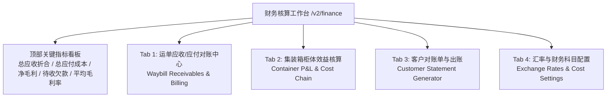
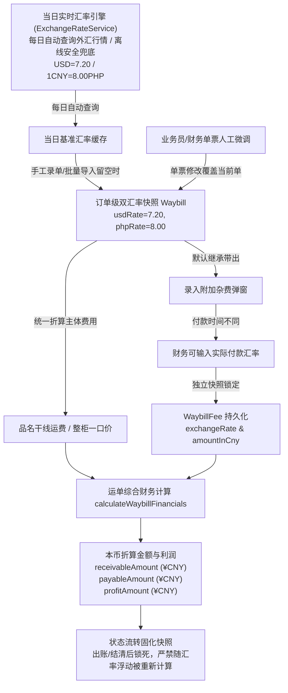

# 业务模块 04：多币种财务结算、核算工作台与汇率成本链 (Finance & Cost Chain)

> 参考数据源与实战沉淀：
> - `整柜信息进度表2026.8.13(1).xlsx`
> - `万海入库计划表 广州 2026.8.13xlsx.xlsx.xlsx`
> - `万海入库计划表 龙岩 空运2026.8.13.xlsx`
> - 财务与业务实战研讨（多币种收付、每单汇率浮动、杂费实付汇率与汇兑损益处理）

---

## 📌 1. 业务概念与多币种收付背景

国际物流业务涉及跨境多环节协同，天然存在 **多币种混合结算 (RMB 人民币、PHP 菲律宾比索、USD 美元)** 与 **细粒度成本项**：

- **人民币 (RMB / CNY)**：国内收发货人主运费结算、国内短驳拖车、国内港杂、出口报关费；
- **菲律宾比索 (PHP / Peso)**：目的港 THC（码头操作费）、超期堆存费、目的港派车小费、海外货主马尼拉现结运费；
- **美元 (USD)**：国际海运庄家/船司订舱纯海运费 (Ocean Freight)。

### 🚨 核心业务痛点：多币种混合收付与“汇率差”难题
在实际运作中，不同客户由于贸易模式与结算主体不同，付款习惯高度离散：
- **混合币种付款**：有的人付比索，有的人付美金，有的人付人民币；甚至同一票货，国内发货人付 RMB，海外收件人到付 PHP；
- **每笔订单汇率动态变化**：不同出运批次、不同客户谈判协议、不同订舱周期的结算汇率互不相同；
- **多重时间差与汇兑损益 (Exchange Gain/Loss)**：
  1. *报价与开单时点*（业务员给客户承诺的单票基准汇率）；
  2. *杂费实际支付时点*（目的港代理在抵港后 1~2 周支付清关/超期柜租时的实际外汇牌价）；
  3. *实收核销时点*（客户 20 天后打款结汇时的实际到账汇率）。

---

## 🏗️ 2. 财务核算工作台功能架构规范 (`/v2/finance`)

财务中台设计为包含 **顶部全局统计看板 + 4 大核心视图 Tab** 的综合核算工作台：

### 2.1 顶部全局财务指标看板 (Financial KPI Summary)
- **总应收账款 (Total Receivables)**：折合 ¥CNY 汇总（附带 PHP 比索原币、USD 原币汇总）；
- **总应付成本 (Total Payables)**：干线成本 + 渠道杂费 + 整柜分段硬成本；
- **综合毛利与毛利率 (Gross Profit & Margin)**：`总毛利 = 总应收 - 总应付`；严格做好除零保护（`receivableAmount > 0.0001`）；
- **待收欠款 / 在途资金 (Uncollected Balance)**：已完成签收但尚未核销结清的运单款项；
- **核算业务总量**：统计当前筛选周期内的运单票数与集装箱柜数。

### 2.2 4 大核心视图 Tab 规范
- **Tab 1: 运单对账与出账明细**：支持多维度过滤（按客户唛头、按出运渠道、按核销状态），直观查看每单原币总额、折合人民币金额及单票毛利；
- **Tab 2: 集装箱柜体效益核算**：聚合柜内所有运单的应收总和，扣除海运费、港杂费、拖车费等，核算单柜毛利；
- **Tab 3: 客户账单生成器**：按客户一键生成账单明细，原币与折合双轨并存，支持导出 Excel 与打印 PDF；
- **Tab 4: 汇率与财务配置**：提供当日实时汇率看板与各费用科目字典维护。

---

## 💱 3. 订单级统一双汇率与多币种利润核算机制 (Per-Order Dual Rate Architecture)

### 3.1 订单级双汇率快照架构 (Per-Order Dual Exchange Rate Snapshot)
在国际多币种物流场景中，每项品名明细单独配置汇率极其繁琐且易错，系统确立以下标准：
1. **订单主体统一绑定双汇率**：
   - 运单主表 (`Waybill`) 统一持有两个核心汇率快照字段：
     - `usdRate`（美金汇率，如 `7.20`，即 1 USD = 7.20 CNY）；
     - `phpRate`（比索汇率，如 `8.00`，即 1 CNY = 8.00 PHP）。
   - **废止明细级独立汇率**：货物品名明细行（`WaybillItem`）只需自由选择结算币种（CNY / PHP / USD）并录入原币单价，不再单独配置和维护汇率；
   - **整柜一口价纯粹走单票汇率**：整柜海运一口价金额按运单选定的整柜报价币种（`settlementCurrency`），直接采用运单的 `usdRate` 或 `phpRate` 换算为人民币，不再设置独立的“一口价汇率”。

### 3.2 贵币计价法统一折算公式
任何原币金额折算人民币 (CNY) 严格遵循外汇交易贵币计价法：
- **USD（美元，美元为贵币）**：
  $$\text{折合人民币} = \text{原币金额} \times \text{usdRate}$$
- **PHP（比索，人民币为贵币）**：
  $$\text{折合人民币} = \text{原币金额} \div \text{phpRate}$$
- **CNY（人民币）**：
  $$\text{折合人民币} = \text{原币金额}$$
- **单票毛利核算公式**：
  $$\text{单票毛利 (¥CNY)} = \text{折合总应收 (receivableAmount)} - \text{折合总应付成本 (payableAmount)}$$
  彻底杜绝跨币种直接相减导致的虚假利润。

### 3.3 附加杂费 (WaybillFee) 汇率生命周期与实付汇率覆盖规范
由于各类杂费的实际支付时间可能与开单相隔数周，牌价变动明显，系统确立**“默认继承、允许覆盖、快照锁定”**三阶段生命周期：
1. **初始建单阶段 (Excel 导入 / 手工建单)**：
   - 随单录入的拖车费、订舱费等杂费，直接继承单票录入的 `usdRate` / `phpRate` 自动折算并记录初始快照，无需人工逐笔输入；
2. **后期追加与实付阶段 (运单详情页录入附加杂费)**：
   - 当在运单详情页录入附加杂费并选择币种为 `USD` 或 `PHP` 时，弹窗**自动预填**该运单当前的单票汇率作为参考基准；
   - **支持单笔人工修改**：若该笔杂费是到港后两周才支付的超期柜租或查验费，操作人员可直接修改为实际付款当天的实付汇率；
   - 界面实时联动根据贵币公式计算并预览 `折合人民币: ¥ xxx.xx`；
3. **入库独立快照锁定 (Snapshot Protection)**：
   - 附加杂费一旦提交入库，其记录中的 `exchangeRate` 与 `amountInCny` 即形成**永久独立快照**；
   - 运单后续即使重新微调了单票的基准 `usdRate` 或 `phpRate`，已付款杂费的历史实际人民币成本也**绝对不会被篡改**，精准保护财务真实账目。

### 3.4 当日实时汇率自动化与接口异常强报错机制（严禁静默默认值兜底）
1. **系统自动获取当日汇率**：
   - 系统内置汇率自动获取服务（`ExchangeRateService`），每日自动连接外汇接口查询基准外汇行情并缓存；
   - 提供后端查询接口 `/api/v2/finance/exchange-rate/today`。
2. **严禁硬编码静默兜底（财务风控铁律）**：
   - 若外汇接口断网、超时或异常，**绝对严禁使用固定默认值（如 7.20 / 8.00）静默兜底**；
   - 接口获取失败时系统必须**立即阻断并明确报错**，强制要求操作员/财务在 Excel 表格或开单界面**手动录入实际单票汇率**，从根源杜绝因静默记错汇率导致的大额汇兑亏损。
3. **单票人工录入与微调（仅对当前单生效）**：
   - 手工录单或批量导入时，优先采用业务员/财务填写的单票汇率；
   - 留空时自动尝试拉取当日最新实时牌价；若拉取失败则强阻断并提示在表格中补充；
   - **坚决不设月度默认汇率**：不同订单出运与结汇时间离散，统一月度默认极易与实际行情脱节引发亏损，因此坚持“当日实时参考 + 单票手工微调 + 失败强制人工录入”模式。

### 3.5 历史账目防篡改机制（Snapshot Locking 铁律）
- **持久化双轨存储**：订单主表保存 `rawReceivableAmount` (原币)、`settlementCurrency` (原币种)、`usdRate`、`phpRate`、`receivableAmount` (折合CNY)、`payableAmount` (折合CNY)、`profitAmount` (折合CNY)；
- **锁汇不可逆性**：一旦运单进入 `BILLED (已出账)` 或 `PAID (已结清)` 状态，所有折合人民币金额及汇率快照永久固化，严禁被后续全局汇率波动重新触发重算；
- **导出与核销闭环**：
  - 导出标准 Excel 对账单 / 打印 PDF 账单；
  - 上传客户转账水单，批量核销标记结清。

---

## 📋 4. 待与业务员对接确认的细节清单 (Pending Alignments)

在后续业务运作中，建议与业务团队就以下几点保持对齐：
1. **客户结算币种常态分布**：统计付比索（PHP）、付美金（USD）、付人民币（CNY）的具体占比及到付现结场景；
2. **汇差承担与平账规则**：海外客户付比索时，汇率波动产生的汇差内部消化核销计入汇兑损益还是二次对账追收；
3. **单票汇率录入节点与责任人**：单票约定的结算汇率由录单业务员在开单时确定，还是由财务在出账核算时统一审核复核；
4. **收款方式与水单分类**：支持的收款通道（国内公私账、菲律宾 BDO/BPI 银行转账、GCash 等）。
