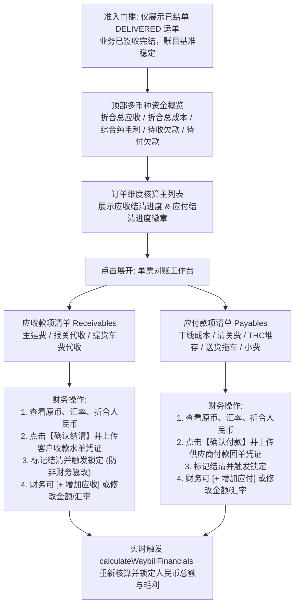
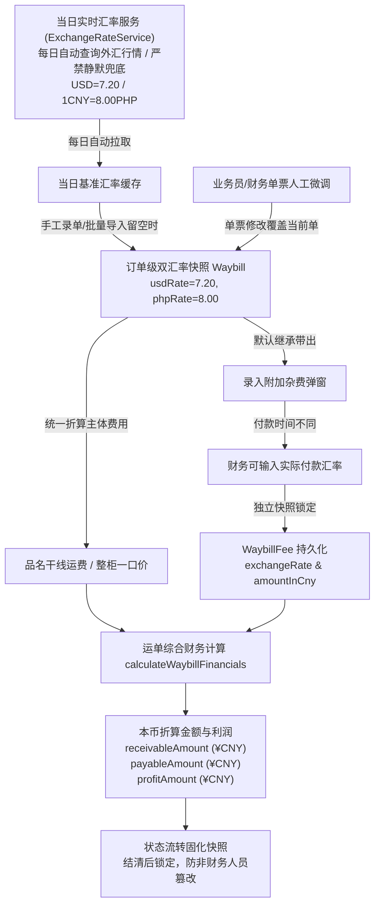

# 业务模块 04：多币种财务结算、核算工作台与汇率成本链 (Finance & Cost Chain)

> 参考数据源与实战沉淀：
> - `整柜信息进度表2026.8.13(1).xlsx`
> - `万海入库计划表 广州 2026.8.13xlsx.xlsx.xlsx`
> - `万海入库计划表 龙岩 空运2026.8.13.xlsx`
> - 财务与业务实战研讨（订单维度细颗粒度对账、多币种实收实付结清、凭证上传与锁定制）

---

## 📌 1. 业务概念与多币种收付背景

国际物流业务涉及跨境多环节协同，天然存在 **多币种混合结算 (RMB 人民币、PHP 菲律宾比索、USD 美元)** 与 **细粒度成本项**：

- **人民币 (RMB / CNY)**：国内收发货人主运费结算、国内短驳拖车、国内港杂、出口报关费；
- **菲律宾比索 (PHP / Peso)**：目的港 THC（码头操作费）、超期堆存费、目的港派车小费、海外货主马尼拉现结运费；
- **美元 (USD)**：国际海运庄家/船司订舱纯海运费 (Ocean Freight)。

### 🚨 核心业务痛点与核算原则
在实际运作中，不同客户由于贸易模式与结算主体不同，付款习惯高度离散：
- **混合币种实收实付**：有的人付比索，有的人付美金，有的人付人民币；甚至同一票货，国内发货人付 RMB，海外收件人到付 PHP；
- **核算原则**：
  1. **对账结清以实收实付的原币为准**（原币付足即认为该笔款项已结清）；
  2. **总账与利润统一核算为人民币 (¥CNY)**（遵循外汇贵币计价法统一折算对冲，得出真实人民币纯毛利）；
  3. **订单维度逐条确认**：业务员录入的每一项应收款、每一项应付款，财务逐条审核并点击“确认结清”，支持上传收付款凭证；
  4. **已结单准入**：财务对账池仅针对**已结单（`DELIVERED` 签收完结）**的订单进行核算，避免运输在途频繁改单干扰账目。

---

## 🏗️ 2. 财务核算工作台功能架构规范 (`/v2/finance`)

经实战研讨与精简聚焦，一期财务工作台坚决摒弃冗余的“客户大资金池分摊”与“集装箱独立结清”等过度设计，**彻底聚焦于「订单维度 + 款项细颗粒度逐笔结清」**：

### 2.1 顶部全局财务指标看板 (Financial KPI Summary)
直观呈现当前已结单业务的资金健康度（折合人民币本位币 + 多币种原币汇总）：
- 💰 **已结单总应收**：折合 ¥CNY 汇总（原币按贵币计价法折算）；
- 📉 **已结单总应付**：干线成本与分段硬成本折合 ¥CNY 汇总；
- 📈 **综合纯毛利与毛利率**：折合 ¥CNY 净毛利，毛利率百分比（严格做好除零保护：`receivableAmount > 0.0001`）；
- ⏳ **待收款总额 (未结清应收)**：订单名下所有尚未收齐结清的款项折合 ¥CNY 汇总；
- ⏳ **待付款总额 (未结清应付)**：订单名下所有尚未支付结清的成本折合 ¥CNY 汇总。

---

### 2.2 订单维度核算主列表规范 (Main Table)
- **准入门槛与筛选器**：
  - **订单状态**：默认勾选已结单（`DELIVERED`），可切换查看历史所有订单；
  - **结清状态快捷过滤**：全部 / 存在未结收款 / 存在未结付款 / 收付全结清；
  - **运输方式**：全部 / 海运拼箱 (SEA_LCL) / 空运专线 (AIR) / 海运整柜 (SEA_FCL)；
  - **综合搜索**：运单号、客户唛头、集装箱柜号、海运提单号；
  - **时间范围**：签收完结日、出运日、入库日。
- **主表关键展示列**：
  - `运单号 / 运输方式 / 客户唛头`
  - `实收件数 / 计费方量(CBM) / 计费重量(KG)`
  - **应收结清进度徽章**：如 `2/3 项已结`（存在未结收款显示黄色，全结清显示翠绿色）；
  - **应付结清进度徽章**：如 `1/2 项已结`（清晰反映对外付款进度）；
  - `折合总应收(¥) / 折合总应付(¥) / 净毛利(¥) / 毛利率(%)`（负毛利红色高亮）；
  - `签收日期`
  - **操作**：【核算明细 / 对账】入口。

---

### 2.3 单票对账抽屉 / 弹窗 (Line-Item Reconciliation Drawer)
点击某订单后滑出，清晰并列呈现**应收**与**应付**两组独立款项清单：

#### ① 应收款项清单 (Receivables)
- 包含：主运费项（原币及折算）、一口价协议包干款、代收国内车费、代收报关费等；
- 每一条明细展示：`[款项名称] [币种] [原币金额] [单票汇率] [折合人民币] [结清状态与操作]`；
- **结清核销交互（轻量化作业）**：
  - 未结清 ➔ 点击 **【确认结清】**：弹出极简确认框，选择收款方式（如银行对公、菲律宾 BDO、微信支付宝、现金）并填写银行流水摘要备注；
  - **凭证防漏提醒机制**：结清弹窗内不设重复上传入口，而是轻量校验本订单下方凭证池：
    - 若订单已归档凭证：提示 *“✓ 本单已归档 X 份收付款凭证，可直接确认结清”*；
    - 若订单暂无凭证：提示 *“⚠️ 提示：本订单暂未上传任何收付款凭证，建议先在下方凭证区上传水单”*，财务确认后仍可结清；
  - 已结清 ➔ 显示绿底锁定标签 `已结清`（含结清方式与备注）；
  - **财务反结清权限**：仅财务主管（`FINANCE` 或 `ADMIN`）可执行【撤销结清】。
- **财务调账权限**：财务有权点击 **`+ 添加应收款项`**，或在未结清时修改原币金额与汇率。

#### ② 应付款项清单 (Payables)
- 包含：干线海运/空运成本、出口报关费、国内拖车费、目的港清关费、码头THC/超期堆存费、送货拖车与派送小费等；
- 每一条明细支持财务逐笔点击 **【确认付款】**，记录付款方式与出纳回单流水备注，标记结清并记录操作人；
- 财务可点击 **`+ 添加应付款项`**，或修改未结清成本金额与汇率。

#### ③ 订单级统一收付款凭证与单据图文归档池 (Order-Level Voucher Pool)
- **业务定性**：真实物流收付款中，一张网银水单常常同时结清主运费和附加费（一单多费同水单），或者分批多张水单支付一笔费用。因此，**收付款凭证坚决绑定在订单维度 (`WaybillAttachment`)，严禁强行与单个费用条目死绑定**；
- **数据结构与归属**：统一存储于 `WaybillAttachment` 表，类型固定为 `PAYMENT_PROOF`（收付款凭证水单）；废除并清理旧逻辑引入的条目级冗余字段 `freightVoucherUrl` 与 `WaybillFee.voucherUrl`；
- **交互与功能规范**：
  - 在抽屉下方常驻「统一收付款凭证与单据图文归档」区域；
  - **支持多选批量上传**（`multiple` 拖拽或选择多张图片/PDF）；
  - **凭证分类默认选中「其他」，支持财务手动输入自定义分类名称**：如“送货签收单”、“现场破损拍照”、“装柜过磅单”等，系统自动将自定义名称作为标签提取展示；
  - **支持凭证自定义重命名/文件描述**（财务可标注例如“主运费网银水单”、“THC码头费发票”）；
  - 支持全屏大图预览 (Lightbox) 与财务删除凭证。

#### ④ 财务增改实时重算联动
- 任何款项的增加、修改或删除，后台自动调用 `calculateWaybillFinancials` 重新精确计算该运单的 `receivableAmount`、`payableAmount` 与 `profitAmount`，时刻保持账目与利润绝对精准。

---

## 💱 3. 订单级统一双汇率与多币种利润核算机制

### 3.1 订单级双汇率快照架构
- 运单主表 (`Waybill`) 统一持有两个核心汇率快照字段：`usdRate`（如 `7.20`）与 `phpRate`（如 `8.00`）；
- 货物品名明细行（`WaybillItem`）只需自由选择结算币种（CNY / PHP / USD）并录入原币单价；
- 整柜一口价直接采用运单的 `usdRate` 或 `phpRate` 换算为人民币。

### 3.2 贵币计价法统一折算公式
- **USD（美元，美元为贵币）**：
  $$\text{折合人民币} = \text{原币金额} \times \text{usdRate}$$
- **PHP（比索，人民币为贵币）**：
  $$\text{折合人民币} = \text{原币金额} \div \text{phpRate}$$
- **CNY（人民币）**：
  $$\text{折合人民币} = \text{原币金额}$$
- **单票纯毛利公式**：
  $$\text{单票毛利 (¥CNY)} = \text{折合总应收 (receivableAmount)} - \text{折合总应付成本 (payableAmount)}$$

### 3.3 附加杂费与凭证快照锁定规范 (Snapshot & Anti-Tamper)
- 附加杂费录入时默认继承单票汇率，同时允许财务录入到港后实际支付的牌价；
- **结清锁定铁律**：款项一旦被财务确认结清（`isPaid = true`），该条目及其关联合同凭证立刻被系统锁定，普通业务员严禁修改和删除。

---

## 📋 4. 后续迭代储备与技术备忘 (Future Iterations Backlog)

本次一期开发明确**暂不引入**以下复杂逻辑，作为后续版本备忘储备：
1. **大额合并打款跨单拆分冲销（如 50,000 比索冲平 1 个半订单）**：一期由财务线下核算并对已付足单票点击结清，尾款单票通过调账补差或后续二期上线客户资金池冲账系统；
2. **客户维度资金总账**：一期以订单维度为核心，二期再视客户月结规模增加客户资金对账账户；
3. **集装箱独立结清**：海运整柜费用直接在整柜运单本身名下进行收支结清，集装箱仅作为物理配载与时效跟踪载体，不单设独立的财务结清流程。
