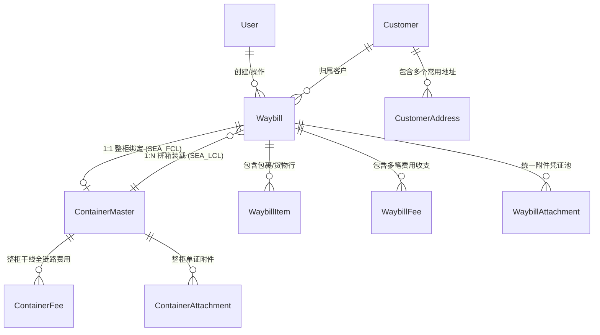

# 数据架构标准：全新 Prisma Schema 设计规范 (V2)

> 本规范定义重构后的全新数据库模型，完全解耦旧代码，作为后端数据库构建的基础。

---

## 🏛️ 模型总览



---

## 📄 Prisma Schema 结构定义

```prisma
// ==========================================
// 1. 用户与认证 (详见 11_USER_ROLES_AND_MARKS.md)
// ==========================================
model User {
  id            String       @id @default(uuid())
  phone         String       @unique             // 登录手机号
  name          String                           // 用户姓名 / 客户名称
  passwordHash  String
  userRole      UserRoleEnum @default(USER)       // ADMIN | SALES | FINANCE | USER
  shippingMarks String[]     @default([])        // 普通用户关联的唛头列表 (如 ["WH-ZZY-FLB", "WH-10115"])
  createdAt     DateTime     @default(now())
  updatedAt     DateTime     @updatedAt
  deletedAt     DateTime?

  waybills      Waybill[]    @relation("UserWaybills")
}

enum UserRoleEnum {
  ADMIN       // 超级管理员
  SALES       // 业务员/调度
  FINANCE     // 财务会计
  USER        // 普通客户
}

// ==========================================
// 2. 客户档案与常用地址簿
// ==========================================
model Customer {
  id                 String            @id @default(uuid())
  clientCode         String            @unique // 客户编码/唛头 (如 WH-ZZY-FLB, WH-10096)
  name               String            // 客户名称/企业名
  phone              String?
  email              String?
  company            String?
  destinationCountry String?           // 常用目的国
  destinationPort    String?           // 常用目的港
  defaultWarehouse   String?           // 常用起运仓 (广州/龙岩/义乌)
  note               String?
  createdAt          DateTime          @default(now())
  updatedAt          DateTime          @updatedAt

  addresses          CustomerAddress[]
  waybills           Waybill[]
}

model CustomerAddress {
  id           String        @id @default(uuid())
  customerId   String
  addressType  AddressType   @default(OVERSEAS_RECIPIENT) // DOMESTIC_SENDER | OVERSEAS_RECIPIENT
  name         String        // 联系人姓名
  phone        String        // 联系电话
  company      String?       // 公司名称
  country      String?       // 国家
  region       String?       // 省/市/地区
  address      String        // 详细地址
  isDefault    Boolean       @default(false)
  createdAt    DateTime      @default(now())
  updatedAt    DateTime      @updatedAt

  customer     Customer      @relation(fields: [customerId], references: [id], onDelete: Cascade)

  @@index([customerId, addressType, isDefault])
}

enum AddressType {
  DOMESTIC_SENDER       // 国内寄件/送仓
  OVERSEAS_RECIPIENT    // 海外收件人
}

// ==========================================
// 3. 运单总表 (Waybill - 覆盖拼柜/空运/整柜客户委托)
// ==========================================
model Waybill {
  id                 String            @id @default(uuid())
  waybillNo          String            @unique // 系统运单号
  orderType          ShipmentType                // SEA_LCL | AIR | SEA_FCL | LAND
  status             WaybillStatus     @default(DRAFT)
  
  // 客户与基础信息
  customerId         String?
  userMark           String            // 客户编码/唛头镜像
  operatorId         String?           // 录入/经办业务员
  originWarehouse    String?           // 起运仓/渠道 (广州/龙岩/义乌等)
  destinationCountry String            // 目的国 (菲律宾/印尼/泰国等)
  destinationPort    String?           // 目的港口 (马尼拉南港/北港等)
  expressNo          String?           // 运递单号/专线单号 (如 FLY100002162)
  customsType        String?           // 报关/货品通道 (如 普货双清 / 退税报关 / 敏感特货)
  forwarderChannel   String?           // 承运服务商/同行外发渠道 (如 自营专线 / 中外运 / 菲通 / 天帆)
  voyageNumber       String?           // 船名/航次 (海运拼箱用)
  airWaybillNo       String?           // 空运单号 AWB (空运专用)
  note               String?           // 订单备注

  // 地址快照 (创建时从客户地址簿复制，支持随时微调)
  recipientName      String?
  recipientPhone     String?
  recipientCompany   String?
  recipientAddress   String?
  recipientRegion    String?

  overseasName       String?
  overseasPhone      String?
  overseasCompany    String?
  overseasAddress    String?
  overseasRegion     String?

  // 关键时间节点
  inboundDate        DateTime?         // 国内入库时间
  loadingDate        DateTime?         // 装柜/起飞时间
  sailingDate        DateTime?         // 开船时间
  eta                DateTime?         // 预计到港时间
  clearanceDate      DateTime?         // 清关完成时间
  signedDate         DateTime?         // 海外签收时间

  // 关联物理集装箱 (海运拼箱为 N:1 挂载；整柜为 1:1 绑定)
  containerId        String?
  containerMaster    ContainerMaster?  @relation("ContainerWaybills", fields: [containerId], references: [id])

  // 财务汇总缓存
  totalPieces        Int               @default(0)
  totalPayableCbm    Decimal?          @db.Decimal(12, 4)
  totalReceivableCbm Decimal?          @db.Decimal(12, 4)
  totalWeightKg      Decimal?          @db.Decimal(12, 3)
  receivableAmount   Decimal?          @db.Decimal(12, 2)
  payableAmount      Decimal?          @db.Decimal(12, 2)
  profitAmount       Decimal?          @db.Decimal(12, 2)
  settlementCurrency CurrencyType      @default(CNY)
  isFixedPrice       Boolean           @default(false) // 是否一口价

  createdAt          DateTime          @default(now())
  updatedAt          DateTime          @updatedAt

  customer           Customer?         @relation(fields: [customerId], references: [id])
  operator           User?             @relation("UserWaybills", fields: [operatorId], references: [id])
  items              WaybillItem[]
  fees               WaybillFee[]
  attachments        WaybillAttachment[]

  @@index([orderType, status, createdAt(sort: Desc)])
  @@index([userMark])
  @@index([containerId])
}

enum ShipmentType {
  SEA_LCL     // 海运拼柜
  AIR         // 空运快递
  SEA_FCL     // 海运整柜
  LAND        // 陆运
}

enum WaybillStatus {
  DRAFT       // 草稿/已预报
  INBOUND     // 已入库/已核量
  LOADED      // 已装柜/已配载
  IN_TRANSIT  // 运输在途/开船/起飞
  CUSTOMS     // 目的港清关中
  DISPATCHING // 海外派送中/拆箱
  DELIVERED   // 已签收完成
  CANCELLED   // 已取消
}

enum CurrencyType {
  CNY
  PHP
  USD
}

// ==========================================
// 4. 货物明细清单 (WaybillItem)
// ==========================================
model WaybillItem {
  id                 String       @id @default(uuid())
  waybillId          String
  itemIndex          Int          @default(1)
  trackingNumber     String?      // 国内送仓快递单号
  productName        String       // 中文品名
  quantity           Int          @default(1)
  
  // 尺寸与体积计算 (海运核心)
  length             Decimal?     @db.Decimal(8, 2) // cm
  width              Decimal?     @db.Decimal(8, 2) // cm
  height             Decimal?     @db.Decimal(8, 2) // cm
  payableVolume      Decimal?     @db.Decimal(10, 4) // 自动算得体积 m³
  receivableVolume   Decimal?     @db.Decimal(10, 4) // 计费体积 m³
  
  // 重量 (空运核心)
  unitWeight         Decimal?     @db.Decimal(10, 3) // kg
  totalWeight        Decimal?     @db.Decimal(10, 3) // kg

  // 单价
  receivableCurrency CurrencyType @default(CNY)
  receivableUnitPrice Decimal?    @db.Decimal(10, 2) // 应收单价 (元/方 或 元/kg)
  payableCurrency    CurrencyType @default(CNY)
  payableUnitPrice   Decimal?     @db.Decimal(10, 2) // 应付单价

  createdAt          DateTime     @default(now())
  updatedAt          DateTime     @updatedAt

  waybill            Waybill      @relation(fields: [waybillId], references: [id], onDelete: Cascade)

  @@index([waybillId])
  @@index([trackingNumber])
}

// ==========================================
// 5. 运单费用与杂费清单 (WaybillFee)
// ==========================================
model WaybillFee {
  id                 String       @id @default(uuid())
  waybillId          String
  feeName            String       // 费用科目 (如海运费/报关费/国内车费/一口价补差)
  feeDirection       FeeDirection // RECEIVABLE (应收) | PAYABLE (应付)
  amount             Decimal      @db.Decimal(10, 2)
  currency           CurrencyType @default(CNY)
  exchangeRate       Decimal      @default(1.0) @db.Decimal(8, 4) // 折算人民币汇率
  amountInCny        Decimal      @db.Decimal(10, 2)              // 折合人民币
  isPaid             Boolean      @default(false)
  paidAt             DateTime?
  note               String?
  createdAt          DateTime     @default(now())

  waybill            Waybill      @relation(fields: [waybillId], references: [id], onDelete: Cascade)

  @@index([waybillId, feeDirection])
}

enum FeeDirection {
  RECEIVABLE // 应收客户
  PAYABLE    // 应付成本
}

// ==========================================
// 6. 统一附件凭证池 (WaybillAttachment)
// ==========================================
model WaybillAttachment {
  id                 String          @id @default(uuid())
  waybillId          String
  attachmentType     AttachmentType  @default(OTHER)
  fileUrl            String
  fileName           String?
  fileSize           Int?
  fileType           String?         // image/jpeg, application/pdf 等
  uploadedAt         DateTime        @default(now())

  waybill            Waybill         @relation(fields: [waybillId], references: [id], onDelete: Cascade)

  @@index([waybillId, attachmentType])
}

enum AttachmentType {
  PICKUP_SCREENSHOT // 叫车送货截图
  CUSTOMS_SLIP      // 报关费水单
  SIGN_IMAGE        // 签收图片/回执
  BILL_OF_LADING    // 提单草稿
  CERT_OF_ORIGIN    // 产地证
  PAYMENT_PROOF     // 客户付款凭证
  OTHER             // 其他
}

// ==========================================
// 7. 集装箱整柜与航运干线 (ContainerMaster)
// ==========================================
model ContainerMaster {
  id                 String          @id @default(uuid())
  containerNo        String          @unique // 集装箱柜号 (如 MILU6019768 / 广62柜)
  containerType      String?         // 20GP | 40GP | 40HQ | 45HQ
  blNumber           String?         // 提单号 (B/L)
  carrier            String?         // 船司 (如中远海运/万海/马士基)
  vesselVoyage       String?         // 船名/航次
  mmsi               String?         // 船舶 MMSI 识别码 (用于船讯网 AIS 联动)
  imo                String?         // 船舶 IMO 编号
  
  // 航线与港口
  originPort         String?         // 起运港口 (厦门港/天津港/南沙港)
  destinationPort    String?         // 清关目的港 (马尼拉南港/北港/巴生港)
  
  // 渠道链条
  bookingChannel     String?         // 订舱渠道 (如优尼科)
  customsChannel     String?         // 报关渠道 (如中外运)
  clearanceChannel   String?         // 清关渠道 (如泉州万海-渠道5)
  truckingChannel    String?         // 拖车渠道

  // 时间节点
  loadingDate        DateTime?       // 装柜时间
  sailingDate        DateTime?       // 开船时间 (ETD)
  eta                DateTime?       // 预计到港时间 (ETA)
  clearanceDate      DateTime?       // 清关送达时间
  totalShippingDays  Int?            // 总航运天数
  inspectStatus      String?         // 查验状态 (如 TIIU5779829 查验柜)

  // 状态
  status             ContainerStatus @default(LOADING)
  note               String?
  createdAt          DateTime        @default(now())
  updatedAt          DateTime        @updatedAt

  waybills           Waybill[]       @relation("ContainerWaybills")
  fees               ContainerFee[]
  attachments        ContainerAttachment[]

  @@index([containerNo])
  @@index([status])
}

enum ContainerStatus {
  LOADING     // 装柜中
  SAILING     // 开船在途中
  ARRIVED     // 到港
  CUSTOMS     // 清关中
  DISPATCHING // 海外拆箱派送
  COMPLETED   // 全部完成
}

// ==========================================
// 8. 整柜干线全链路费用明细 (ContainerFee)
// ==========================================
model ContainerFee {
  id                 String          @id @default(uuid())
  containerId        String
  feeSubject         ContainerFeeSubject
  feeDirection       FeeDirection    @default(PAYABLE)
  amount             Decimal         @db.Decimal(10, 2)
  currency           CurrencyType    @default(CNY)
  exchangeRate       Decimal         @default(1.0) @db.Decimal(8, 4)
  amountInCny        Decimal         @db.Decimal(10, 2)
  note               String?
  createdAt          DateTime        @default(now())

  container          ContainerMaster @relation(fields: [containerId], references: [id], onDelete: Cascade)

  @@index([containerId, feeSubject])
}

enum ContainerFeeSubject {
  BOOKING_FEE        // 订舱费 (通常为 USD/RMB)
  PORT_SURCHARGE     // 港杂费
  TRUCKING_FEE       // 头程拖车费
  CUSTOMS_FEE        // 报关/产地证费
  CLEARANCE_FEE      // 目的港渠道清关费
  THC_OVERSTAY_FEE   // 目的港 THC超支/堆箱费 (通常为 PHP 比索)
  DEST_TRUCKING_FEE  // 目的港拖车费
  HOLIDAY_TIP        // 节假日拖车小费 (PHP)
  CLIENT_QUOTATION   // 客户整柜报价 (应收)
  OTHER_FEE          // 其他杂费
}

// ==========================================
// 9. 整柜附件 (ContainerAttachment)
// ==========================================
model ContainerAttachment {
  id                 String          @id @default(uuid())
  containerId        String
  fileUrl            String
  fileName           String?
  fileType           String?
  uploadedAt         DateTime        @default(now())

  container          ContainerMaster @relation(fields: [containerId], references: [id], onDelete: Cascade)

  @@index([containerId])
}

// ==========================================
// 10. 渠道分类与服务商管理模型 (ShippingChannel)
// ==========================================
enum ChannelCategory {
  SEA_LCL        // 海运拼箱专线渠道
  AIR            // 空运专线渠道
  FCL_BOOKING    // 整柜 - 订舱渠道 (船司/订舱代理)
  FCL_CUSTOMS    // 整柜 - 报关渠道 (国内报关行)
  FCL_CLEARANCE  // 整柜 - 清关渠道 (目的港清关行)
  FCL_TRUCKING   // 整柜 - 拖车渠道 (卡车车队)
}

model ShippingChannel {
  id            String          @id @default(uuid())
  category      ChannelCategory // 渠道所属分类
  name          String          // 渠道/服务商名称 (如 "万海自营拼箱专线", "中外运", "优尼科订舱")
  code          String?         // 简码/代号
  contactPerson String?         // 联系人
  contactPhone  String?         // 联系电话
  isDefault     Boolean         @default(false) // 是否为该分类下的默认推荐选项
  isActive      Boolean         @default(true)  // 启用状态
  sortOrder     Int             @default(0)     // 排序权重
  note          String?         // 业务备注说明
  createdAt     DateTime        @default(now())
  updatedAt     DateTime        @updatedAt

  @@index([category, isActive])
}

// ==========================================
// 11. 国内起运仓 / 集货点主数据模型 (OriginWarehouse)
// ==========================================
model OriginWarehouse {
  id             String   @id @default(uuid())
  code           String   @unique             // 仓库唯一标识代码，如 GZ-01, YW-01
  name           String                       // 仓库全称，如 广州白云集拼总仓
  shortName      String                       // 仓库简称，如 广州仓
  contactName    String                       // 收货负责人/组别，如 广州收货组 (李主管)
  contactPhone   String                       // 收件联系电话
  province       String?                      // 省份
  city           String?                      // 城市
  address        String                       // 详细仓址
  receivingHours String?                      // 营业收货时间
  isDefault      Boolean  @default(false)     // 是否系统全局默认起运仓
  isActive       Boolean  @default(true)      // 启用状态
  sortOrder      Int      @default(0)         // 排序权重
  note           String?                      // 送仓指引 / 唛头要求提示
  createdAt      DateTime @default(now())
  updatedAt      DateTime @updatedAt

  @@index([code])
  @@index([isActive])
}
```


