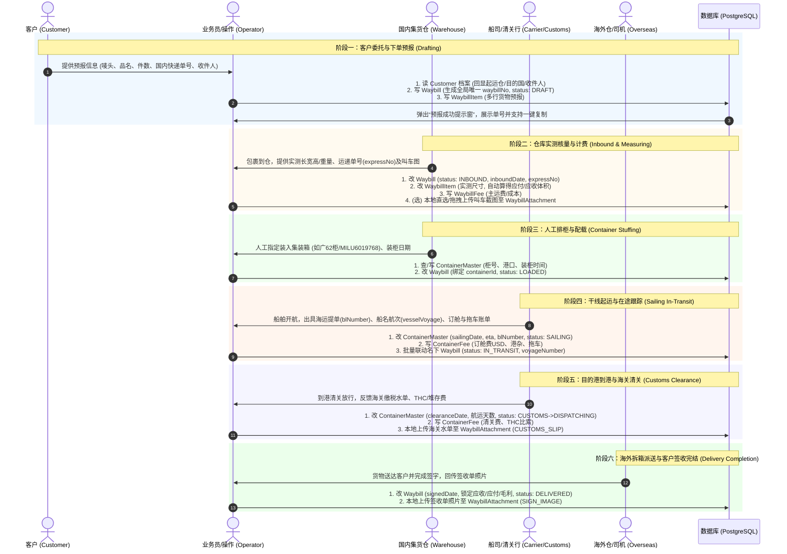

# 业务与数据流转全景：订单全生命周期与数据表使用指南

> 本文档详细阐述一个国际物流订单从客户发起预报到最终海外签收完结的 6 个阶段，以及在每个阶段中各数据库表的读写、前后端交互与关联逻辑。

---

## 🗺️ 1. 全生命周期 6 阶段概览

---

## 📋 2. 各阶段数据库操作与交互详解

### 阶段一：客户预报 (Drafting)
- **入口页面**：[极速预报下单工作台 (/v2/inbound)](file:///d:/ccccc/projects/global-link-logistics/frontend/customer/src/pages/v2/InboundWorkbench.tsx)
- **交互规范**：
  1. **纯净留白**：输入框初始不带任何虚假数据；输入唛头（如 `WH-ZZY-FLB`）后，系统从 `Customer` 真实档案中回显起运仓、目的国、目的港口与默认收件人。
  2. **级联通道**：根据报关通道（`customsType`）自动联动筛选承运服务商（`forwarderChannel`）。
  3. **运单号提示与复制**：表单提交后，后端生成全局唯一 `waybillNo`（如 `LCL2608170001`），前端**弹出运单号成功提示窗口**，提供一键复制按钮及【进入详情推进】、【继续开下一单】快捷入口。
- **触碰的数据表**：
  - `Customer` & `CustomerAddress`（只读）
  - `Waybill`（新建 Insert，`status = DRAFT`）
  - `WaybillItem`（新建 Insert，多行货物明细）

### 阶段二：仓库到货实测 (Inbound & Measuring)
- **入口页面**：[运单全生命周期交互工作台 (/v2/waybills/:id)](file:///d:/ccccc/projects/global-link-logistics/frontend/customer/src/pages/v2/WaybillDetailView.tsx) ➔ 阶段 2 模态框
- **交互规范**：
  1. 录入实际到仓日期 `inboundDate` 与仓库反馈的 `expressNo`（运递单号/运单号）；
  2. 录入实测长宽高与重量，系统实时公式算方 $\text{件数}\times\text{长}\times\text{宽}\times\text{高}/10^6$，并自动计算应收/应付金额；
  3. **本地文件上传**：支持将仓库传回的送仓提货截图从本地直接拖拽上传保存（`LocalFileUpload` 组件）。
- **触碰的数据表**：
  - `Waybill`（更新 Update，`status = INBOUND`）
  - `WaybillItem`（更新 Update，长宽高、重量、实际体积）
  - `WaybillFee`（新建/更新，主运费与车费明细）
  - `WaybillAttachment`（可选新建，`attachmentType = PICKUP_SCREENSHOT`）

### 阶段三：人工排柜拼箱 (Container Stuffing)
- **交互规范**：
  1. 调度员在列表中勾选多票散货，一键批量指派至已有集装箱或新建货柜；
  2. 新建集装箱支持填入柜号 `containerNo`、起运港 `originPort`、装柜时间 `loadingDate`。
- **触碰的数据表**：
  - `ContainerMaster`（新建/查询 Insert/Select）
  - `Waybill`（更新 Update，赋值 `containerId`，`status = LOADED`）

### 阶段四：干线起运在途 (Sailing In-Transit)
- **交互规范**：
  1. 填入实际开船日 `sailingDate`（ETD）、预计到港 `eta`、船名航次 `vesselVoyage` 以及**海运提单号 `blNumber`**；
  2. 录入整柜全链路干线费用（订舱海运费 USD/RMB、港杂、头程拖车）；
  3. 系统自动将该集装箱名下所有散货运单同步为 `status = IN_TRANSIT`。
- **触碰的数据表**：
  - `ContainerMaster`（更新 Update，`status = SAILING`）
  - `ContainerFee`（新建 Insert，整柜干线费用）
  - `Waybill`（批量更新 Update，同步 `status = IN_TRANSIT`）

### 阶段五：目的港清关 (Customs Clearance)
- **交互规范**：
  1. 填入清关放行时间 `clearanceDate`、海关查验状态 `inspectStatus`；
  2. 系统自动计算总航运耗时 `totalShippingDays = clearanceDate - loadingDate`；
  3. 录入目的港清关费、THC/堆存费（支持比索 PHP 计算）；
  4. **本地文件上传**：本地直选或拖拽上传海关缴税水单 PDF / 图片（`attachmentType = CUSTOMS_SLIP`）。
- **触碰的数据表**：
  - `ContainerMaster`（更新 Update，`status = DISPATCHING`）
  - `ContainerFee`（新建 Insert，清关与 THC 费用）
  - `WaybillAttachment`（新建 Insert，上传水单附件）

### 阶段六：海外派送与签收 (Delivery Completion)
- **交互规范**：
  1. 填入海外客户实际签收日期 `signedDate`；
  2. **本地文件上传**：本地上传海外司机回传的客户收货签字照片（`attachmentType = SIGN_IMAGE`）；
  3. 系统将运单流转至终态 `status = DELIVERED`，财务锁定纯毛利；
  4. **整柜自动完结联动**：若该运单挂载了集装箱，后端自动检测该柜内全部散货是否已 100% 签收。若是最后一笔签收，系统**自动将集装箱主表更新为 `status = COMPLETED`**；若后续有撤销签收回退，集装箱自动恢复为 `DISPATCHING`。
- **触碰的数据表**：
  - `Waybill`（更新 Update，`status = DELIVERED`，锁定利润总账）
  - `WaybillAttachment`（新建 Insert，上传签收照片）
  - `ContainerMaster`（自动更新 Update，若名下散货全签收则 `status = COMPLETED`）

---

## 📊 3. 核心表数据状态对照速查表

| 阶段名称 | 运单状态 (`Waybill.status`) | 集装箱状态 (`ContainerMaster.status`) | 核心操作的表 | 关键字段变动 |
| :--- | :--- | :--- | :--- | :--- |
| **1. 客户预报** | `DRAFT` (草稿/预报) | (无) | `Customer`, `Waybill`, `WaybillItem` | 生成 `waybillNo`，回显档案，弹窗提示并复制单号 |
| **2. 到货实测** | `INBOUND` (已入库) | (无) | `Waybill`, `WaybillItem`, `WaybillFee`, `WaybillAttachment` | 录入实测尺寸长宽高，算得体积，填 `expressNo`，本地传叫车图 |
| **3. 人工排柜** | `LOADED` (已装柜) | `LOADING` (装柜中) | `ContainerMaster`, `Waybill` | 创建/选择柜号，散货批量赋值 `containerId` |
| **4. 干线在途** | `IN_TRANSIT` (在途中) | `SAILING` (航运中) | `ContainerMaster`, `ContainerFee`, `Waybill` | 填开船日(ETD)、ETA、提单号(`blNumber`)、船名航次、订舱费 |
| **5. 目的港清关** | `DISPATCHING` (拆派中) | `CUSTOMS` ➔ `DISPATCHING` | `ContainerMaster`, `ContainerFee`, `WaybillAttachment` | 清关时间、航运天数、清关费/THC(PHP)、本地传海关税单 |
| **6. 签收完结** | `DELIVERED` (已完结) | `COMPLETED` (已完结) | `Waybill`, `WaybillAttachment` | 填签收时间、本地传签收照片、锁定最终财务毛利 |

---

## ✈️ 4. 空运业务专属生命周期流转对照表 (方案 A：零迁移规范)

针对 `orderType === 'AIR'` 的空运业务，全景调度工作台将自动切换为专用的空运阶段视图：

| 空运阶段名称 | 状态代码 (`Waybill.status`) | 核心操作与表单控件 | 关键字段映射 (零迁移) | 业务规则与必填约束 |
| :--- | :--- | :--- | :--- | :--- |
| **1. 客户预报** | `DRAFT` | 录入唛头、品名、国内送仓单号、预报件数、收件人 | `Waybill`, `WaybillItem` | 生成 `waybillNo` (如 `AWB2608170001`) |
| **2. 到仓实测** | `INBOUND` | 录入到仓日期、**实测重量 (`totalWeightKg`)**、单价、车费 | `Waybill.totalWeightKg`, `WaybillItem`, `WaybillFee` | 纯按 **kg** 算费，隐藏海运立方算方，自动计算应收/干线成本 |
| **3. 仓库发货** | `LOADED` | 录入发货日期、承运专线、**【发货运单号】**、发货备注 | `Waybill.loadingDate`, `forwarderChannel`, `expressNo` | **【发货运单号】强制必填**，彻底去除柜号、航班号等海运项 |
| **4. 到海外仓** | `IN_TRANSIT` | 录入到达海外仓时间、海外中转仓点备注 | `Waybill.clearanceDate` | 记录干线空运与双清完毕入海外分拨仓节点 |
| **5. 海外派送** | `DISPATCHING` | 录入派送方式（专车/本地快递/自提）、派送单号/司机信息 | `Waybill.status = DISPATCHING`, `Waybill.note` | 海外仓出库末端配送 |
| **6. 签收完结** | `DELIVERED` | 录入客户签收日期、上传签收单照片 (`SIGN_IMAGE`) | `Waybill.signedDate`, `WaybillAttachment` | 客户签收归档，锁定财务毛利 |

---

## 🚢 5. 海运整柜 (SEA_FCL) 业务专属生命周期流转对照表 (方案 A：零迁移规范)

针对 `orderType === 'SEA_FCL'` 的整柜业务，全景调度工作台将自动切换为专用的整柜阶段视图（**不经过国内集拼仓，起运点为国内起运港口**）：

| 整柜阶段名称 | 状态代码 (`Waybill.status`) | 核心操作与表单控件 | 关键字段映射 (零迁移) | 业务规则与必填约束 |
| :--- | :--- | :--- | :--- | :--- |
| **1. 订舱委托** | `DRAFT` | 录入唛头、**国内起运港口 (`originPort`)** ➔ 目的港口、箱型规格、整柜报价 | `Waybill.originWarehouse`, `Waybill.userMark` | 起运点必须是起运港（如厦门港/南沙港），严禁使用始发仓 |
| **2. 产地装箱** | `INBOUND` | 拖车到厂装箱，**直接录入集装箱柜号**、封条号、品名、件数、毛重 | `ContainerMaster.containerNo`, `Waybill.loadingDate` | **阶段 2 直录柜号并绑定 1:1 集装箱**，隐藏长宽高算方 |
| **3. 进港报关** | `LOADED` | 拖车送重柜入码头堆场并完成报关 | `ContainerMaster.status = LOADING` | 确认重柜集港与报关放行，一键流转 |
| **4. 干线航运** | `IN_TRANSIT` | 班轮起运开航，录入提单号 (`blNumber`)、船名航次、ETD/ETA、海运订舱费 | `ContainerMaster.blNumber`, `ContainerFee` | 记录海运干线成本与在途跟踪 |
| **5. 目的港清关** | `DISPATCHING` | 抵港海外清关，录入放行时间、税单、THC/超堆费、码头送柜拖车费 | `ContainerMaster.clearanceDate`, `ContainerFee` | 记录目的港清关成本并提柜派送 |
| **6. 送达签收** | `DELIVERED` | 海外收件人拆箱收货，回传签收单照片 (`SIGN_IMAGE`)，还空箱完结 | `Waybill.signedDate`, `ContainerMaster.status = COMPLETED` | 锁定整柜利润：$\text{报价} - \sum\text{全链路成本}$ |

---

## 🔄 6. 全生命周期阶段回退与水位线截断 (Waterfall Truncation) 规范

为了杜绝跨阶段跳退时的脏数据残留以及货柜广播推进时的误伤，系统实施统一的**阶段水位线截断模型**与**分流回退策略**：

### 6.1 阶段水位线清空矩阵 (Waterfall Reset Matrix)
当运单回退到目标阶段 $N$ 时，系统自动将所有 $> N$ 阶段的字段一次性清空（`Reset to null`）：

| 目标回退阶段 | 运单目标状态 | 自动清空的大于目标阶段字段 (置空 null) | 货柜关联处理 (`containerId`) |
| :--- | :--- | :--- | :--- |
| **回退至 阶段 1 (客户委托)** | `DRAFT` | `inboundDate`, `loadingDate`, `sailingDate`, `clearanceDate`, `signedDate`, `expressNo`, `voyageNumber`, 签收单/水单附件，并清空实测尺寸/方数/重量 | 🔓 **单票立即解绑** (`containerId = null`) |
| **回退至 阶段 2 (已入库)** | `INBOUND` | `loadingDate`, `sailingDate`, `clearanceDate`, `signedDate`, `voyageNumber`, 签收单/水单附件（保留实测尺寸/方数/重量） | 🔓 **单票立即解绑** (`containerId = null`) |
| **回退至 阶段 3 (已装柜/发货)** | `LOADED` | `sailingDate`, `clearanceDate`, `signedDate`, `voyageNumber`, 签收单/水单附件 | 🚢 保持货柜绑定 |
| **回退至 阶段 4 (干线在途)** | `IN_TRANSIT` | `clearanceDate`, `signedDate`, 签收单/水单附件 | 🚢 保持货柜绑定 |
| **回退至 阶段 5 (目的港清关/派送)** | `DISPATCHING` | `signedDate`, 签收单附件 | 🚢 保持货柜绑定 |

### 6.2 回退影响范围分流规则
1. **回退至阶段 1 或阶段 2（单票掏箱作业）**：
   - 仅当前这 1 票运单回退并自动解绑货柜；
   - 货柜内其余在柜运单保持不变，货柜配载统计实时重算扣减；
2. **海运拼箱回退至阶段 3、4、5（货柜级公共事件）**：
   - 必须弹出强二次确认警告，告知业务员将全员广播回退；
   - 确认后，柜内处于更高阶段的所有运单与 `ContainerMaster` 自身同步回退至目标阶段。

---

## 🔒 7. 全生命周期单向递进刚性门禁 (Sequential Step Gate) 规范

为了杜绝因跳阶段操作导致到仓实测尺寸、实测重量或装箱柜号被悬空遗漏，系统实施**前端阶梯严格上锁**与**前置数据完整性强校验**的双重刚性门禁：

### 7.1 前端阶梯严格上锁铁律
1. **已完成阶段 (`idx < currentStageIdx`)**：展示为绿色完成态，支持点击打开弹窗查看和回溯修改历史快照；
2. **当前进行中阶段 (`idx === currentStageIdx`)**：展示为蓝色高亮进行中，为当前**唯一允许操作流转推进的阶段**；
3. **未来未解锁阶段 (`idx > currentStageIdx`)**：展示为灰色置灰态并附加锁头图标（🔒），**严禁点击打开操作弹窗**。系统强制阻断并提示：*“流程不可跳跃！当前处于【阶段 X】，请先按顺序完成当前阶段数据录入与流转。”*

### 7.2 关键阶段前置数据完整性强校验 (Completeness Gate)
在触发流转保存时，系统实施前置数据完整性拦截：
- **推进至 阶段 3 (装柜配载/仓库发货) 前**：
  - 海运拼箱 (`SEA_LCL`)：强校验必须具备实测长宽高或实测总方数 (`payableVolume > 0`)；
  - 空运专线 (`AIR`)：强校验必须具备实测重量 (`totalWeightKg > 0`)；
  - 海运整柜 (`SEA_FCL`)：强校验必须已录入实际装箱清单并成功绑定集装箱柜号；
- **推进至 阶段 4 (干线航运/在途) 前**：
  - 强校验必须已绑定合法集装箱柜号并录入海运提单号及实际开船日；
- 若未满足前置数据完整性，系统弹窗严厉拦截并指引操作员先完善前序阶段数据。

