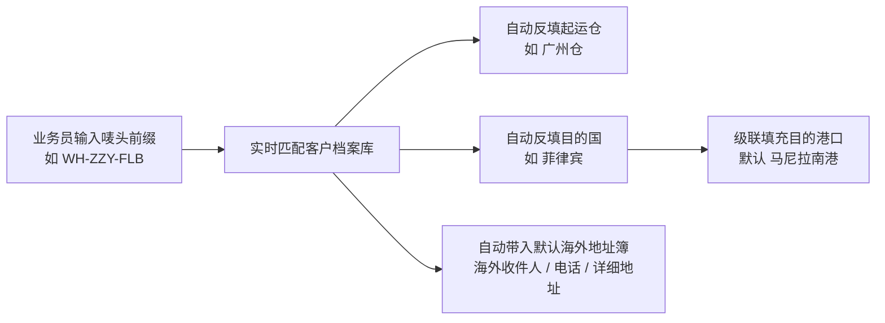
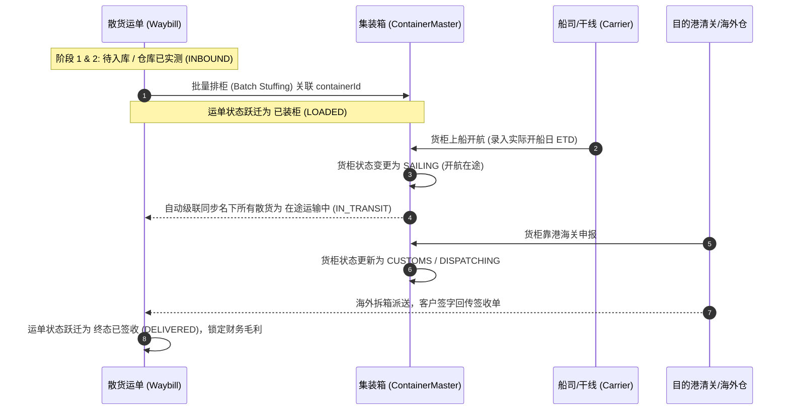

# 业务模块 08：业务实战沉淀、调度工作台与工程避坑指南

> 本文档汇集自系统实际业务场景演练、多国货运实操、中台调度工作台设计以及日常工程运维的宝贵经验，作为系统持续迭代与新成员培训的实践指导。

---

## 🎯 1. 运单录入与调度工作台核心业务经验

### 1.1 客户唛头 (`userMark`) 智能联想与自动化级联
在真实物流运作中，业务员录单一票通常只有 10~20 秒。系统沉淀了基于客户档案的高效自动化联动机制：



- **防错设计**：
  1. 唛头中包含国别后缀（如 `FLB` 菲律宾、`THA` 泰国、`INA` 印尼）时，系统提供智能国别提示。
  2. 客户选择后，若该客户拥有签约的默认收货地址，自动填充至运单海外地址，无需人工二次手工誊抄。

---

### 1.2 目的国 ↔ 目的港口多级联动规范
针对跨国海运，严禁出现“目的国选泰国，目的港却填马尼拉”的低级业务失误。

- **联动规则**：
  - 用户切换**目的国**时，**目的港口下拉列表**立即动态替换为该国专属清关口岸；
  - 自动将目的港重置为该国的**默认主力枢纽港**（如菲律宾默认 `马尼拉南港`、印尼默认 `丹戎不碌港`、泰国默认 `林查班港`、马来西亚默认 `巴生港`）；
  - 保留对非标准自定义口岸的兼容输入。

---

### 1.3 实测体积 vs 电商大宗小包 vs 一口价包干

真实业务中存在 3 种截然不同的拼箱计费形态：

| 业务形态 | 典型录入特征 | 系统结算与算方逻辑 | 典型真实场景 |
| :--- | :--- | :--- | :--- |
| **标准海运拼箱** | 逐件录入长、宽、高 (cm)、件数 | 单包裹体积 $V = (L \times W \times H \times Qty) / 10^6$<br>累加各包裹 $V$ 得到总计费方量 | 五金配件 5件 $85 \times 74 \times 36$ cm |
| **电商大宗小包** | 件数极多（如 300+ 件），无法逐一测量 | **跳过单件尺寸**，直接由仓库主管在运单头核定录入总体积 (如 $16.927\text{ m}^3$) | 拼多多/Shopee 跨境电商集拼货 |
| **一口价包干模式** | 运单勾选 `isFixedPrice = true` | **强制锁定应收总额**（如包干 ¥200），覆盖体积单价，但仍保留实际成本与毛利核算 | 熟客协商特惠包干、样品特惠单 |

---

## 📊 2. 全景调度与大数据量分页控制标准 (Pagination Pattern)

运单中台随着日常出货，数据量会迅速从数百条膨胀至数万条。为了保证调度界面的高流畅性与低延迟，系统制定了以下分页标准：

```
[共 1,280 条数据 (显示第 1-20 条)] ──── [每页 20 条 ▼] ── [<<] [<] [1] [2] [3] ... [64] [>] [>>] ── [跳至 ( ) 页]
```

### 2.1 分页组件核心要素
1. **智能页码折叠（Smart Ellipsis）**：
   - 当总页数 $\le 7$ 时全部平铺；
   - 当总页数 $> 7$ 时，根据当前页位置智能保留首页、末页、前后邻近页与 `...` 省略占位符，防止撑破 UI。
2. **多级每页容量控制（PageSize Selector）**：
   - 预设 `10 / 20 / 50 / 100 条/页`，方便大屏调度与批量排柜。
3. **筛选联动自动重置**：
   - 用户切换**运输类型 Tab**（LCL/AIR/FCL）、**状态流水线过滤器**、**全局搜索关键词**或**修改每页条数**时，前端必须**自动将当前页重置为第 1 页 (`page = 1`)**，避免出现“第 5 页无数据”的假空状态。

---

## 🚢 3. 集装箱装柜配载与全流程状态级联 (Lifecycle Synchronization)



- **业务精髓**：
  调度员只需在集装箱维度更新“开船时间”或“抵港清关”，系统会自动触发名下几十票甚至上百票散货的流转，极大释放人工重复操作。

---

## 📎 4. 统一附件凭证池与单证归档实践

摒弃传统系统“付款凭证只能放付款处、清关单只能放清关处”的割裂设计，V2 系统采用**运单级统一凭证池 (`WaybillAttachment`)**：

| 凭证代码 | 中文名称 | 推荐归档时机 | 业务防纠纷价值 |
| :--- | :--- | :--- | :--- |
| `PICKUP_SCREENSHOT` | **叫车/提货截图** | 国内安排货车送仓或自提时 | 明确货车进仓交接责任 |
| `CUSTOMS_SLIP` | **报关费缴税水单** | 海关放行核税后 | 财务退税与报关费结算唯一凭据 |
| `SIGN_IMAGE` | **客户签收单/照片** | 海外车队送达客户签收时 | 杜绝丢货争议，运单完结与尾款催收依据 |
| `BILL_OF_LADING` | **海运提单 (B/L)** | 船司出具正本/电放件时 | 货权凭证与海外换单提货依据 |
| `PAYMENT_PROOF` | **客户转账水单** | 客户打款核销时 | 财务对账与未结款项核销 |

---

## ⚠️ 5. 工程运维与版本管理安全守则（防踩坑规范）

### 5.1 Git 仓库安全与大文件拦截
- 🚫 **绝对禁止提交超大真实业务 Excel**：
  如历史业务表格（广州进仓单单文件达 **60.8MB**，合计 >73MB），一旦提交会导致 Git 仓库体积暴增、远程拉取极慢，且存在客户商业信息泄漏风险。
- 🚫 **禁止提交本地运行态文件与数据卷**：
  - 本地嵌入式数据库目录：`backend/.embedded-pg-data/`
  - 用户上传的真实图片/附件：`backend/uploads/*`（保留 `.gitkeep` 与 `README.md` 目录骨架即可）
  - 本地环境变量配置文件：`*.env`（仅保留 `.env.example` 模版）
  - 临时备份文件：`*.bak`、`*.tmp`、`*.old`

### 5.2 Windows 批处理一键启动脚本避坑指南
- ❌ **坑点**：Windows `cmd.exe` 在默认代码页（CP936/GBK）下解析 UTF-8 中文字符时，若字符字节序列包含特殊管道符（`&`、`|` 等），会导致批处理在 `chcp 65001` 之前就发生断行语法错误，提示 `'xxx' 不是内部或外部命令`。
- ✅ **标准解法**：
  1. 批处理脚本控制台输出采用纯净英文或标准 ANSI/ASCII；
  2. 使用 `%~dp0` 获取脚本所在绝对路径（如 `cd /d "%~dp0backend"`）；
  3. 目录路径使用标准 Windows 反斜杠 `\` 并加双引号防护。
