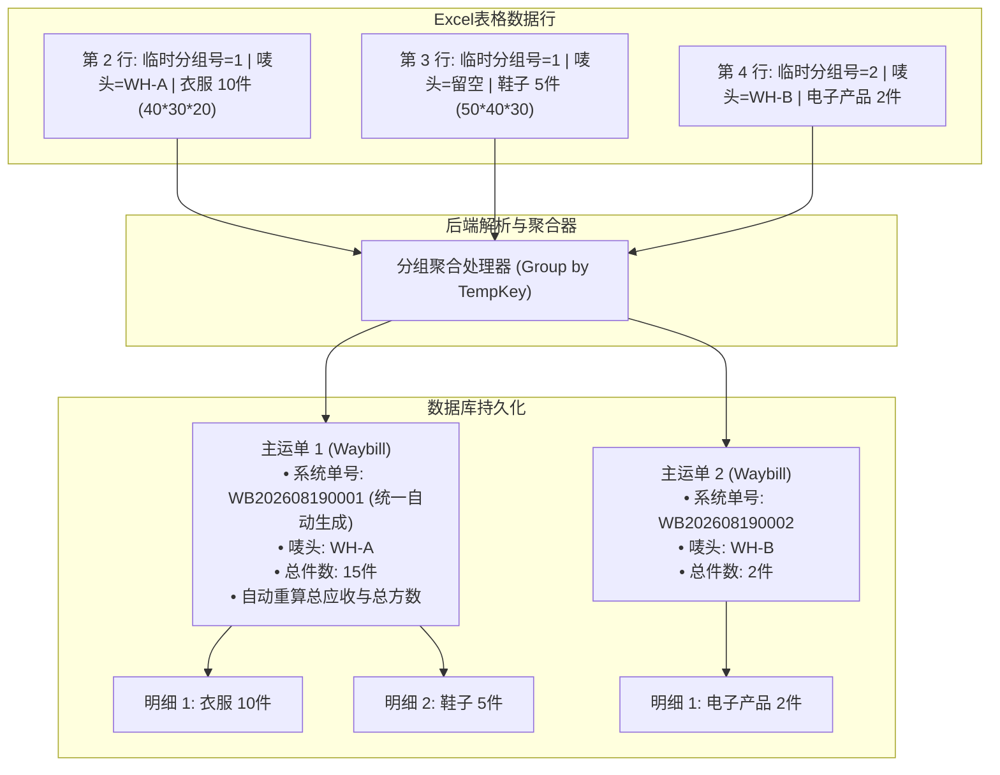

# 09. 批量导入业务与技术规范标准 (Batch Import Standards)

> 本文档规范了系统内「客户档案批量导入」与「新订单专用模板批量导入」的业务规则、字段规范、容错机制与技术实现标准。

---

## 🎯 1. 核心设计原则与架构定位

1. **前后解耦与独立建档**：
   - **客户档案前置**：客户档案（`Customer`）与唛头单独设计导入，先建档再导单，避免导单时产生未知客户的脏数据。
2. **拒绝通用臃肿表，专线独立模板**：
   - 针对不同运输方式（海运散拼 `SEA_LCL`、空运专线 `AIR`、海运整柜 `SEA_FCL`）分别提供定制化专用 Excel 模板。
3. **容错跳过机制 (Partial Success)**：
   - 导入过程中遇到异常数据（如客户唛头不存在、格式错误），**仅跳过错误行并记录明细，合法行正常入库**，不触发整批回滚。
4. **一单多品名（多行聚合）与临时分组机制**：
   - 支持同一运单挂载多条申报明细，通过 Excel 内临时序号聚合，系统入库后统一自动生成全局规范单号（`waybillNo`），**手输临时序号不强制入库**。
5. **内嵌图片自动提取与凭证归档**：
   - 自动解析提取 Excel 中 WPS（`DISPIMG`）和 Office 单元格内嵌图片，自动归档至统一凭证池（`WaybillAttachment`）。
6. **轻量化同步处理**：
   - 现阶段采用轻量级即时同步解析，不引入外部 Job/MQ 队列，易维护、高响应。

---

## 👤 2. 客户档案与多海外收件人导入规范

### 2.1 单客户多海外收件人 (1:N) 多行聚合机制

在客户建档中，单个客户唛头名下可拥有 1 至 N 个常用海外收件人（如“马尼拉总仓”、“宿务分仓”、“达沃档口”）。
系统采用 **“按唛头多行聚类 + 首行主导主数据 + 独立收件人地址簿”** 规范：

```
+-------------------------------------------------------------------------------------------------------------+
| 客户唛头 (必填) | 客户联系电话 (货主) | 常用起运仓 | 【海外收件联系人】 | 【海外联系电话/WhatsApp】 | 【目的港口】 | 【详细派送地址】 | 【是否默认】 |
| WH-ZZY-FLB    | 13800138000 (首行优先)| 广州仓    | Alex Johnson    | +63 917 123 4567         | 马尼拉南港   | BGC Tower...   | 是         |
| WH-ZZY-FLB    | (留空继承)           | (留空)    | Bob Williams    | +63 918 888 9999         | 宿务港       | Reclamation... | 否         |
| WH-ZZY-FLB    | (留空继承)           | (留空)    | Charlie Zhang   | +63 919 666 7777         | 达沃港       | Laurel Ave...  | 否         |
+-------------------------------------------------------------------------------------------------------------+
```

1. **首行主导主数据 (Head Priority)**：
   - 客户主表（`Customer`）的核心属性（客户名称、货主本人联系电话 `Customer.phone`、常用起运仓）以**首行（或首个非空行）**为准；
   - 若同一个唛头在后续行出现了不同的【客户联系电话】，系统优先保护首行货主主联系电话，避免主数据紊乱。
2. **多收件人独立存储 (`CustomerAddress`)**：
   - 表格中的每一行海外收件人信息（姓名、电话/WhatsApp、公司、国家、港口/地区、详细派送地址）均**独立完整存入 `CustomerAddress` 表**，互不覆盖；
3. **默认收件人与路线驱动**：
   - 标记为【`是否默认 = 是`】（或 `true` / `1`）的行，被置为 `isDefault = true`；
   - 系统自动提取该默认收件人的国家与港口（如菲律宾 · 马尼拉南港），**单向同步覆盖**至客户主表 `destinationCountry / destinationPort`；
   - 若表格中多行均未显式标注，系统默认将**第 1 个收件人**作为默认收件人；
4. **电话号码归一化防重**：
   - 导入收件人地址簿时，自动剔除国际区号前缀中的 `+`、空格、横线进行纯数字比对，同一客户下同电话同地址自动去重合并，防止重复沉淀。

### 2.2 字段定义与必填约束

| 字段名称 | 对应数据库字段 | 是否必填 | 格式/校验规则 | 缺省/默认值处理 |
| :--- | :--- | :--- | :--- | :--- |
| **客户唛头 / 编码** | `clientCode` | **✅ 必填 (唯一)** | 字符串（如 `WH-ZZY-FLB`、`WH-10115`），去首尾空格 | 无，为空则跳过该行 |
| **客户名称** | `name` | ❌ 选填 | 字符串（如 `张三`、`某某贸易有限公司`） | 若为空，默认填充与 `clientCode` 相同 |
| **客户联系电话** | `Customer.phone` | ❌ 选填 | 货主本人手机/座机字符串 | `null` (首行优先) |
| **常用起运仓** | `defaultWarehouse` | ❌ 选填 | 枚举/文本（如 `广州仓`、`龙岩仓`、`义乌仓`） | `null` |
| **常用目的国** | `destinationCountry` | ❌ 选填 | 文本（如 `菲律宾`、`印尼`） | 默认由默认收件人国家反填 |
| **常用目的港** | `destinationPort` | ❌ 选填 | 文本（如 `马尼拉南港`、`马尼拉北港`） | 默认由默认收件人口岸反填 |
| **【海外收件联系人】** | `CustomerAddress.name` | ❌ 选填 | 该档口/仓库收件人姓名（如 `Alex Johnson`） | `null` |
| **【海外联系电话/WhatsApp】** | `CustomerAddress.phone` | ❌ 选填 | 海外本地电话（如 `+63 917 123 4567`） | `null` |
| **【海外收件公司】** | `CustomerAddress.company` | ❌ 选填 | 海外公司名称（如 `Manila Trading Inc.`） | `null` |
| **【目的港口/地区】** | `CustomerAddress.region` | ❌ 选填 | 口岸或省市（如 `马尼拉南港`、`宿务`） | 若空取客户目的港 |
| **【海外详细派送地址】** | `CustomerAddress.address` | ❌ 选填 | 海外末端门牌与送货详细地址 | `null` |
| **【是否默认收件人】** | `CustomerAddress.isDefault` | ❌ 选填 | `是` / `否` (或 `true` / `false`) | 默认首行为 `是`，后续为 `否` |
| **客户备注** | `note` | ❌ 选填 | 文本 | `null` |

### 2.3 重复冲突处理策略
* **策略支持**：提供「唛头已存在则跳过」或「唛头已存在则覆盖更新」两种选项（默认为跳过已存在唛头）。

### 2.4 客户档案删除与安全保护
* **外键安全校验**：删除客户时，系统强校验该客户名下是否已关联运单（`Waybill`）。若已产生运单关联，禁止直接删除并提示 `该客户名下已关联 X 票运单，无法直接删除！请先处理或转移相关运单`；
* **级联清除**：无运单绑定的客户在删除时，其关联的默认地址簿（`CustomerAddress`）自动级联移除。

---

## 📦 3. 新订单专用模板与海外收件人继承规范

### 3.1 海外收件人双轨继承与防污染原则
1. **留空自动继承 (推荐日常模式)**：
   - 订单 Excel 中【海外收件人】、【海外联系电话】、【海外详细派送地址】**留空未填时**，系统自动根据填写的客户唛头，从该客户的 `CustomerAddress` 地址簿中读取**默认收件人**（`isDefault = true`）并写入本票运单快照（`Waybill.overseasName / overseasPhone / overseasAddress / overseasRegion`）；
2. **填录单票覆盖 (临时改派模式)**：
   - 若订单 Excel 中显式填写了海外收件人信息，系统以 Excel 中填写的数据作为本票运单的独占快照；
   - **防污染原则**：订单中临时导入的收件人仅作为单票快照，默认不自动沉淀至客户地址簿，防止一次性代发散单污染客户常用主数据。

### 3.2 《海运散拼导入模板 (SEA_LCL)》

| 列名 | 数据库对应字段 | 必填 | 说明 |
| :--- | :--- | :--- | :--- |
| **订单临时分组号** | *(内存解析 Key)* | ❌ 选填 | 仅用于同单多明细归一；单行单品可留空 |
| **客户唛头** | `userMark` / `customerId` | **✅ 必填** | 必须在 `Customer` 表中已存在，否则报错跳过 |
| **起运仓** | `originWarehouse` | ❌ 选填 | 如 `广州仓`、`龙岩仓` |
| **目的国** | `destinationCountry` | ❌ 选填 | 如 `菲律宾`、`印尼` |
| **承运渠道/服务商** | `forwarderChannel` | ❌ 选填 | 如 `中外运`、`万海自营专线`、`天帆`、`菲通` |
| **报关/通道类型** | `customsType` | ❌ 选填 | 如 `普货双清`、`化妆退税`、`敏感特货` |
| **海外收件联系人** | `Waybill.overseasName` | ❌ 选填 | 留空则自动继承该唛头默认收件人 |
| **海外联系电话** | `Waybill.overseasPhone` | ❌ 选填 | 留空则自动继承该唛头默认收件人电话 |
| **海外详细派送地址** | `Waybill.overseasAddress` | ❌ 选填 | 留空则自动继承该唛头默认派送地址 |
| **专线单号** | `expressNo` | ❌ 选填 | 专线或运递单号（如 `FLY100002162`） |
| **申报品名** | `WaybillItem.productName` | **✅ 必填** | 货物中文品名 |
| **实收件数** | `WaybillItem.quantity` | **✅ 必填** | 大于 0 的整数 |
| **实测长 (cm)** | `WaybillItem.length` | ❌ 选填 | 实测尺寸，用于算方 |
| **实测宽 (cm)** | `WaybillItem.width` | ❌ 选填 | 实测尺寸，用于算方 |
| **实测高 (cm)** | `WaybillItem.height` | ❌ 选填 | 实测尺寸，用于算方 |
| **实测单重 (kg)** | `WaybillItem.unitWeight` | ❌ 选填 | 实测单件重量 |
| **实测体积 (m³)** | `WaybillItem.payableVolume` | ❌ 选填 | 若填尺寸自动计算，也可直接录入方数 |
| **应收单价 (元/方)** | `WaybillItem.receivableUnitPrice` | ❌ 选填 | 散货体积销售单价（如 `850`） |
| **应付单价 (元/方)** | `WaybillItem.payableUnitPrice` | ❌ 选填 | 散货体积成本单价（如 `750`） |
| **送仓快递单号** | `WaybillItem.trackingNumber` | ❌ 选填 | 快递单号 |
| **备注** | `note` | ❌ 选填 | 订单备注 |
| **叫车截图** | `WaybillAttachment` | ❌ 选填 | 单元格内嵌图片，归档为 `PICKUP_SCREENSHOT` |
| **签收截图** | `WaybillAttachment` | ❌ 选填 | 单元格内嵌图片，归档为 `SIGN_IMAGE` |

### 3.3 《空运专线导入模板 (AIR)》

| 列名 | 数据库对应字段 | 必填 | 说明 |
| :--- | :--- | :--- | :--- |
| **订单临时分组号** | *(内存解析 Key)* | ❌ 选填 | 仅用于同单多明细归一；单行单品可留空 |
| **客户唛头** | `userMark` / `customerId` | **✅ 必填** | 必须已建档 |
| **起运仓** | `originWarehouse` | ❌ 选填 | 如 `龙岩仓`、`广州仓` |
| **目的国** | `destinationCountry` | ❌ 选填 | 如 `菲律宾`、`印尼` |
| **承运渠道/服务商** | `forwarderChannel` | ❌ 选填 | 如 `菲通货运`、`万海特货通道` |
| **报关/通道类型** | `customsType` | ❌ 选填 | 如 `普货双清`、`敏感特货` |
| **海外收件联系人** | `Waybill.overseasName` | ❌ 选填 | 留空则自动继承该唛头默认收件人 |
| **海外联系电话** | `Waybill.overseasPhone` | ❌ 选填 | 留空则自动继承该唛头默认收件人电话 |
| **海外详细派送地址** | `Waybill.overseasAddress` | ❌ 选填 | 留空则自动继承该唛头默认派送地址 |
| **空运提单号 (AWB)** | `airWaybillNo` | ❌ 选填 | 主单/分单号（如 `91041985`） |
| **申报品名** | `WaybillItem.productName` | **✅ 必填** | 货物中文品名 |
| **实收件数** | `WaybillItem.quantity` | **✅ 必填** | 整数 |
| **计费总重量 (kg)** | `WaybillItem.totalWeight` | **✅ 必填** | 实测/计费重量（如 `11.5`） |
| **应收单价 (元/kg)** | `WaybillItem.receivableUnitPrice` | ❌ 选填 | 空运重量销售单价（如 `38.5`） |
| **应付单价 (元/kg)** | `WaybillItem.payableUnitPrice` | ❌ 选填 | 空运重量成本单价（如 `35.0`） |
| **内部车费 (元)** | `WaybillFee(PAYABLE)` | ❌ 选填 | 杂费科目：内部车费 |
| **渠道车费 (元)** | `WaybillFee(PAYABLE)` | ❌ 选填 | 杂费科目：渠道车费 |
| **送仓快递单号** | `WaybillItem.trackingNumber` | ❌ 选填 | 快递单号 |
| **备注** | `note` | ❌ 选填 | 订单备注 |
| **过磅截图** | `WaybillAttachment` | ❌ 选填 | 单元格内嵌图片 |
| **签收截图** | `WaybillAttachment` | ❌ 选填 | 单元格内嵌图片 |

### 3.4 《海运整柜导入模板 (SEA_FCL)》

| 列名 | 数据库对应字段 | 必填 | 说明 |
| :--- | :--- | :--- | :--- |
| **客户唛头** | `userMark` | **✅ 必填** | 货主标识 |
| **海外收件联系人** | `Waybill.overseasName` | ❌ 选填 | 留空则自动继承该唛头默认收件人 |
| **海外联系电话** | `Waybill.overseasPhone` | ❌ 选填 | 留空则自动继承该唛头默认收件人电话 |
| **海外详细派送地址** | `Waybill.overseasAddress` | ❌ 选填 | 留空则自动继承该唛头默认派送地址 |
| **集装箱柜号** | `ContainerMaster.containerNo` | **✅ 必填** | 柜号（如 `MILU6019768`） |
| **提单号 (B/L)** | `ContainerMaster.blNumber` | ❌ 选填 | 海运提单号 |
| **船司** | `ContainerMaster.carrier` | ❌ 选填 | 船公司（中远/万海/马士基等） |
| **起运港 / 目的港** | `originPort / destinationPort` | ❌ 选填 | 如 厦门港 / 马尼拉南港 |
| **装柜日期 / 到港时间** | `loadingDate / eta` | ❌ 选填 | 时间节点 |
| **订舱/报关/清关渠道** | `booking/customs/clearanceChannel` | ❌ 选填 | 合作服务商渠道 |
| **整柜客户总报价 (元)** | `Waybill.receivableAmount` | ❌ 选填 | 整柜协议总应收 |
| **拖车/港杂/THC等成本** | `ContainerFee` | ❌ 选填 | 各项集装箱硬成本 |

---

## 🔀 4. 一单多申报明细（多行聚合）机制

在物流制表中，一票运单通常包含多箱不同尺寸或多个品名：



---

## 📚 4. 多 Sheet 配置字典导出与严格校验拦截架构 (Strict Validation & Multi-Sheet Dictionary)

### 4.1 核心设计哲学：杜绝模糊归一，严格精准匹配
在跨境物流业务扩张中，**同一个城市/口岸极可能存在多个不同性质的仓库或码头**（例如：广州同时存在“广州白云集拼总仓”与“广州番禺服装仓”；马尼拉分为“马尼拉南港”与“马尼拉北港”）。
如果系统盲目猜测模糊归一，会导致**送仓指引错误、调度派车错乱甚至货物错发口岸**的严重运营事故。

因此系统确立 **“Excel 单元格下拉绑定 + 独立字典参考 Sheet + 后端严格精准校验拦截 (方案 1 + 方案 4)”** 准则：

### 4.2 双工作表架构设计 (Dual-Sheet Template Architecture)

所有导出的 Excel 模板（客户档案、海运散拼、空运、整柜）均包含两个工作表：
1. **Sheet 1（数据录入主页）**：
   - 包含业务数据录入各列；
   - 关键主数据列（起运仓、目的国、目的港口、国内起运港、分类渠道、通道类型、是否默认）通过 **Excel 跨表数据验证公式（Data Validation Formula）** 直接绑定 Sheet 2 的专属单元格区域，自带下拉箭头，**彻底突破 Excel 255 字符长度限制**；
2. **Sheet 2（`系统字典与配置` - 只读参考页）**：
   - 将不同业务分类的服务商独立分列展示，彻底杜绝多渠道混杂：
     - **A 列**：`起运仓全称 (下拉源)`
     - **B 列**：`起运仓简码`
     - **C 列**：`起运仓详细地址与联系方式 (参考)`
     - **D 列**：`目的国家 (下拉源)`
     - **E 列**：`目的口岸/港口 (下拉源)`
     - **F 列**：`国内起运港口 (下拉源)`
     - **G 列**：`海运散拼专线渠道 (下拉源)` $\rightarrow$ 绑定海运散拼模板 E 列
     - **H 列**：`空运专线渠道 (下拉源)` $\rightarrow$ 绑定空运专线模板 E 列
     - **I 列**：`整柜订舱服务商 (下拉源)` $\rightarrow$ 绑定海运整柜模板 M 列
     - **J 列**：`整柜报关行 (下拉源)` $\rightarrow$ 绑定海运整柜模板 N 列
     - **K 列**：`整柜目的港清关行 (下拉源)` $\rightarrow$ 绑定海运整柜模板 O 列
     - **L 列**：`集装箱柜型规格 (下拉源)` $\rightarrow$ 绑定海运整柜模板 F 列
     - **M 列**：`报关/通道类型 (下拉源)` $\rightarrow$ 绑定散拼/空运 F 列
     - **N 列**：`是否默认 (下拉源)` $\rightarrow$ 绑定客户档案 L 列
   - **动态实时生成**：模板从后端下载时，实时按 `ChannelCategory` 分组读取启用的渠道主数据。

### 4.3 表头严格精准映射规范 (Exact Header Mapping Standard)

为彻底杜绝表头模糊包含（`text.includes('xxx')`）引发的**“费用列覆盖口岸列”**或**“渠道列误识别”**的恶性冲突（例如 `目的港清关费 (元)` 误识别为 `目的港`），系统一律实行**精准白名单别名映射（Exact Match Aliases Mapping）**：

* **数据清洗流程**：
  1. 读取表头单元格原始字符串，剔除首尾空格、中英文括号及其中单位（例如 `目的港清关费 (元)` $\rightarrow$ 归一化为 `目的港清关费`；`实测长 (cm)` $\rightarrow$ `实测长`）；
  2. 比对字段专属的【权威表头全称别名列表】；
  3. 严格精准匹配，严禁多列冲突互串。

### 4.4 后端严格精准校验规则 (Strict Validation Rules)

后端在解析 Excel 数据时，对配置字段执行严格精准比对，拒绝模棱两可：

1. **起运仓 (`originWarehouse`) 校验**：
   - 必须精确匹配系统中启用的 `OriginWarehouse` 的 **仓库全称**（如 `广州白云集拼总仓`）、**仓库简称**（如 `广州仓`）或 **仓库简码**（如 `GZ-01`）；
   - 若用户输入不明确的“广州”（存在多个广州仓），系统**主动拦截报错并跳过该行**；
2. **国内海运起运港 (`originPort`) 校验 (整柜专属)**：
   - 必须精确匹配标准起运港（如 `深圳蛇口港`、`广州南沙港`、`厦门港`、`天津港` 等）；
3. **目的国家与目的口岸校验**：
   - 目的国家必须精确匹配系统有效国家字典（如 `菲律宾`、`印度尼西亚`、`泰国`、`马来西亚`）；
   - 目的港口必须明确至具体码头（如 `马尼拉南港` 或 `马尼拉北港`，不能模糊填写 `马尼拉`）；
4. **报关/通道类型校验**：
   - 必须精确匹配 `普货双清` / `化妆退税` / `敏感特货`；
### 4.5 海运整柜 (SEA_FCL) 专属字段特化与看板同步规范

海运整柜与拼箱/空运具有本质不同的业务形态（**整柜产地直装直发，不入国内集拼仓**），系统在数据入库与前端渲染时必须严格遵循以下规范：

1. **起运口岸映射规范**：
   - 整柜导入时以 Excel 中的【起运港】（如 `厦门港`）为准；
   - 运单主表字段 `Waybill.originWarehouse` 存入标准起运港名称（如 `厦门港`）；
   - 集装箱表字段 `ContainerMaster.originPort` 同步存入标准起运港名称（如 `厦门港`）；
   - **严禁整柜模式回退到默认集拼仓（如“广州仓”）**；
2. **订舱渠道映射规范**：
   - 整柜导入时以 Excel 中的【订舱渠道】（如 `优尼科订舱`）为准；
   - 运单主表字段 `Waybill.forwarderChannel` 同步存入该订舱渠道；
   - 集装箱表字段 `ContainerMaster.bookingChannel` 存入该订舱渠道；
3. **前端看板与始发指引条特化**：
   - 运单详情顶部副标题路径：`路线: 厦门港 ➔ 菲律宾 (马尼拉北港)`；
   - 顶部始发摘要指引条：特化显示为 🚢 **国内起运港: `厦门港`** `[整柜产地直装 · 直拉码头进港]`，严禁展示集拼仓收货电话与仓库地址；
   - 阶段 1 预报修改弹窗：【国内起运港口】下拉自动精准回显选中 `厦门港`，【承运渠道/服务商】下拉自动精准回显选中 `优尼科订舱`。

---

## 🔀 5. 一单多申报明细（多行聚合）机制

### 5.1 校验拦截规则
1. **客户唛头强校验**：查询 `Customer` 表，若不存在直接记录错误并**跳过该运单入库**；
2. **多明细一致性原则**：若同一个临时分组号名下有某一行明细校验失败（如尺寸格式非法），则**整票运单跳过**，杜绝残缺数据入库；
3. **合法数据正常入库**：其余合规的运单正常批量写入数据库，绝不因单行错误回滚整批任务。

### 5.2 统一响应结构 (API Output)

```json
{
  "code": 200,
  "message": "批量导入完成",
  "data": {
    "total": 50,
    "successCount": 47,
    "failedCount": 3,
    "successWaybillNos": ["WB202608190001", "WB202608190002"],
    "errors": [
      {
        "row": 6,
        "userMark": "WH-UNKNOWN",
        "reason": "客户唛头 [WH-UNKNOWN] 不存在，请先录入客户档案"
      },
      {
        "row": 18,
        "userMark": "WH-10068",
        "reason": "品名为空，缺少必要申报品名"
      },
      {
        "row": 25,
        "userMark": "WH-ZZY-FLB",
        "reason": "尺寸格式非法（长宽高必须为大于0的有效数值）"
      }
    ]
  }
}
```

---

## 🖼️ 6. Excel 单元格内嵌图片提取机制

* **技术实现原理**：
  1. 解压 `.xlsx` 包，扫描 `xl/drawings/drawing*.xml` 与 `xl/cellimages.xml`；
  2. 获取 WPS 的 `=DISPIMG("ID_xxx", 1)` 关联映射及 Office 嵌入图片坐标；
  3. 将匹配到的图片二进制流上传至系统存储，生成访问 URL；
  4. 自动创建 `WaybillAttachment` 记录，并根据 Excel 表头列名自动绑定凭证分类（`PICKUP_SCREENSHOT` 叫车截图 / `SIGN_IMAGE` 签收单 / `CUSTOMS_SLIP` 报关水单）。
