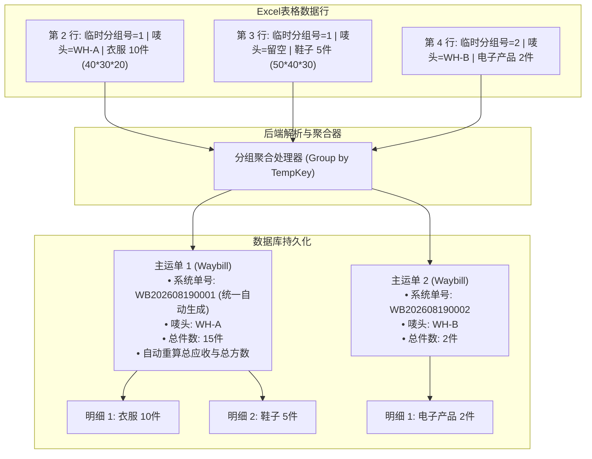

# 09. 批量导入业务与技术规范标准 (Batch Import Standards)

> 本文档规范了系统内「客户档案批量导入」与「新订单专用模板批量导入」的业务规则、字段规范、容错机制与技术实现标准。

---

## 🎯 1. 核心设计原则与架构定位

1. **前后解耦与独立建档**：
   - **客户档案前置**：客户档案（`Customer`）与唛头单独设计导入，先建档再导单，避免导单时产生未知客户的脏数据。
2. **拒绝通用臃肿表，专线独立模板**：
   - 针对不同运输方式（海运散拼 `SEA_LCL`、空运专线 `AIR`、海运整柜 `SEA_FCL`）分别提供定制化专用 Excel 模板。
3. **容错跳过机制 (Partial Success)**：
   - 导入过程中遇到异常数据（如客户唛头不存在、格式错误），**仅跳过错误行并记录明细，合法行正常入库**，不触发整批回滚。
4. **一单多品名（多行聚合）与临时分组机制**：
   - 支持同一运单挂载多条申报明细，通过 Excel 内临时序号聚合，系统入库后统一自动生成全局规范单号（`waybillNo`），**手输临时序号不强制入库**。
5. **内嵌图片自动提取与凭证归档**：
   - 自动解析提取 Excel 中 WPS（`DISPIMG`）和 Office 单元格内嵌图片，自动归档至统一凭证池（`WaybillAttachment`）。
6. **轻量化同步处理**：
   - 现阶段采用轻量级即时同步解析，不引入外部 Job/MQ 队列，易维护、高响应。

---

## 👤 2. 客户档案独立导入规范

### 2.1 字段定义与必填约束

| 字段名称 | 对应数据库字段 | 是否必填 | 格式/校验规则 | 缺省/默认值处理 |
| :--- | :--- | :--- | :--- | :--- |
| **客户唛头 / 编码** | `clientCode` | **✅ 必填 (唯一)** | 字符串（如 `WH-ZZY-FLB`、`WH-10115`），去首尾空格 | 无，为空则跳过该行 |
| **客户名称** | `name` | ❌ 选填 | 字符串（如 `张三`、`某某贸易有限公司`） | 若为空，默认填充与 `clientCode` 相同 |
| **联系电话** | `phone` | ❌ 选填 | 手机/座机字符串 | `null` |
| **电子邮箱** | `email` | ❌ 选填 | 邮箱字符串 | `null` |
| **常用起运仓** | `defaultWarehouse` | ❌ 选填 | 枚举/文本（如 `广州仓`、`龙岩仓`、`义乌仓`） | `null` |
| **常用目的国** | `destinationCountry` | ❌ 选填 | 文本（如 `菲律宾`、`印尼`、`泰国`、`马来`） | `null` |
| **常用目的港** | `destinationPort` | ❌ 选填 | 文本（如 `马尼拉南港`、`马尼拉北港`） | `null` |
| **客户备注** | `note` | ❌ 选填 | 文本 | `null` |

### 2.2 重复冲突处理策略
* **策略支持**：提供「唛头已存在则跳过」或「唛头已存在则覆盖更新」两种选项（默认为跳过已存在唛头）。

### 2.3 客户档案删除与安全保护
* **外键安全校验**：删除客户时，系统强校验该客户名下是否已关联运单（`Waybill`）。若已产生运单关联，禁止直接删除并提示 `该客户名下已关联 X 票运单，无法直接删除！请先处理或转移相关运单`；
* **级联清除**：无运单绑定的客户在删除时，其关联的默认地址簿（`CustomerAddress`）自动级联移除。

---

## 📦 3. 新订单专用模板与字段规范

### 3.1 《海运散拼导入模板 (SEA_LCL)》

| 列名 | 数据库对应字段 | 必填 | 说明 |
| :--- | :--- | :--- | :--- |
| **订单临时分组号** | *(内存解析 Key)* | ❌ 选填 | 仅用于同单多明细归一；单行单品可留空 |
| **客户唛头** | `userMark` / `customerId` | **✅ 必填** | 必须在 `Customer` 表中已存在，否则报错跳过 |
| **起运仓** | `originWarehouse` | ❌ 选填 | 如 `广州仓`、`龙岩仓` |
| **目的国** | `destinationCountry` | ❌ 选填 | 如 `菲律宾`、`印尼` |
| **承运渠道/服务商** | `forwarderChannel` | ❌ 选填 | 如 `中外运`、`万海自营专线`、`天帆`、`菲通` |
| **报关/通道类型** | `customsType` | ❌ 选填 | 如 `普货双清`、`化妆退税`、`敏感特货` |
| **专线单号** | `expressNo` | ❌ 选填 | 专线或运递单号（如 `FLY100002162`） |
| **申报品名** | `WaybillItem.productName` | **✅ 必填** | 货物中文品名 |
| **实收件数** | `WaybillItem.quantity` | **✅ 必填** | 大于 0 的整数 |
| **实测长 (cm)** | `WaybillItem.length` | ❌ 选填 | 实测尺寸，用于算方 |
| **实测宽 (cm)** | `WaybillItem.width` | ❌ 选填 | 实测尺寸，用于算方 |
| **实测高 (cm)** | `WaybillItem.height` | ❌ 选填 | 实测尺寸，用于算方 |
| **实测单重 (kg)** | `WaybillItem.unitWeight` | ❌ 选填 | 实测单件重量 |
| **实测体积 (m³)** | `WaybillItem.payableVolume` | ❌ 选填 | 若填尺寸自动计算，也可直接录入方数 |
| **应收单价 (元/方)** | `WaybillItem.receivableUnitPrice` | ❌ 选填 | 散货体积销售单价（如 `850`） |
| **应付单价 (元/方)** | `WaybillItem.payableUnitPrice` | ❌ 选填 | 散货体积成本单价（如 `750`） |
| **送仓快递单号** | `WaybillItem.trackingNumber` | ❌ 选填 | 快递单号 |
| **备注** | `note` | ❌ 选填 | 订单备注 |
| **叫车截图** | `WaybillAttachment` | ❌ 选填 | 单元格内嵌图片，归档为 `PICKUP_SCREENSHOT` |
| **签收截图** | `WaybillAttachment` | ❌ 选填 | 单元格内嵌图片，归档为 `SIGN_IMAGE` |

### 3.2 《空运专线导入模板 (AIR)》

| 列名 | 数据库对应字段 | 必填 | 说明 |
| :--- | :--- | :--- | :--- |
| **订单临时分组号** | *(内存解析 Key)* | ❌ 选填 | 仅用于同单多明细归一；单行单品可留空 |
| **客户唛头** | `userMark` / `customerId` | **✅ 必填** | 必须已建档 |
| **起运仓** | `originWarehouse` | ❌ 选填 | 如 `龙岩仓`、`广州仓` |
| **目的国** | `destinationCountry` | ❌ 选填 | 如 `菲律宾`、`印尼` |
| **承运渠道/服务商** | `forwarderChannel` | ❌ 选填 | 如 `菲通货运`、`万海特货通道` |
| **报关/通道类型** | `customsType` | ❌ 选填 | 如 `普货双清`、`敏感特货` |
| **空运提单号 (AWB)** | `airWaybillNo` | ❌ 选填 | 主单/分单号（如 `91041985`） |
| **申报品名** | `WaybillItem.productName` | **✅ 必填** | 货物中文品名 |
| **实收件数** | `WaybillItem.quantity` | **✅ 必填** | 整数 |
| **计费总重量 (kg)** | `WaybillItem.totalWeight` | **✅ 必填** | 实测/计费重量（如 `11.5`） |
| **应收单价 (元/kg)** | `WaybillItem.receivableUnitPrice` | ❌ 选填 | 空运重量销售单价（如 `38.5`） |
| **应付单价 (元/kg)** | `WaybillItem.payableUnitPrice` | ❌ 选填 | 空运重量成本单价（如 `35.0`） |
| **内部车费 (元)** | `WaybillFee(PAYABLE)` | ❌ 选填 | 杂费科目：内部车费 |
| **渠道车费 (元)** | `WaybillFee(PAYABLE)` | ❌ 选填 | 杂费科目：渠道车费 |
| **送仓快递单号** | `WaybillItem.trackingNumber` | ❌ 选填 | 快递单号 |
| **备注** | `note` | ❌ 选填 | 订单备注 |
| **过磅截图** | `WaybillAttachment` | ❌ 选填 | 单元格内嵌图片 |
| **签收截图** | `WaybillAttachment` | ❌ 选填 | 单元格内嵌图片 |

### 3.3 《海运整柜导入模板 (SEA_FCL)》

| 列名 | 数据库对应字段 | 必填 | 说明 |
| :--- | :--- | :--- | :--- |
| **客户唛头** | `userMark` | **✅ 必填** | 货主标识 |
| **集装箱柜号** | `ContainerMaster.containerNo` | **✅ 必填** | 柜号（如 `MILU6019768`） |
| **提单号 (B/L)** | `ContainerMaster.blNumber` | ❌ 选填 | 海运提单号 |
| **船司** | `ContainerMaster.carrier` | ❌ 选填 | 船公司（中远/万海/马士基等） |
| **起运港 / 目的港** | `originPort / destinationPort` | ❌ 选填 | 如 厦门港 / 马尼拉南港 |
| **装柜日期 / 到港时间** | `loadingDate / eta` | ❌ 选填 | 时间节点 |
| **订舱/报关/清关渠道** | `booking/customs/clearanceChannel` | ❌ 选填 | 合作服务商渠道 |
| **整柜客户总报价 (元)** | `Waybill.receivableAmount` | ❌ 选填 | 整柜协议总应收 |
| **拖车/港杂/THC等成本** | `ContainerFee` | ❌ 选填 | 各项集装箱硬成本 |

---

## 🔀 4. 一单多申报明细（多行聚合）机制

在物流制表中，一票运单通常包含多箱不同尺寸或多个品名：



### 核心规则：
1. **临时分组号作用域**：仅在本次 Excel 导入解析内存中生效，**入库时不强制持久化**。
2. **主单号统一由系统生成**：入库时系统底层统一自动生成规范的 `waybillNo`（如 `WB202608190001`）。
3. **单品单票简化**：当一行即为一票单时，“订单临时分组号”可完全留空，系统自动按行独立生成主运单。

---

## 🛡️ 5. 校验、容错与错误反馈 (Partial Success)

### 5.1 校验拦截规则
1. **客户唛头强校验**：查询 `Customer` 表，若不存在直接记录错误并**跳过该运单入库**；
2. **多明细一致性原则**：若同一个临时分组号名下有某一行明细校验失败（如尺寸格式非法），则**整票运单跳过**，杜绝残缺数据入库；
3. **合法数据正常入库**：其余合规的运单正常批量写入数据库，绝不因单行错误回滚整批任务。

### 5.2 统一响应结构 (API Output)

```json
{
  "code": 200,
  "message": "批量导入完成",
  "data": {
    "total": 50,
    "successCount": 47,
    "failedCount": 3,
    "successWaybillNos": ["WB202608190001", "WB202608190002"],
    "errors": [
      {
        "row": 6,
        "userMark": "WH-UNKNOWN",
        "reason": "客户唛头 [WH-UNKNOWN] 不存在，请先录入客户档案"
      },
      {
        "row": 18,
        "userMark": "WH-10068",
        "reason": "品名为空，缺少必要申报品名"
      },
      {
        "row": 25,
        "userMark": "WH-ZZY-FLB",
        "reason": "尺寸格式非法（长宽高必须为大于0的有效数值）"
      }
    ]
  }
}
```

---

## 🖼️ 6. Excel 单元格内嵌图片提取机制

* **技术实现原理**：
  1. 解压 `.xlsx` 包，扫描 `xl/drawings/drawing*.xml` 与 `xl/cellimages.xml`；
  2. 获取 WPS 的 `=DISPIMG("ID_xxx", 1)` 关联映射及 Office 嵌入图片坐标；
  3. 将匹配到的图片二进制流上传至系统存储，生成访问 URL；
  4. 自动创建 `WaybillAttachment` 记录，并根据 Excel 表头列名自动绑定凭证分类（`PICKUP_SCREENSHOT` 叫车截图 / `SIGN_IMAGE` 签收单 / `CUSTOMS_SLIP` 报关水单）。
