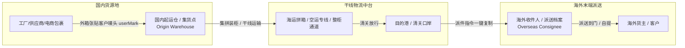
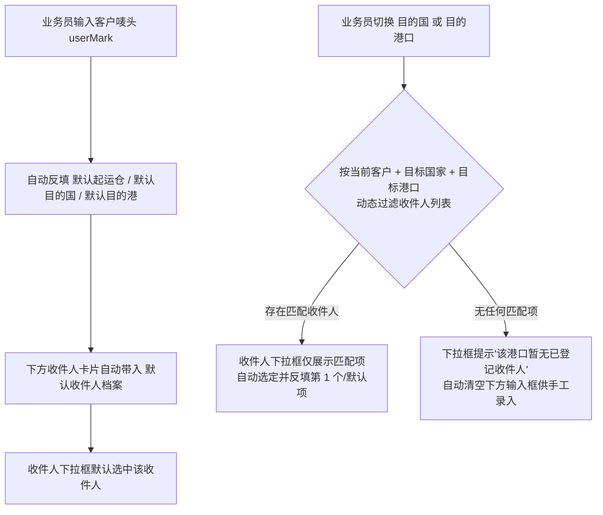
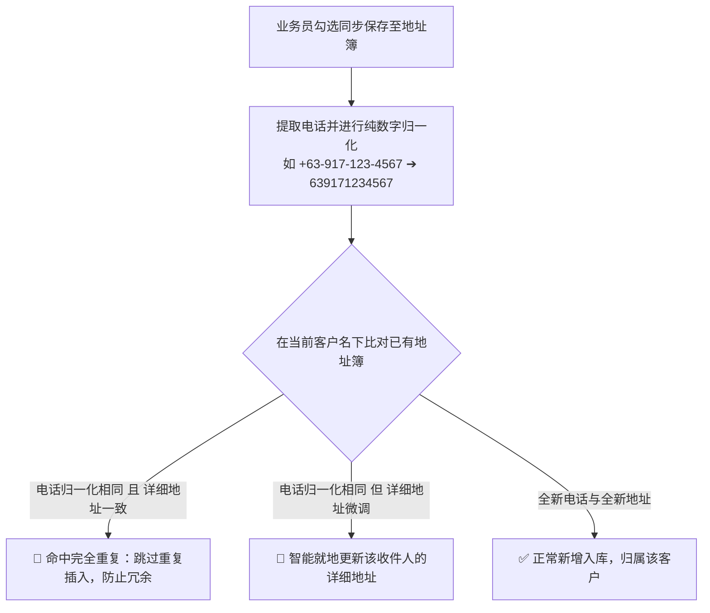

# 业务模块 10：收发件人体系与国内起运仓主数据架构

> 本文档详述了跨境物流业务中“收发人”与“起运集货点”的业务定位、设计哲学、数据模型与交互标准，确立了 **“认唛头不认发件人，集运认起运仓，末端认海外收件人”** 的核心业务基准。

---

## 🎯 1. 核心业务痛点与设计哲学

### 1.1 “国内寄件人”歧义与去除原则
在早期系统或传统快递软件中，常设有“寄件人 (Sender)”与“收件人 (Recipient)”字段。但在**跨境集运与散货拼箱 (SEA_LCL/AIR/SEA_FCL)** 的真实作业场景中，该设计存在严重认知歧义：
- **歧义点**：“国内寄件人”到底是终端供应商、代发货工厂、物流跟单员、还是集运仓操作员？
- **业务实际**：跨境物流公司的核心是**仓配集拼**。国内包裹由五湖四海的工厂或淘宝/1688商家寄往集运仓，仓库收货人员**只认外箱所贴的客户唛头 (`userMark`)** 进行扫码归集入库，完全不需要登记国内是谁发出的快递。
- **设计准则**：
  > **彻底从入库与运单生命周期中剥离“国内寄件人”字段。认唛头归集客户，认起运仓进行集货，认海外收件人进行末端派送。**

---

### 1.2 起运仓由“简单文本”升维为“主数据体系”
- **旧模式**：运单仅记录一个简单的字符串（如 `"广州"` 或 `"龙岩"`），缺少收货人、仓址、联系方式及收货时间。
- **全新主数据架构 (`OriginWarehouse`)**：
  - 将广州白云集拼总仓、龙岩集散中心、义乌小商品集拼中心、深圳专线仓、泉州产业带集散仓等沉淀为中心化主数据；
  - 记录仓库简码 (`code`)、全称 (`name`)、简称 (`shortName`)、收货负责人 (`contactName`)、收件咨询电话 (`contactPhone`)、省市区及详细仓址 (`address`)、营业收货时间 (`receivingHours`)、默认仓标记 (`isDefault`)；
  - **业务赋能**：支持系统一键生成“客户送仓指引”，一键复制发给客户或送货司机，自带醒目贴唛警示。

---

## 🗺️ 2. 收发人全链路拓扑与数据流动



---

## 🏗️ 3. 数据模型设计规范

### 3.1 起运仓主数据表 (`OriginWarehouse`)
```prisma
model OriginWarehouse {
  id             String   @id @default(uuid())
  code           String   @unique             // 仓库简码，如 GZ-01, YW-01, LY-01
  name           String                       // 仓库全称，如 广州白云集拼总仓
  shortName      String                       // 仓库简称，如 广州仓
  contactName    String                       // 收货负责人/组别，如 李主管 / 广州收货组
  contactPhone   String                       // 联系电话 / 咨询热线
  province       String?                      // 省份
  city           String?                      // 城市
  address        String                       // 仓库详细地址
  receivingHours String?                      // 营业收货时间，如 09:00 - 21:00
  isDefault      Boolean  @default(false)     // 是否系统默认起运仓
  isActive       Boolean  @default(true)      // 启用状态
  sortOrder      Int      @default(0)         // 排序权重
  note           String?                      // 备注说明 / 送仓注意事项
  createdAt      DateTime @default(now())
  updatedAt      DateTime @updatedAt

  @@index([code])
  @@index([isActive])
}
```

### 3.2 运单主表海外收件人字段 (`Waybill`)
| 字段名 | 类型 | 说明 | 生命周期与维护规则 |
| :--- | :--- | :--- | :--- |
| `originWarehouse` | `String?` | 始发起运仓标识/名称 | 阶段 1 预报与入库时确定，支持从起运仓主数据动态选择 |
| `overseasName` | `String?` | 海外收件人姓名/联系人 | 客户预报带入，全生命周期在途均支持纠偏修改 |
| `overseasPhone` | `String?` | 海外联系电话 / WhatsApp | 国际格式电话，末端派送联系依据 |
| `overseasCompany` | `String?` | 海外收件公司名称 | 选填，商用客户与提货公司标识 |
| `overseasRegion` | `String?` | 目的国家/省份地区 | 辅助末端分拨与派送区域划分 |
| `overseasAddress` | `String?` | 目的港详细派送/送货地址 | 末端送货到门的核心详细地址 |

---

## 🎨 4. 前端交互体系设计（形态 2：紧凑摘要条 + 展开式档案）

针对运单详情页已有复杂的实测计费、尺寸算方、6阶段生命周期推进流转看板，为了平衡**信息可见性**与**操作高效性**，系统选定并实现了 **形态 2** 架构：

```
+---------------------------------------------------------------------------------------------------------+
| [始发起运仓: 广州白云集拼总仓 (李主管 · 138-0000-1111)] ➔ [海外收件人: Alex Johnson (+63 917 123 4567)] |
|                                                    [ 📋 复制派件指令 ]  [ 🖊 修改海外收件人 ]  [ 展开档案 ▾ ] |
+---------------------------------------------------------------------------------------------------------+
| ▼ (展开后展现结构化两点一线双档案卡片)                                                                     |
|  +--------------------------------------------+    +--------------------------------------------+       |
|  | 🏢 国内起运集运仓 (Origin Hub)  [GZ-01]     |    | 📍 海外收货与派送地址 (Consignee) [菲律宾]   |       |
|  | - 仓库全称: 广州白云集拼总仓               |    | - 收件联系人: Alex Johnson                 |       |
|  | - 负责人/电话: 广州收货组 (138-0000-1111)  |    | - 联系电话: +63 917 123 4567               |       |
|  | - 详细仓址: 广东省广州市白云区石沙路...     |    | - 收件公司: Manila Trading Inc.            |       |
|  | - 营业时间: 09:00 - 21:00 (周一至周日)     |    | - 派送详细地址: Unit 802, BGC Tower, Taguig|       |
|  | 💡 送仓提示: 外箱醒目处请务必贴牢客户唛头!  |    +--------------------------------------------+       |
|  +--------------------------------------------+                                                         |
+---------------------------------------------------------------------------------------------------------+
```

### 4.1 四大核心功能亮点
1. **常驻单行紧凑摘要**：
   - 顶部单行卡片，一眼获知起运仓联系电话与海外收件人、目的国，不遮挡计费与生命周期。
2. **一键生成格式化派件指令 (`handleCopyDispatchInstruction`)**：
   - 自动生成如下标准格式文本写入剪贴板，调度员可一键转发当地车队/派送人员：
   ```text
   【派件单】运单号: GLL-2026-0089 | 唛头: WH-ZZY-FLB
   始发仓: 广州白云集拼总仓
   目的港: 菲律宾 (马尼拉南港)
   海外收件人: Alex Johnson
   联系电话: +63 917 123 4567
   收件公司: Manila Trading Inc.
   派送地址: Unit 802, BGC Tower, Taguig City, Metro Manila
   货物概况: 共 12 件 / 计费体积 2.450 m³ / 渠道: 万海自营拼箱专线
   ```
3. **全生命周期随时在途修改海外收件人 (`handleSaveOverseasConsignee`)**：
   - 独立弹窗抽屉，即使货物已进入在途、清关等后续阶段，业务员也可随时响应客户的改派需求，修改后即时覆盖主表持久化。
4. **关键流转节点双向核对保障**：
   - **阶段 1 (客户预报修改)**：支持重新选择起运仓与修改预报收件人快照；
   - **阶段 5 (目的港清关放行)**：放行水单上传前高亮渲染末端收件人档案，强制核对派送地址，杜绝错派漏派。

---

## 📋 5. 工程与运维准则

1. **种子仓自初始化**：
   - `OriginWarehouseV2Service.ensureSeedWarehouses()` 在数据库无起运仓时自动写入 5 大核心口岸仓（广州、龙岩、义乌、深圳、泉州），确保系统开箱即用。
2. **默认起运仓排他性保护**：
   - 当将某一仓库标记为 `isDefault = true` 时，后端服务自动将其他起运仓重置为 `false`，确保全局唯一默认仓。
3. **前端防呆与容错**：
   - 运单详情中的起运仓根据标识/名称自动匹配主数据对象；若主数据被停用或删除，前端平滑降级显示运单中保存的历史快照文本，绝不产生白屏或崩溃。

---

## 📖 6. 客户内嵌【海外收件人地址簿】管理机制 (方案 1)

### 6.1 业务定位与权属关系
- **认唛头权属**：海外收件人 (`CustomerAddress`) 完全归属于对应的客户档案 (`Customer`)；
- **多地址支持**：单个客户唛头名下可拥有 1 到 N 个海外收件人（如“马尼拉总仓”、“宿务档口”），支持分别设置姓名、国际电话/WhatsApp、海外公司名、详细送货地址，并指定其中 1 个为 `isDefault = true` 默认收件人。

### 6.2 客户管理与全局反查功能
- **客户卡片直观展开**：在 `CustomerManagement.tsx` 页面中，每个客户卡片直接展示默认收件人档案，并支持一键展开该客户名下的所有收件人列表；
- **增删改查与设为默认**：支持独立维护每个收件人地址条目，可一键切换默认收件人；
- **全局反向模糊反查**：在客户搜索框中输入**海外收件人姓名、电话或地址**，后端通过 `addresses.some` 关系自动命中并定位所属的客户档案与唛头。

### 6.3 开单与在途调度极速联动
- **入库工作台 (`InboundWorkbench.tsx`)**：输入/匹配客户唛头后，若客户名下拥有多个常用收件人，提供 **[从地址簿快速切换 ▾]** 下拉选择器，选择后秒级自动填充收件人姓名、电话、公司与详细地址；
- **运单详情页在途变更 (`WaybillDetailView.tsx`)**：在“独立修改海外收件人”抽屉及“阶段 1 预报维护”中，均提供 **[从该唛头地址簿快捷带入 ▾]**，支持业务员在客户临时改派时一秒调取历史档案完成纠偏保存。

---

## 🎯 7. 目的国/港口与海外收件人智能级联过滤标准 (Cascading Standards)

### 7.1 核心设计原则：默认收件人驱动客户主路线
为了保证客户主数据与收件人档案的 100% 强一致，系统确立 **“单向驱动”** 原则：
- 只要在客户档案中添加或修改收件人，并标记为 `isDefault = true`（默认收件人），系统在保存时将**自动同步覆盖**客户主表的常用目的国 (`destinationCountry = address.country`) 与常用目的港 (`destinationPort = address.region`)；
- 避免出现客户主表路线偏好与默认收件人地理口岸相互冲突的数据脏乱问题。

### 7.2 开单工作台级联过滤与自动带入规范
在「极速预报下单工作台」中，遵循以下 4 级联动时序：



### 7.3 开单卡片常驻交互形态
在「海外收货人与目的港派送档案 (CONSIGNEE)」卡片顶部，常驻直观的收件人选择条：
```
+----------------------------------------------------------------------------------------------------+
| 📍 海外收货人与目的港派送档案 (CONSIGNEE)                                                           |
|                                                                                                    |
| [ 👤 选择该港口下属海外收件人:  [ Alex Johnson (马尼拉总店 · +63 917...) ⭐[默认]         ▼ ] ]     |
|   ↳ (动态筛选：当前展示【菲律宾 · 马尼拉南港】下属的 2 个已登记收件人)                              |
|                                                                                                    |
| [海外收件联系人]             [海外联系电话 / WhatsApp]        [海外公司名称 (选填)]                  |
| [Alex Johnson        ]     [+63 917 123 4567         ]    [Manila Trading Inc.  ]                  |
|                                                                                                    |
| [海外目的港详细派送送货地址]                                                                       |
| [Unit 802, BGC High Street, Taguig City, Metro Manila                                            ] |
+----------------------------------------------------------------------------------------------------+
```
- **手动编辑保护**：当业务员从下拉框选择某一收件人后，若对输入框进行了临时手动微调（如更改门牌号），系统以输入框中的最新快照为准入库，既保证了快捷带入的高效性，又保留了临时单次派送调整的灵活性。

---

## 🛡️ 8. 开单新收件人显式沉淀与防重校验标准 (Deduplication & Anti-Pollution)

### 8.1 业务风险与“显式勾选沉淀”设计哲学
在跨境专线中，客户经常有单次一件代发或零散零售包裹，如果系统“无条件全自动保存新地址”，会导致客户名下在一个月内堆积数百条一次性买家垃圾数据，导致地址簿彻底报废。

因此系统确立 **“显式勾选 (Scheme A) + 强防重校验”** 准则：
```
+----------------------------------------------------------------------------------------------------+
| 📍 海外收货人与目的港派送档案 (CONSIGNEE)                                                           |
|                                                                                                    |
| [海外收件联系人: Alex       ] [海外联系电话: +63 917...] [海外公司: Manila Trading]                  |
| [海外详细派送地址: Unit 802, BGC High Street, Taguig City, Metro Manila]                            |
|                                                                                                    |
|  [ ] 💾 同步将该收件人保存至【WH-ZZY-FLB】的常用地址簿 (可供后续开单复用)                           |
+----------------------------------------------------------------------------------------------------+
```
- **默认不勾选**：散单/代发货不勾选直接下单，收件人只作为单票运单快照，不污染客户主数据；
- **业务员主动沉淀**：确认为客户新开的海外仓/档口时，勾选复选框，下单时一并沉淀至 `CustomerAddress`。

### 8.2 客户地址簿防重校验算法 (Deduplication Algorithm)
当勾选了同步保存至地址簿时，后端服务执行多维强防重校验：



1. **电话号码归一化算法**：自动剔除国际区号前缀中的 `+`、空格、短横线 `-`、括号等干扰字符，进行纯数字串比对；
2. **完全重复静默保护**：若客户名下已存在同电话且同地址的收件人，系统正常生成运单，静默跳过重复插入，防止同一地址重复创建 10 余条；
3. **地址微调智能更新**：若客户名下该联系人电话已存在，但门牌号发生变动，自动更新该收件人记录，保证地址簿数据常新。

---

## ✈️ 9. 空运场景下海外收件人国家级解耦与过滤标准 (Air Freight Consignee Standards)

### 9.1 业务场景差异
- **海运场景 (SEA_LCL / SEA_FCL)**：受海港清关与港区拖车派送范围限制，收件人必须严格按 `国家 + 目的海港` 双维度过滤（如马尼拉南港仅能派送大马尼拉及周边）；
- **空运场景 (AIR)**：空运直达枢纽机场清关后，由中转分拨仓负责目的地全境门到门派送，因此**收件人与具体海港完全解耦**。

### 9.2 前端过滤与自适应规则
1. **收件人计算规则 (`availableConsignees`)**：
   - 当 `orderType === 'AIR'` 时，算法忽略 `destinationPort` 与 `address.region` 的匹配，只要 `address.country === destinationCountry` 即判定匹配；
   - 切换目的国（如选为“泰国”）时，下拉框直接呈现该客户在泰国的全部常用收件人，无需受曼谷港或林查班港等海港限制。
2. **界面交互与防 NPE 规范**：
   - 开单工作台 (`InboundWorkbench.tsx`) 与 运单详情阶段 1 维护 (`WaybillDetailView.tsx`) 在空运模式下**自动隐藏目的海港下拉框**；
   - 运单路线统一格式化为 `起运仓 ➔ 目的国家 (空运专线)`，`destinationPort` 提交与存储均为 `null / undefined`，杜绝任何前端空指针异常。
