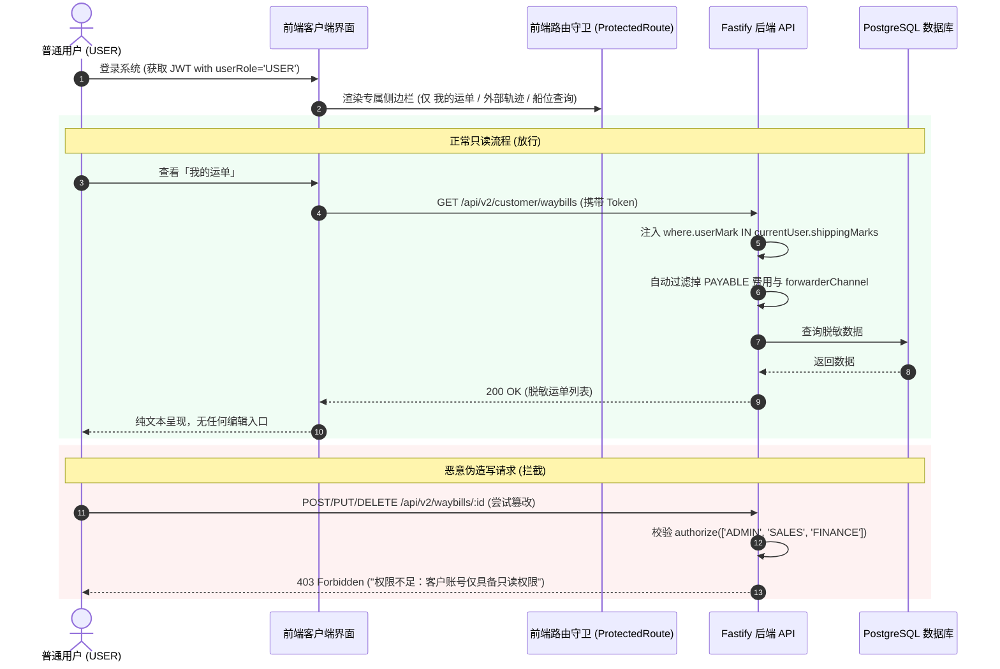

# 客户门户权限与内部数据隔离规范

> 本规范定义外部普通客户（`USER` 角色）的门户菜单边界、全流程只读交互规范以及内部商业敏感数据（渠道成本/应付费用/内部调度）的脱敏过滤标准。

---

## 🏛️ 一、 客户门户定位与界面矩阵

在 Global Link Logistics 系统中，普通用户（`USER`）为委托货主、电商买家或海外收件代表。其系统交互实行**“极简菜单、专属看板、全流程只读”**原则。

```mermaid
graph TD
    subgraph 内部中台人员 (ADMIN / SALES / FINANCE)
        M1[入库拼箱工作台 /v2/inbound]
        M2[运单全景调度 /v2/waybills]
        M3[集装箱整柜跟踪 /v2/containers]
        M4[客户档案与唛头 /v2/customers]
        M5[渠道与服务商 /v2/channels]
        M6[起运仓集货点 /v2/warehouses]
        M7[用户系统管理 /user-management]
    end

    subgraph 外部普通客户 (USER)
        C1[📦 我的运单 /customer/waybills]
        C2[🔍 外部轨迹查询 /external-tracking]
        C3[🚢 船舶船讯查询 /vessel-position]
    end

    M1 & M2 & M3 & M4 & M5 & M6 & M7 -->|具备写与调度权限| FullAccess[全功能数据与成本调度]
    C1 & C2 & C3 -->|纯只读 + 数据脱敏| ReadOnlyAccess[仅查看绑定唛头应收账单与轨迹]
```

### 1. 侧边栏菜单可见性对照表

| 菜单模块 | 路由路径 | 内部员工 (ADMIN/SALES/FINANCE) | 普通客户 (USER) | 权限说明 |
| :--- | :--- | :---: | :---: | :--- |
| **入库拼箱工作台** | `/v2/inbound` |  可见 | ❌ 隐藏 | 内部扫码入库、尺寸实测与打单排柜 |
| **运单全景调度** | `/v2/waybills` |  可见 | ❌ 隐藏 | 包含同行外发渠道、全生命周期调度 |
| **集装箱整柜跟踪** | `/v2/containers` |  可见 | ❌ 隐藏 | 集装箱干线节点与全链路干线成本 |
| **客户档案与唛头** | `/v2/customers` |  可见 | ❌ 隐藏 | 维护全局客户档案与常用地址簿 |
| **渠道与服务商** | `/v2/channels` |  可见 | ❌ 隐藏 | 维护自营及同行服务商底价与联络人 |
| **起运仓集货点** | `/v2/warehouses` |  可见 | ❌ 隐藏 | 维护国内各集货仓地址与收货时间 |
| **用户系统管理** | `/user-management` |  仅 ADMIN | ❌ 隐藏 | 系统账号与密码分配 |
| **我的运单** | `/order/list` 或 `/customer/waybills` | ❌ 隐藏 (使用全景调度) |  **可见** | **专属客户运单看板（纯只读）** |
| **外部轨迹查询** | `/external-tracking` |  可见 |  **可见** | 公共单号轨迹查询工具 |
| **船舶船讯查询** | `/vessel-position` |  可见 |  **可见** | 实时 AIS 船位与港口查询工具 |

---

## 🔒 二、 内部敏感数据脱敏过滤标准

普通客户在查看「我的运单」列表及单票详情时，系统必须对商业敏感数据进行彻底脱敏与隐藏：

### 1. 字段可见性矩阵

| 数据分类 | 具体字段 / 模块 | 内部人员视角 | 普通客户视角 | 说明 |
| :--- | :--- | :---: | :---: | :--- |
| **单号与基础信息** | 系统运单号、委托类型、起运仓、目的国、目的港、快递单号 | 可读写 | 👁️ **只读可见** | 基础运输要素 |
| **物流节点与时间轴** | 入库时间、装柜时间、开船时间、预计到港、清关时间、签收时间 | 可读写 | 👁️ **只读可见** | 关键物流节点透明化 |
| **货物包裹明细** | 货物行索引、品名、件数、实测长宽高、实测体积、实测重量 | 可读写 | 👁️ **只读可见** | 仓库实测结算依据 |
| **收发件人信息** | 国内寄件人/海外收件人姓名、电话、公司、详细地址 | 可读写 | 👁️ **只读可见** | 地址快照 |
| **客户应收账单** | **`RECEIVABLE` 方向费用**（运费、报关费、派送费、小费等） | 可读写 | 👁️ **只读可见** | 客户应付给货代的款项 |
| **凭证图片池** | 水单凭证、叫车图、签收单、装柜图 | 可上传/删除 | 👁️ **只读预览** | 仅供在线预览与下载 |
| **同行服务商渠道** | `forwarderChannel`（如：天帆、菲通、中外运、自营专线） | 可读写 | ❌ **完全隐藏** | 商业机密，防止客户跳过货代找同行 |
| **内部承运成本** | **`PAYABLE` 方向费用**（向船司/车队/报关行支付的底价成本） | 可读写 | ❌ **完全隐藏** | 财务利润与底价，客户绝对不可见 |
| **内部调度备注** | 操作内部备注、同行订舱单号、排柜工单编号 | 可读写 | ❌ **完全隐藏** | 内部协作信息 |

---

## 🛡️ 三、 端到端“零写权限”安全防护策略



### 1. 前端 UI 规范
1. **彻底移除所有写操作组件**：不渲染「新增」、「编辑」、「保存」、「删除」、「批量导入」、「修改状态」、「添加费用」等任何按钮。
2. **纯展示组件**：所有的货物数据、体积重量、收件人信息均采用只读 Typography / Card / Badge 展示，不提供任何 Focus 态的 Input。

### 2. 后端接口强拦截
1. **写接口强校验**：所有创建、更新、删除接口（包括运单、集装箱、费用、附件）均在 preHandler 中挂载 `authorize(['ADMIN', 'SALES', 'FINANCE'])`。
2. **读接口自动脱敏**：当 `request.user.userRole === 'USER'` 时，API 响应自动执行 `sanitizeWaybillForCustomer` 脱敏函数，移除 `fees` 中的所有 `PAYABLE` 项与内部渠道字段。
